テキストコミュニケーションにおける、対話/スレッド層の役割について。

対話/スレッド層
構成: 複数文書の時系列的交換
特徴: 送信者と受信者の往復

# テキストコミュニケーションの対話/スレッド層 - 初学者のための完全ガイド

## 🔍 一言要約
メッセージが時系列で往復する、会話の「流れ」を作る層

## 📚 目次
1. [はじめに](#-はじめに)
2. [対話/スレッド層とは](#-対話スレッド層とは)
3. [基本構造](#-基本構造)
4. [時代背景と発見に至った経緯](#-時代背景と発見に至った経緯)
5. [種類と特徴](#-種類と特徴)
6. [関連する用語](#-関連する用語)
7. [メリットとデメリット](#-メリットとデメリット)
8. [応用と実例](#-応用と実例)
9. [置換、変遷](#-置換変遷)
10. [代替、競合](#-代替競合)
11. [実世界への影響とその後の発展](#-実世界への影響とその後の発展)

## 🌟 はじめに

私たちが日々使うLINE、メール、Slackなどでのやり取り。これらは単なる「文字の羅列」ではなく、**会話の流れ**を持っています。

例えば：
- 友達に「今日ランチどう？」と送る
- 友達が「いいね！12時は？」と返す
- あなたが「OK！駅前で」と返す

この**往復のやり取り**こそが「対話/スレッド層」です。まるでキャッチボールのように、メッセージが行ったり来たりする構造を指します。

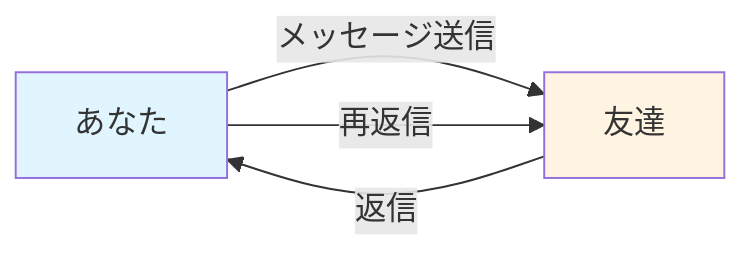

## 🏗️ 対話/スレッド層とは

テキストコミュニケーションは、実は**複数の層（レイヤー）**で成り立っています：

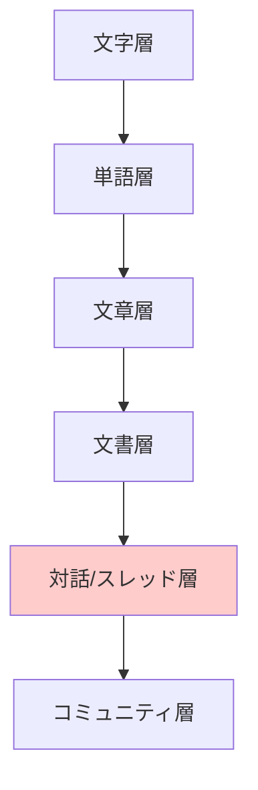

**対話/スレッド層**は、この中で：
- **構成要素**: 複数の文書（メッセージ）
- **配置**: 時系列順に並ぶ
- **特徴**: 送信者と受信者が入れ替わる

## 🏗️ 基本構造

対話/スレッド層の本質的な構造を見てみましょう：

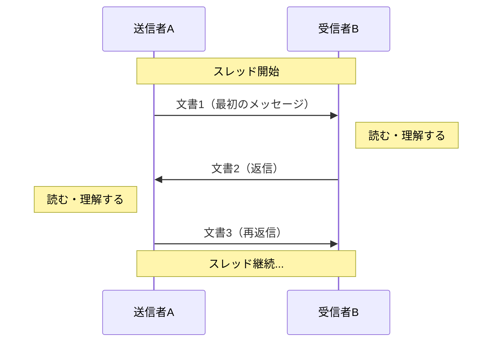

### 重要な3つの要素

1. **時系列性**: メッセージは時間順に並ぶ
2. **往復性**: 送信者と受信者が交互に入れ替わる
3. **文脈の連続性**: 前のメッセージを踏まえて次が生まれる

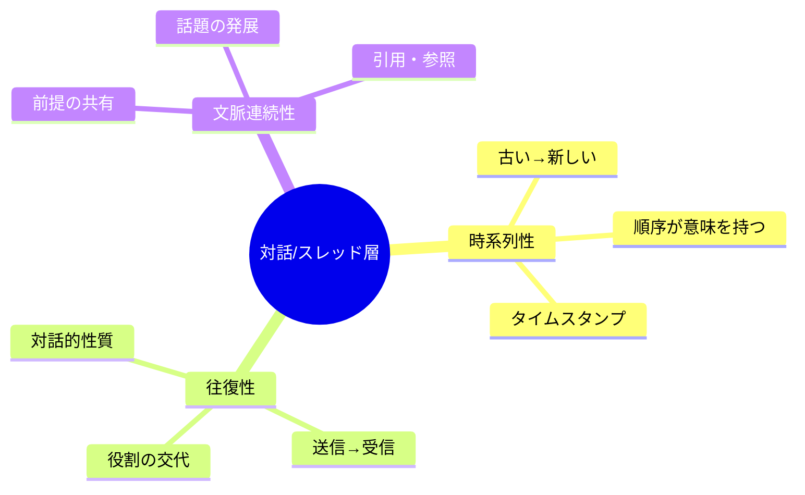

## 📜 時代背景と発見に至った経緯

### 手紙の時代（紀元前〜）

人類は古代から「往復書簡」という形で対話/スレッド層を実践してきました。

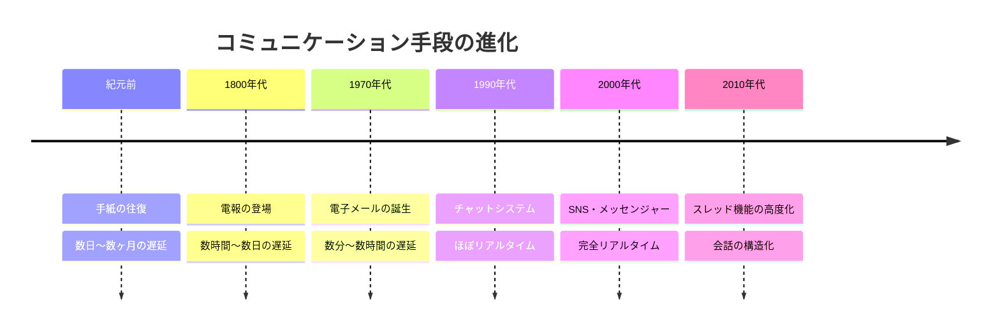

### 概念の明確化（2000年代〜）

インターネット時代になり、以下の必要性から「層」として認識されるようになりました：

1. **技術的必要性**: システム設計のため階層構造を理解する
2. **ユーザー体験**: どこまでが「1つの会話」かを明確にする
3. **情報整理**: 膨大なメッセージを管理する

## 🎨 種類と特徴

対話/スレッド層には、様々な形態があります：

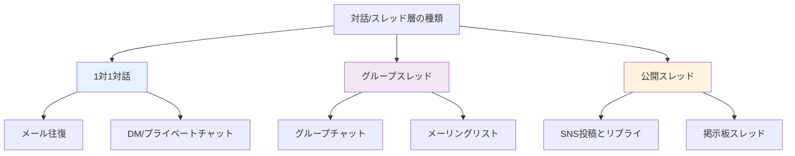

### 比較表

| 種類 | 参加者 | 可視性 | 応答速度 | 例 |
|------|--------|--------|----------|-----|
| 1対1対話 | 2人 | 非公開 | 速い | LINE、メール |
| グループスレッド | 3人以上 | 限定公開 | 中程度 | Slackチャンネル |
| 公開スレッド | 不特定多数 | 公開 | 遅い | Twitterスレッド |

## 📗 関連する用語

### 同義語・類似概念
- **スレッド（Thread）**: 糸のように繋がった会話
- **セッション（Session）**: 一連のやり取り期間
- **会話（Conversation）**: より日常的な表現
- **往復書簡**: 古典的な表現

### 対義語
- **単発メッセージ**: 返信を期待しない一方的な通知
- **ブロードキャスト**: 大勢への一斉送信（対話性なし）

### 多義語との区別
- **スレッド（プログラミング用語）**: コンピュータの処理単位 ← 別物
- **セッション（Web用語）**: ブラウザの接続状態 ← 別物

### 類義語の比較

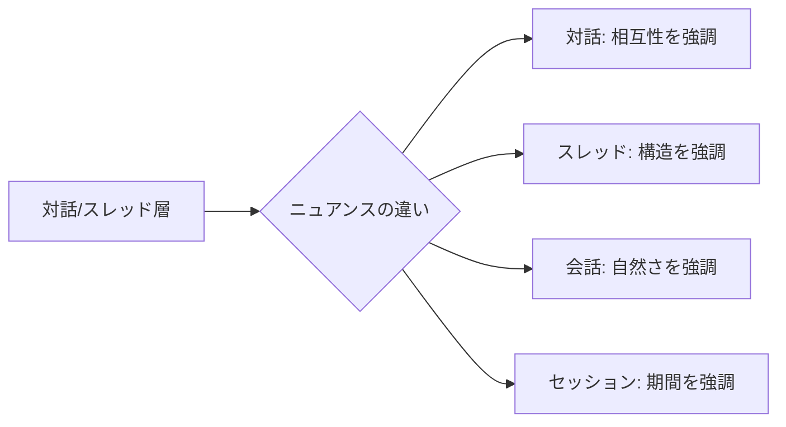

## 💡 メリットとデメリット

### メリット

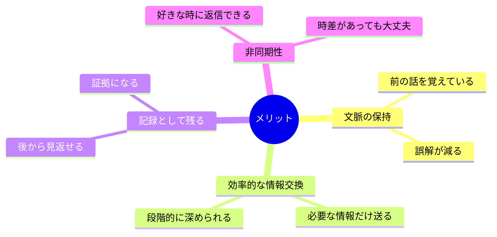

1. **文脈の継続性**: 「あれ」「それ」で通じる
2. **考える時間**: 即答不要で熟考できる
3. **検索可能性**: 過去のやり取りを探せる
4. **複数並行**: 複数の会話を同時進行できる

### デメリット

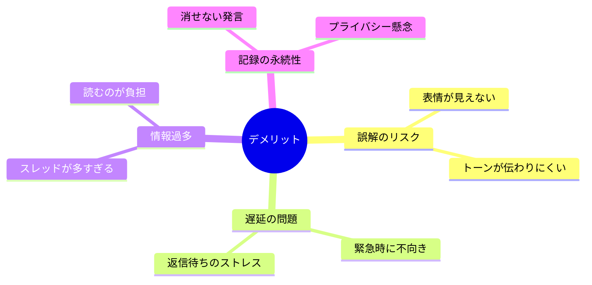

## 🚀 応用と実例

### 身近な実例

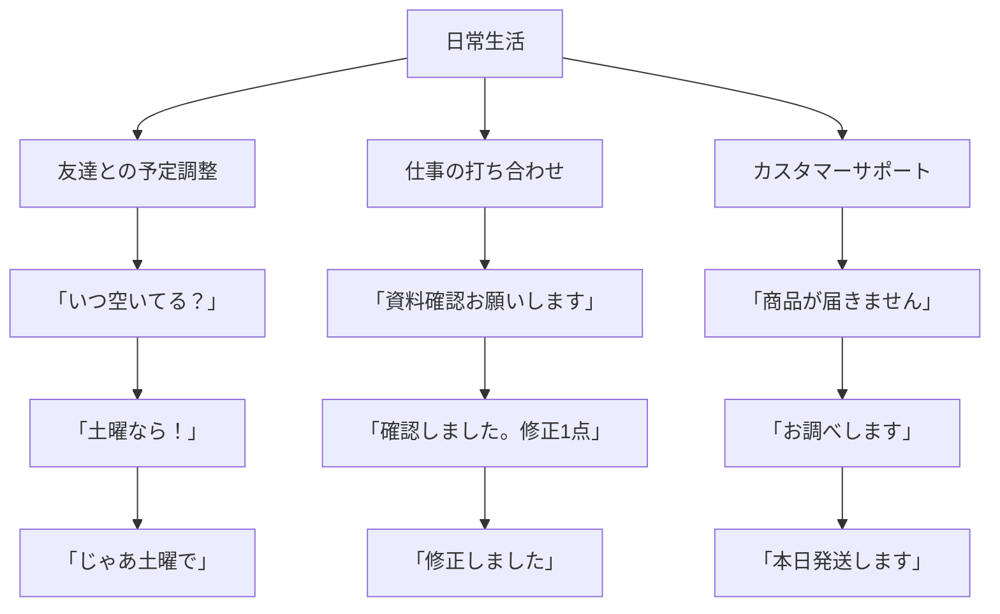

### 高度な応用

1. **ビジネス交渉**: 条件を段階的に詰める
2. **共同執筆**: アイデアを往復させて磨く
3. **オンライン教育**: 質問と回答の繰り返し
4. **カウンセリング**: 継続的な対話による支援

## 🚀 置換、変遷

### 何を置き換えたか

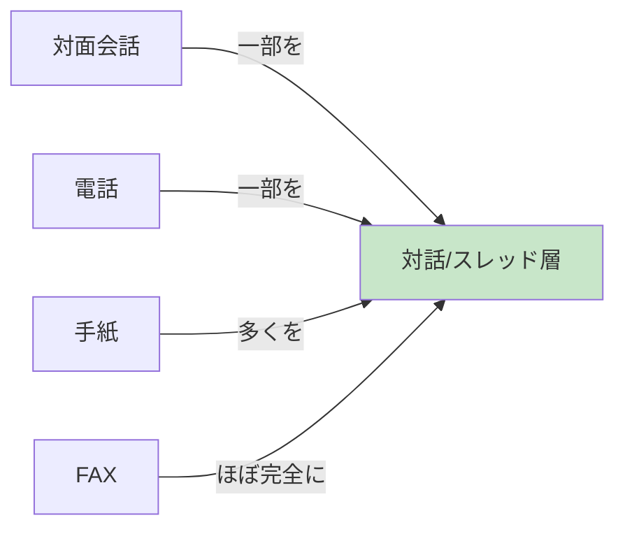

**置き換えた理由**:
- 時間の制約がない（非同期）
- 記録が自動的に残る
- 複数人と同時にやり取り可能
- コストが安い（ほぼ無料）

### 何に置き換えられたか・置き換えられつつあるか

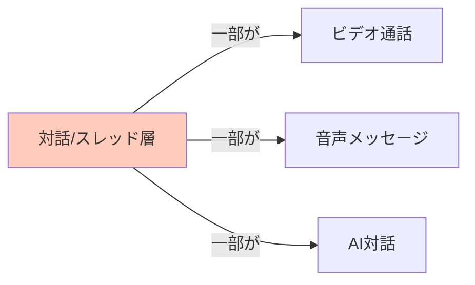

**置き換えられる場面**:
- 複雑な議論 → ビデオ会議の方が効率的
- 緊急時 → 電話の方が確実
- 感情的な話 → 対面の方が適切

### 継承関係

**継承したもの**:
- 手紙の往復構造
- 会話の順番交代
- 文脈の連続性

**継承されたもの**:
- チャットボット → 人間の対話パターンを学習
- AI アシスタント → スレッド形式で会話を記憶

## 🚀 代替、競合

### 代替可能な場面

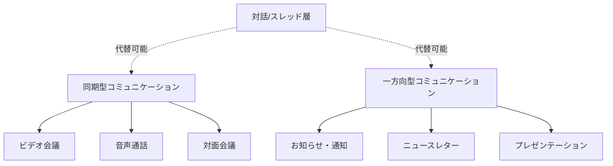

**代替の判断基準**:
- 緊急度（高い → 同期型へ）
- 複雑度（高い → 対面へ）
- 情報の方向性（一方向 → 通知へ）

### 競合する技術・手法

| 競合相手 | 優位な点 | 劣る点 |
|----------|----------|--------|
| ビデオ通話 | 豊かな情報量 | 記録が残りにくい |
| 音声メッセージ | 感情が伝わる | 検索・引用しにくい |
| 対面会議 | 信頼構築 | 時間・場所の制約 |
| ドキュメント共有 | 構造化された情報 | 対話性が低い |

### 共存の形

実際には**完全な置き換え**ではなく、**適材適所**で使い分けられています：

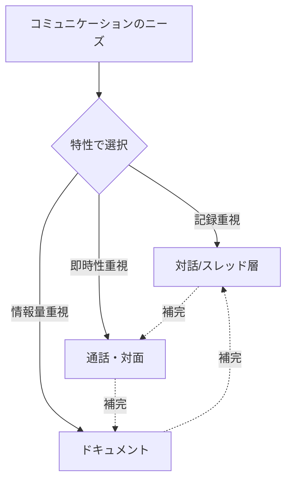

## 🌍 実世界への影響とその後の発展

### 社会への影響

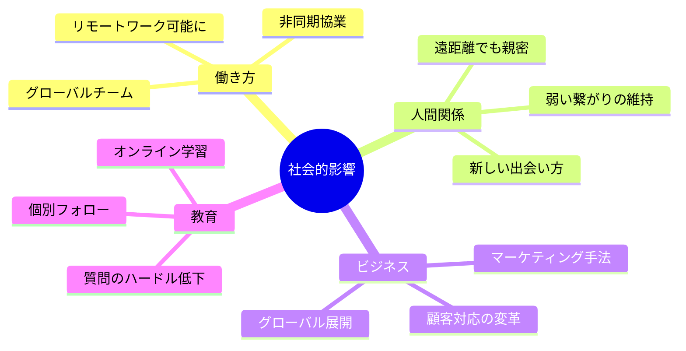

### 今後の発展方向

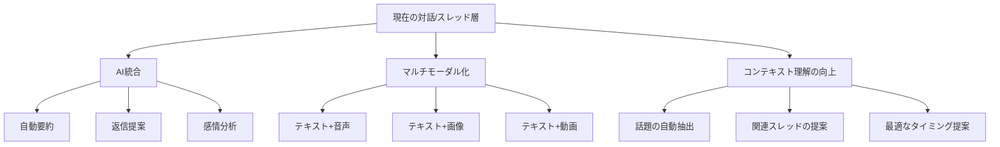

### 未来の可能性

1. **AI アシスタントの進化**: 対話を理解し、適切に介入
2. **感情の可視化**: テキストから感情を読み取りフィードバック
3. **自動翻訳の高度化**: 言語の壁を超えた対話
4. **VR/AR統合**: 仮想空間での対話体験
5. **脳波インターフェース**: 考えるだけで送信する時代

---

## 🎓 学習の次のステップ

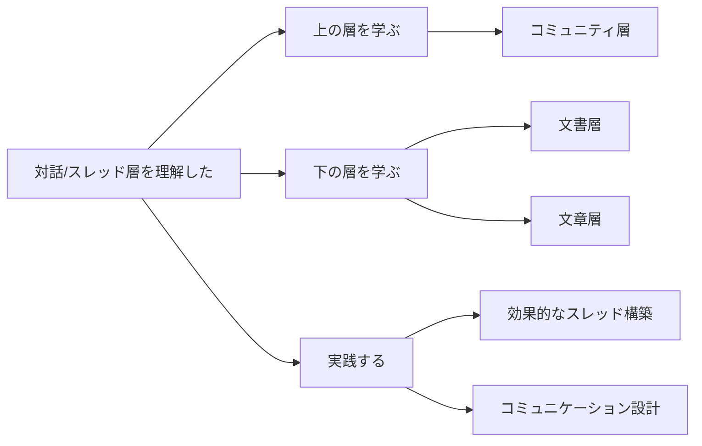

---

