メンタルモデル（Mental Model）のうち、文字を扱う上での、単語の役割について

# 単語の役割 - 初学者のための完全ガイド

## 🔍 一言要約
言葉の意味を正確に理解し伝えるための「単語の働き方」の地図

## 📚 目次
1. はじめに - 単語の役割とは何か
2. 基本構造 - 言語理解の設計図
3. 8つの主要な単語の役割
4. 時代背景と発見の経緯
5. 役割の種類と特徴
6. 関連用語の整理
7. メリットとデメリット
8. 応用と実例
9. 置換と変遷
10. 代替と競合
11. 実世界への影響

## 🌟 はじめに

料理を作るとき、材料にはそれぞれ役割があります。肉は主役、塩は味付け、水は繋ぎ役。言葉も同じです。

**単語の役割（品詞）** とは、文の中で各単語が果たす「仕事」のこと。これを理解すると、言葉の意味が立体的に見えてきます。

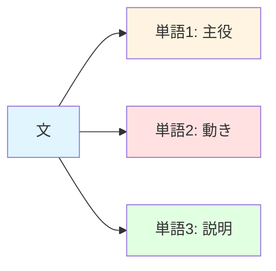

## 🏗️ 基本構造

言語を理解するには3つの層があります：

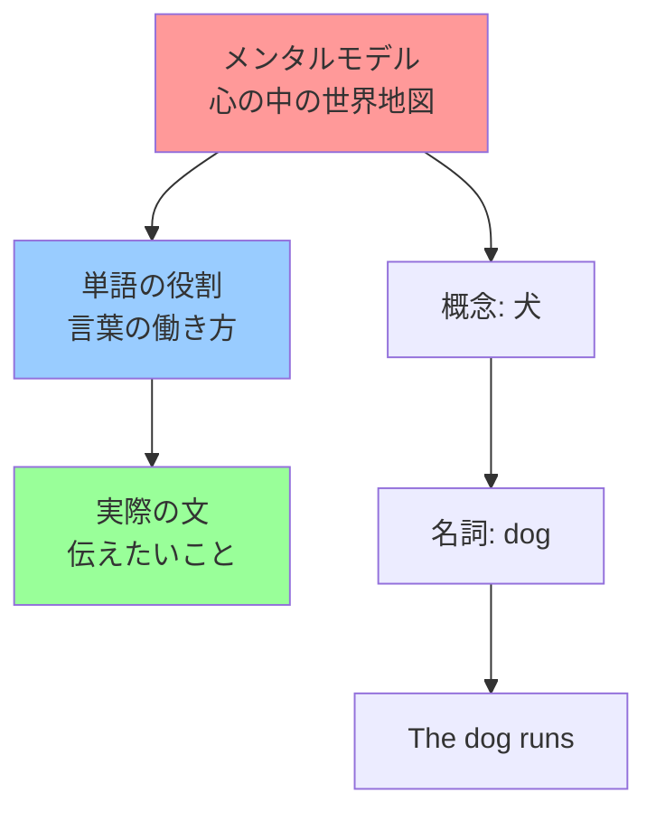

**3層の関係：**
- **メンタルモデル層**：「犬」という概念が頭の中に存在
- **単語役割層**：その概念を「名詞」として表現
- **実現層**：文の中で具体的に使う

## ⚡ 8つの主要な単語の役割

### 基本の3役

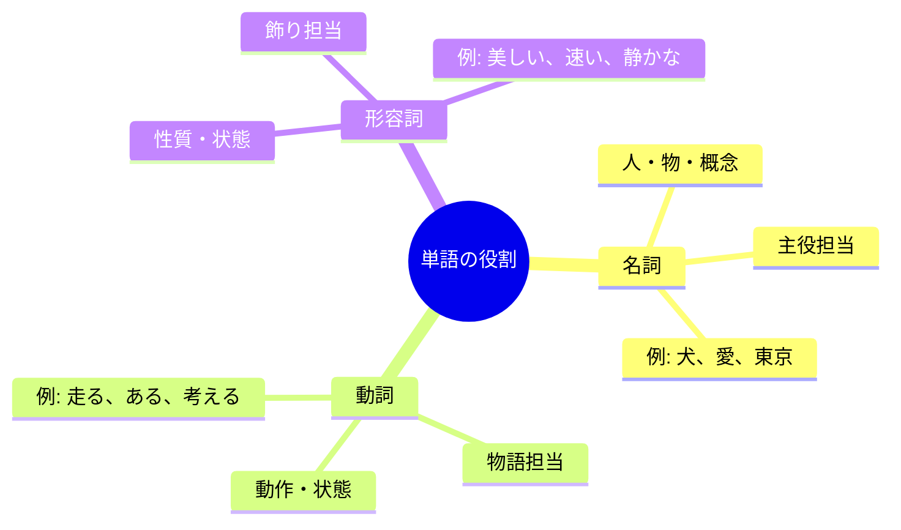

### 補助の5役

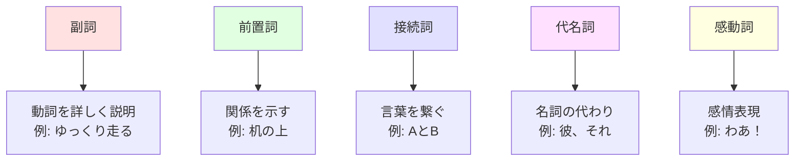

## 📜 時代背景と発見の経緯

### 古代からの探求

**紀元前5世紀 - ギリシャ**
哲学者プラトンが「名詞と動詞」の区別を発見。「世界には物（名詞）と動き（動詞）がある」という気づき。

**紀元前4世紀 - アリストテレス**
8品詞の原型を確立。言語を科学的に分析する第一歩。

**中世 - ラテン文法の発展**
ヨーロッパで教育の基礎に。「言葉の仕組みを知れば、思考が明確になる」という発見。

**近代 - 各言語への適用**
英語、日本語、中国語など、あらゆる言語で独自の品詞体系が発展。

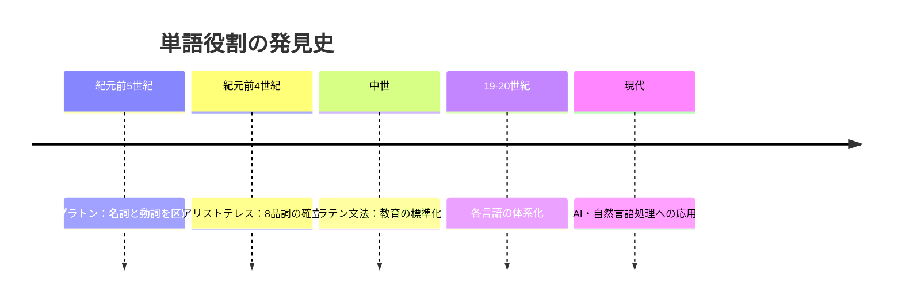

## 🎨 種類と特徴

### 日本語の品詞体系
- 学術文法では11品詞や、形容動詞を名詞＋助動詞と解釈するなど、異説が存在する点が省略されている。

| 品詞 | 役割 | 変化 | 例 |
|------|------|------|-----|
| 名詞 | 物・概念 | しない | 犬、愛 |
| 動詞 | 動作・状態 | する | 走る、食べる |
| 形容詞 | 性質 | する | 美しい、高い |
| 形容動詞 | 性質・状態 | する | 静かだ、元気だ |
| 副詞 | 修飾 | しない | ゆっくり、とても |
| 連体詞 | 名詞を修飾 | しない | この、あの |
| 接続詞 | 繋ぐ | しない | そして、しかし |
| 感動詞 | 感情 | しない | ああ、わあ |
| 助詞 | 関係を示す | しない | は、を、に |
| 助動詞 | 意味を加える | する | れる、させる |

### 英語の品詞体系

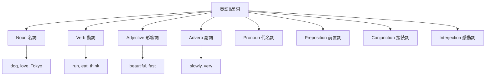

## 📗 関連する用語

### 同義語・類似概念
- **品詞**：単語の役割の別名
- **文法カテゴリー**：より学術的な表現
- **語類**：中国語での呼び方
- **Part of Speech**：英語での呼び方（略称: POS）

### 関連用語の比較

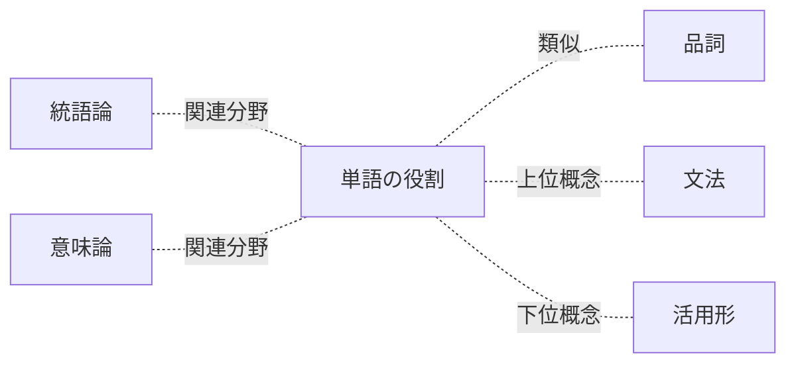

| 用語 | 意味 | 関係性 |
|------|------|--------|
| 品詞 | 単語の役割の正式名称 | 完全同義 |
| 活用 | 単語の形が変わること | 役割に付随する性質 |
| 統語論 | 文の構造の研究 | 役割を研究する分野 |
| 形態論 | 単語の形の研究 | 役割と密接に関連 |

## 💡 メリットとデメリット

### メリット

**1. 言語理解の加速**
品詞を知ると、辞書なしで意味を推測できる場面が増えます。

**2. 外国語学習の効率化**
「この言語では動詞が文末に来る」など、パターンで理解できます。

**3. 明確なコミュニケーション**
文の構造を意識すると、誤解が減ります。

**4. プログラミングへの応用**
自然言語処理（NLP）の基礎技術として活用されます。

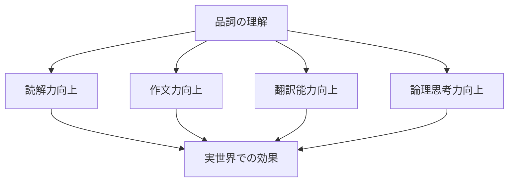

### デメリット

**1. 言語の柔軟性を損なう可能性**
「これは名詞だけ」と固定すると、創造的な表現を妨げることも。

**2. 言語間の違いで混乱**
日本語の「形容動詞」は英語にない概念です。

**3. 学習初期の負担**
最初は覚えることが多く感じられます。

**4. 例外の多さ**
「走る」は動詞だが「走り」は名詞。ルールには常に例外があります。

## 🚀 応用と実例

### 日常生活での活用

**例1: 料理レシピの理解**
```
「玉ねぎを薄く切る」
- 玉ねぎ（名詞）= 材料
- 薄く（副詞）= 方法
- 切る（動詞）= 動作
```

**例2: ニュースの読解**
```
「新しい技術が急速に発展している」
- 新しい（形容詞）→ どんな技術？
- 急速に（副詞）→ どのように発展？
- 発展している（動詞）→ 何が起きてる？
```

### テクノロジーへの応用

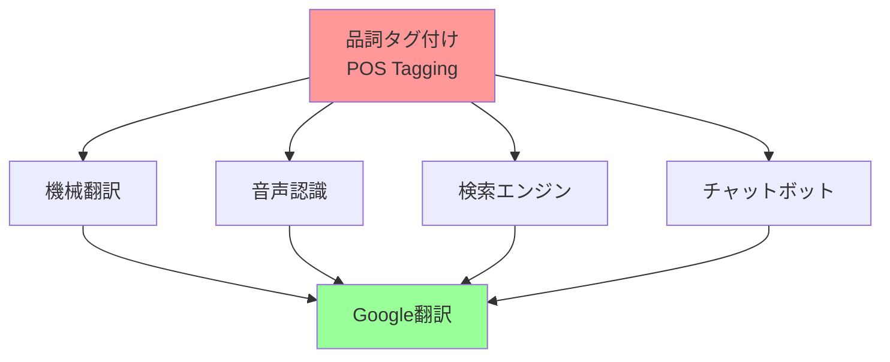

**AI・機械学習での利用：**
1. **検索エンジン**：「run」が動詞か名詞かで検索結果を変える
2. **音声アシスタント**：文の構造を理解して適切に応答
3. **自動翻訳**：品詞を正しく識別して自然な翻訳を生成

## 🔄 置換と変遷

### 何を置き換えたか

**置換前：直感的な言語理解**
- 「なんとなく意味がわかる」
- 体系的な説明ができない

**置換後：科学的な言語理解**
- ルールに基づいて説明できる
- 他人に教えられる

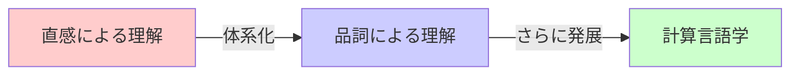

### 何に置き換えられたか・継承されたか

**現代の発展形：**
- **依存構文解析**：単語間の関係をより詳細に分析
- **意味役割ラベリング**：「誰が・何を・どうした」を特定
- **埋め込み表現**：単語を数値ベクトルで表現（Word2Vec, BERT）

**継承関係：**
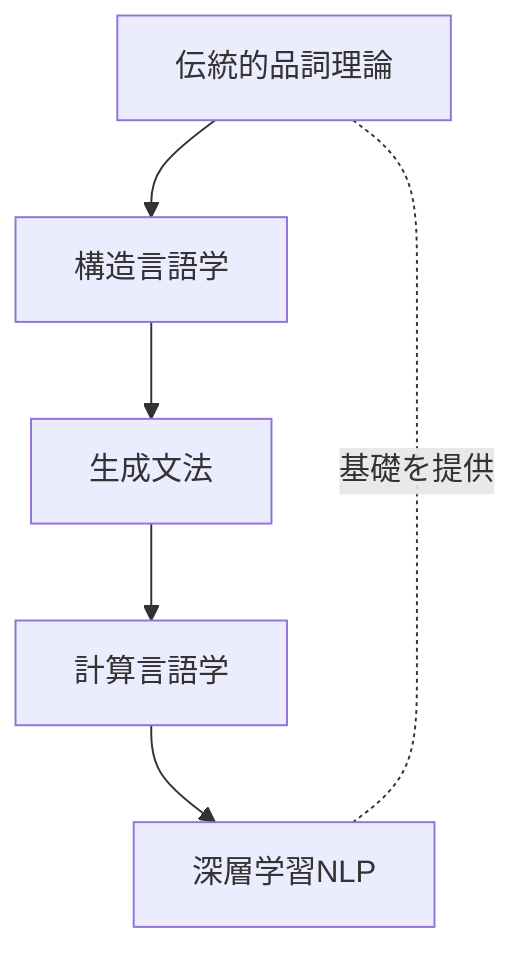

## 🔀 代替と競合

### 代替可能な概念

| 手法 | 特徴 | 向き・不向き |
|------|------|--------------|
| 品詞タグ付け | シンプル、高速 | ○ 教育、基礎研究 |
| 依存構文解析 | 関係性重視 | ○ 翻訳、質問応答 |
| 意味役割解析 | 意味重視 | ○ 要約、推論 |
| ニューラル埋め込み | 文脈考慮 | ○ 最新AI、× 説明性 |

### 競合する理論

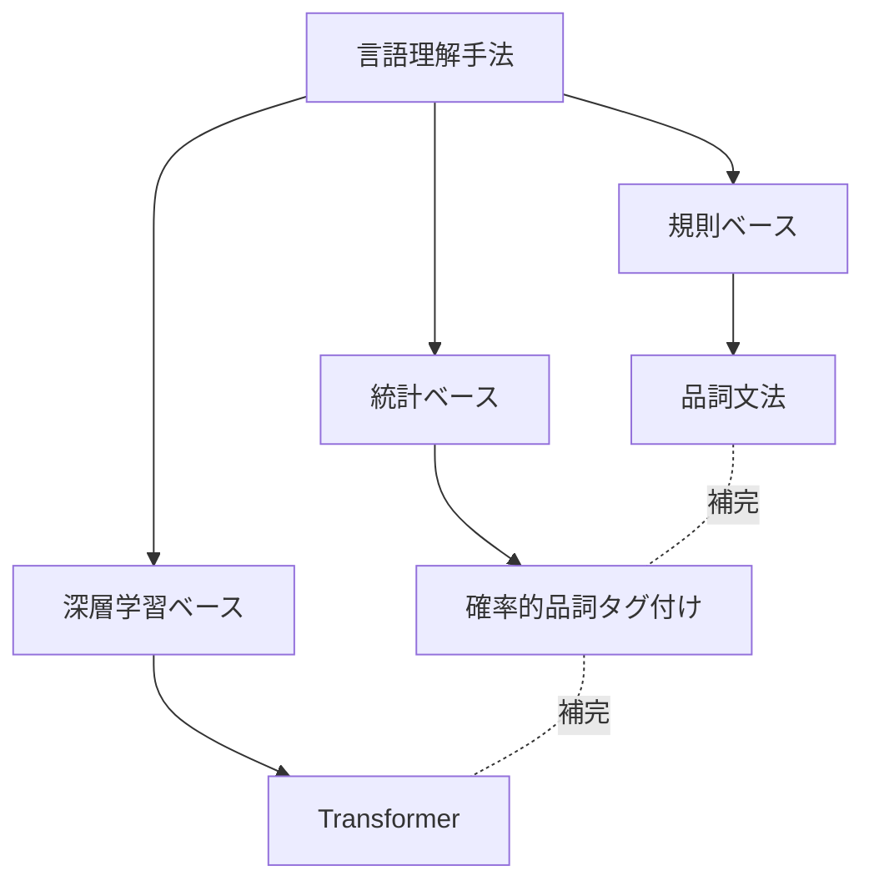

**現状：**
品詞の概念は消えていません。むしろ、最新のAIシステムも内部で品詞情報を活用しています。

## 🌍 実世界への影響とその後の発展

### 教育への影響

**世界中の言語教育の基礎**
- 小学校の国語：品詞の学習が必修
- 外国語学習：文法理解の出発点
- 論理的思考力の育成ツール

### テクノロジーへの影響

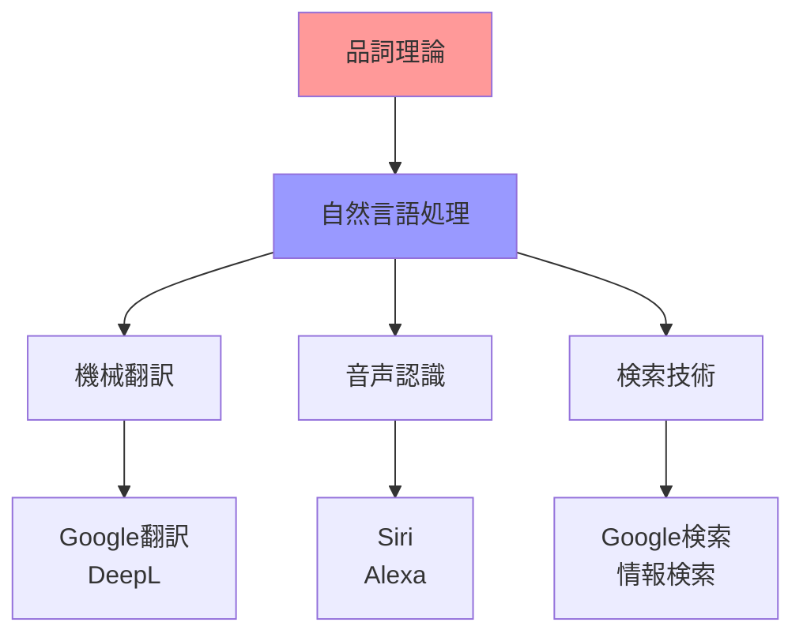

### 未来展望

**2025年以降の発展：**
1. **多言語品詞体系の統一**：AIによる言語間の橋渡し
2. **リアルタイム品詞解析**：会話中に自動で文法チェック
3. **個人化された言語学習**：品詞理解度に応じた教材提供
4. **より深い意味理解**：品詞を超えた概念理解へ

---

**この資料で、単語の役割が「言語という料理を作るレシピ」として立体的に理解できるはずです。**
