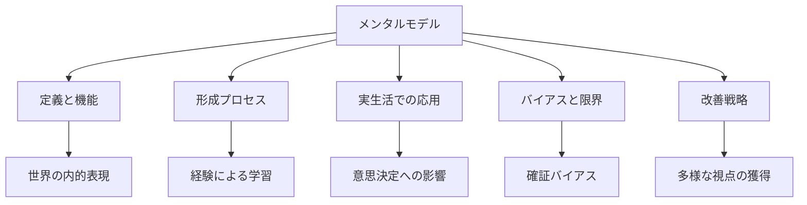
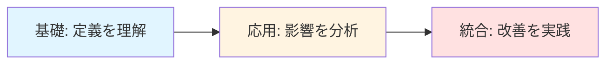
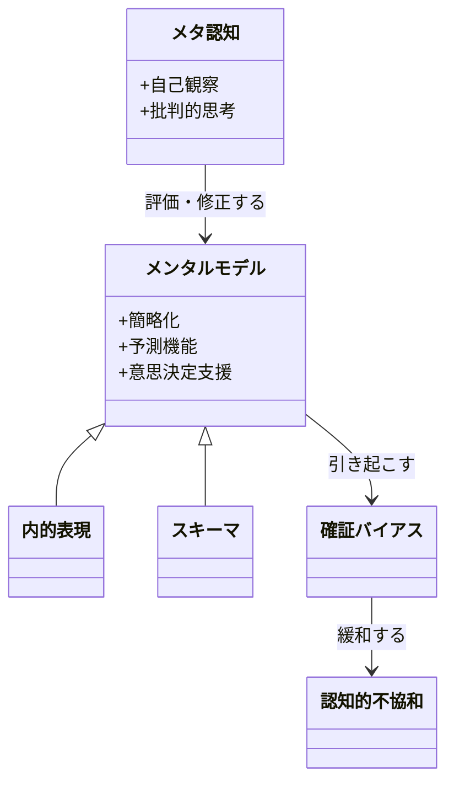
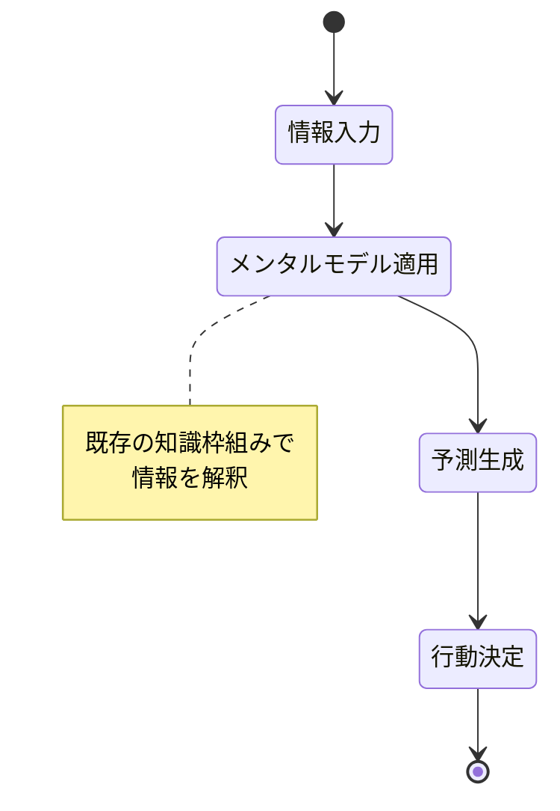
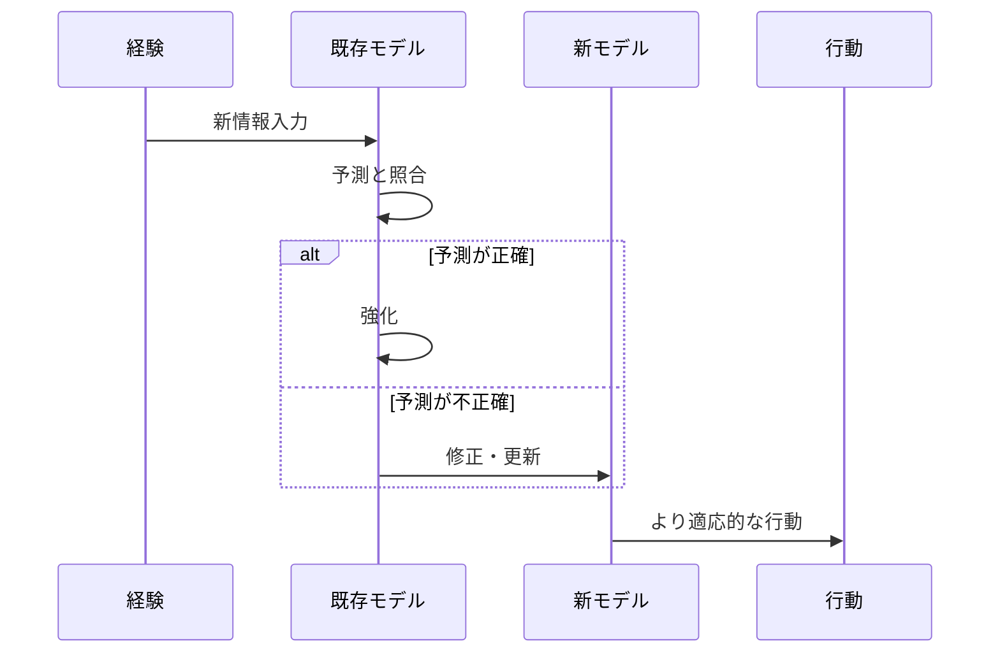
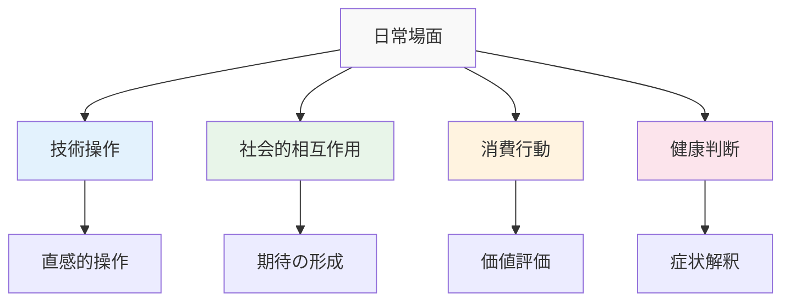
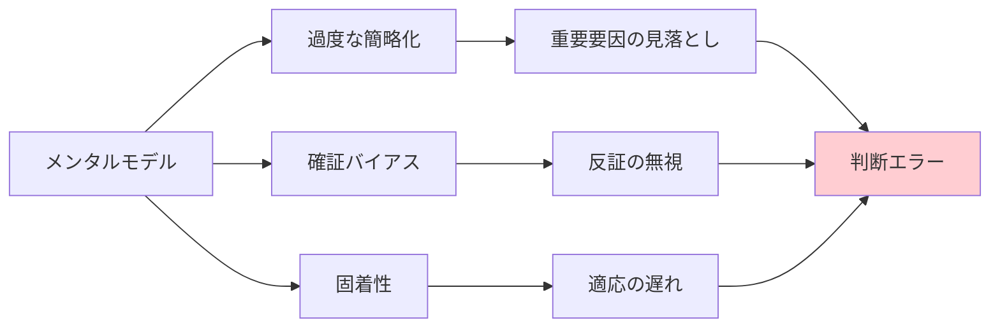
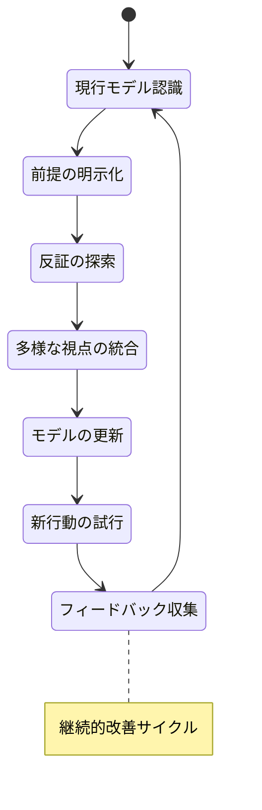
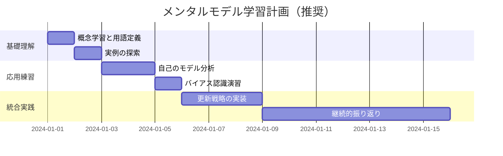

# メンタルモデル: 段階的理解ガイド

> **学習目標**: メンタルモデルの概念を理解し、思考や判断への影響を認識できるようになる
> **推奨学習時間**: 2-3時間
> **前提知識**: なし

---

## 1. 全体マップ

**メンタルモデルとは**、私たちが世界をどう理解し、予測し、意思決定するかの基盤となる「心の中の設計図」です。

### 学習範囲
- **含む内容**: 定義、形成プロセス、日常での影響、改善方法
- **含まない内容**: 神経科学的詳細、専門的認知心理学理論

### 主要トピック
1. メンタルモデルの定義と重要性
2. 形成メカニズム
3. 日常生活での実例
4. メンタルモデルの限界とバイアス
5. 効果的な更新方法

---

## 2. ガイド質問

### 基礎レベル ★☆☆
- メンタルモデルとは何か？
- なぜ私たちはメンタルモデルを持つのか？
- メンタルモデルはどのように形成されるか？

### 応用レベル ★★☆
- メンタルモデルが誤っている場合、どのような問題が起きるか？
- 自分のメンタルモデルをどうやって認識できるか？
- 異なる人が同じ状況を違う形で理解するのはなぜか？

### 統合レベル ★★★
- メンタルモデルと確証バイアスはどう関連するか？
- 効果的なメンタルモデルを構築するには何が必要か？
- 組織やチームでメンタルモデルの共有はなぜ重要か？

---

## 3. 核心概念

### 重要用語

**メンタルモデル（Mental Model）**
個人が外界の仕組みを理解するために脳内に構築する簡略化された表現。

**内的表現（Internal Representation）**
現実世界の対象や関係性を心の中で再現したもの。

**スキーマ（Schema）**
経験から形成される知識の枠組みで、新しい情報の解釈に使われる。

**確証バイアス（Confirmation Bias）**
既存のメンタルモデルを支持する情報だけを選択的に受け入れる傾向。

**認知的不協和（Cognitive Dissonance）**
メンタルモデルと矛盾する情報に出会ったときの心理的不快感。

**メタ認知（Metacognition）**
自分の思考プロセスを認識し評価する能力。

### 概念間の関係

**記憶補助（SCHEMA）**:
- **S**implified (簡略化された)
- **C**onstructed (構築された)
- **H**euristic (発見的)
- **E**xperience-based (経験に基づく)
- **M**ental (心的)
- **A**pproximation (近似)

---

## 4. 段階的詳細展開

### 4.1 メンタルモデルの定義と機能

#### 層1: 導入
メンタルモデルは、複雑な現実を理解可能にするための「簡略化された地図」です。地図が実際の地形を完全には再現しないように、メンタルモデルも現実の近似表現にすぎません。

#### 層2: 展開
私たちは日々、膨大な情報に晒されています。スマートフォンの操作、道路の横断、他者との会話など、すべての行動にメンタルモデルが関与します。

**具体例**: 
- **ドアノブのモデル**: 回すか押すかを瞬時に判断
- **天気のモデル**: 暗い雲を見て傘を持っていく
- **社会的モデル**: 初対面での適切な距離感の判断

**一般的な誤解**: メンタルモデルは「正確であるべき」ではなく、「有用であるべき」です。完璧な精度より、素早い判断が求められる場面が多いのです。

#### 層3: 要約
メンタルモデルは認知の効率化装置であり、不完全ながら日常生活を可能にする必須ツールです。

---

### 4.2 形成メカニズム

#### 層1: 導入
メンタルモデルは主に**直接経験**、**観察学習**、**文化的伝達**の3経路で形成されます。

#### 層2: 展開

**1. 直接経験による学習**
- 試行錯誤を通じて因果関係を理解
- 例: 子どもが熱いストーブに触れて「熱い物体は危険」というモデルを形成

**2. 観察学習（モデリング）**
- 他者の行動を見て学習
- 例: 料理番組を見て調理手順のモデルを獲得

**3. 言語・文化的伝達**
- 説明や指示を通じて獲得
- 例: 学校教育で科学的概念を学ぶ

**形成の特徴**:
- **漸進的**: 一度に完成せず、繰り返しの経験で洗練
- **文脈依存**: 同じ人でも状況によって異なるモデルを活性化
- **効率重視**: 完全性より処理速度を優先

#### 層3: 要約
メンタルモデルは多様な経路で段階的に構築され、実用性を重視して進化します。

---

### 4.3 日常生活での実例

#### 層1: 導入
メンタルモデルは意識されないまま、私たちの判断や行動を常に導いています。

#### 層2: 展開

**テクノロジー使用**
- **スマートフォン**: アイコンを「タップ」すると何かが起こるというモデル
- **誤ったモデルの例**: 高齢者が「強く押さないと反応しない」と誤解

**対人関係**
- **笑顔のモデル**: 笑顔=友好的というシンプルなモデル
- **文化差**: 視線の合わせ方に関するモデルは文化により異なる

**経済行動**
- **価格のモデル**: 「高価=高品質」という簡略化
- **限界**: ブランド価値や原価構造を無視した判断につながる

**健康管理**
- **病気のモデル**: 「風邪は暖かくすれば治る」
- **科学的モデルとの乖離**: ウイルス感染のメカニズムを正確に反映していない

#### 層3: 要約
様々な領域で作動するメンタルモデルは、効率的だが時に不正確な判断を導きます。

---

### 4.4 メンタルモデルの限界とバイアス

#### 層1: 導入
すべてのメンタルモデルは本質的に不完全であり、体系的な誤りを生じやすい構造を持ちます。

#### 層2: 展開

**主要な限界**

**1. 過度な簡略化**
- 複雑な現実を単純な因果関係に還元
- 例: 「勉強時間∝成績」というモデルは学習方法の質を無視

**2. 確証バイアスの強化**
- 既存モデルを裏付ける情報のみを探索・記憶
- 反証を無視または軽視する傾向

**3. 固着と硬直性**
- 一度形成されたモデルは変更が困難
- 例: 旧式のソフトウェアの操作法を新版でも適用しようとする

**4. 利用可能性ヒューリスティック**
- 思い出しやすい事例に基づいてモデルを形成
- メディアで報道される稀な事件を過大評価

**5. アンカリング効果**
- 最初に得た情報がモデルの基準点となる
- 後続情報の解釈を歪める

**誤ったモデルの実害**
- **医療**: 誤った病気のモデルが適切な治療を妨げる
- **投資**: 市場の誤ったモデルが金銭的損失を招く
- **対人関係**: ステレオタイプが偏見を固定化

#### 層3: 要約
メンタルモデルの構造的制約が認知バイアスを生み、判断の質を低下させる可能性があります。

---

### 4.5 効果的な更新方法

#### 層1: 導入
メンタルモデルの質を高めるには、意図的な更新と多様な視点の統合が必要です。

#### 層2: 展開

**実践的戦略**

**1. メタ認知の活性化**
- 「なぜそう考えたのか」を定期的に自問
- 前提条件を明示化する習慣

**2. 反証の積極的探索**
- 自分の仮説に反する証拠を意図的に探す
- 「もし自分が間違っていたら、どんな証拠があるはずか」と考える

**3. 多様な情報源の活用**
- 異なる専門領域の知見を統合
- 異なる文化・価値観を持つ人との対話

**4. フィードバックループの構築**
- 予測を明示し、結果と照合
- 誤りから体系的に学ぶ仕組み

**5. 外部化と可視化**
- モデルを図や文章で表現
- 他者と共有し批評を求める

**組織レベルの応用**
- **共有メンタルモデル**: チーム全体で状況理解を統一
- **学習する組織**: 失敗を組織的知識に転換
- **多様性の価値**: 異なるモデルを持つ人材が盲点を補完

**具体的演習**
- **前提チェック**: 「この判断の前提は何か」をリスト化
- **代替シナリオ**: 「別の見方をすれば」と3つの視点を考える
- **事後検証**: 重要な決定の1ヶ月後に結果を振り返る

#### 層3: 要約
メンタルモデルの改善は、自己の思考プロセスへの意識的介入と多様な視点の統合により達成されます。

---

## 5. 統合・実践

### ガイド質問への回答

**Q: メンタルモデルとは何か？**
A: 個人が世界の仕組みを理解・予測するために脳内に構築する簡略化された表現です。地図が実際の地形の近似であるように、メンタルモデルも現実の実用的な近似として機能します。

**Q: なぜメンタルモデルを持つのか？**
A: 認知資源の制約があるため、膨大な情報を効率的に処理する必要があります。メンタルモデルは素早い判断と予測を可能にし、日常生活を機能させます。

**Q: 効果的なメンタルモデルを構築するには何が必要か？**
A: ①自己の前提を意識するメタ認知、②反証を探す姿勢、③多様な情報源からの学習、④継続的なフィードバックと更新が必要です。

### 統合演習問題

**問題1: 実生活での応用**
あなたが最近行った重要な判断を1つ選び、以下を分析してください：
- どのようなメンタルモデルがその判断に影響したか
- そのモデルはどのように形成されたか
- 見落とした視点や前提はないか

**問題2: バイアスの認識**
ニュース記事を1つ読み、自分がどのような確証バイアスを示したか振り返ってください。記事の中で自分の既存信念と一致する部分と矛盾する部分をそれぞれ3つ挙げてください。

**問題3: モデルの外部化**
あなたの専門分野（または趣味）について、初心者に説明するメンタルモデルを図で表現してください。その後、その図の限界や簡略化した点を説明してください。

### 自己評価チェックリスト

- [ ] メンタルモデルを自分の言葉で説明できる
- [ ] 日常生活で作動している3つ以上のメンタルモデルを特定できる
- [ ] 確証バイアスが自分の判断に与える影響を認識している
- [ ] 自分のメンタルモデルの前提を明示化できる
- [ ] 反証を探す習慣を1つ実践し始めた
- [ ] 他者のメンタルモデルが自分と異なることを理解している

### 学習計画

---

## 学習の次のステップ

### 推奨発展テーマ
1. **システム思考**: メンタルモデルをより複雑なシステムレベルで理解
2. **認知バイアス**: 体系的なバイアスの分類と対策
3. **批判的思考**: メンタルモデルを評価する思考技術
4. **デザイン思考**: ユーザーのメンタルモデルを考慮した設計
5. **学習科学**: メンタルモデルの更新を促進する教育手法

### 推奨リソース
- **入門書**: メンタルモデルに関する認知科学の基礎文献
- **実践**: 日々の判断日記をつけ、使用したモデルを記録
- **コミュニティ**: 異なる背景を持つ人々との定期的な対話
