人間のメンタルモデルとAIとの間で、意思疎通に必要となるインタフェースである自然言語を、人間が上手にインプット・アウトプットする重要性について、特に人間のメンタルモデルの観点から説明

# 人間とAIをつなぐ自然言語インターフェース - メンタルモデル完全ガイド

## 🔍 一言要約
人間の頭の中の「思考の設計図」とAIの理解を橋渡しする、言葉という魔法の架け橋

## 📚 目次
1. [🌟 はじめに - なぜ言葉が重要なのか](#はじめに)
2. [🧠 メンタルモデルとは何か](#メンタルモデルとは)
3. [🏗️ 人間とAIの思考構造](#思考構造)
4. [⚡ 自然言語インターフェースの核心](#自然言語の核心)
5. [📜 コミュニケーションの進化史](#進化史)
6. [🎨 メンタルモデルの種類と特徴](#種類と特徴)
7. [📗 関連する重要概念](#関連概念)
8. [💡 上手な言葉の使い方のメリットとデメリット](#メリットデメリット)
9. [🚀 実践的な応用例](#応用例)
10. [🔄 従来手法からの変遷](#変遷)
11. [🆚 他の手法との比較](#比較)
12. [🌍 未来社会への影響](#未来への影響)

## 🌟 はじめに {#はじめに}

想像してください。あなたが外国人と話すとき、お互いの「頭の中の地図」が違うために、同じ言葉でも全く違う意味に受け取られることがあります。

人間とAIの関係も、まさにこれと同じです。人間には「メンタルモデル」という独特な思考の設計図があり、AIには独自の情報処理システムがあります。この2つの異なる世界をつなぐ唯一の手段が「自然言語」なのです。

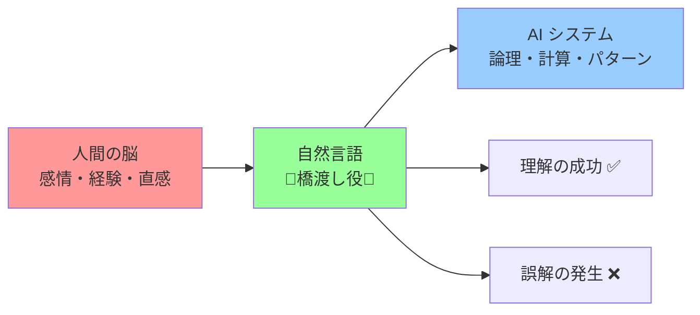

## 🧠 メンタルモデルとは何か {#メンタルモデルとは}

メンタルモデルとは、簡単に言うと「頭の中にある世界の設計図」です。

### 日常例で理解するメンタルモデル

🏠 **家の例**
- あなたが「家」と聞いて頭に浮かぶイメージ
- 玄関、リビング、台所の配置
- 「くつろぎの場所」という感情的な意味

🚗 **車の例**  
- エンジンをかける → アクセルを踏む → 動く
- 「移動手段」だけでなく「自由の象徴」としての意味

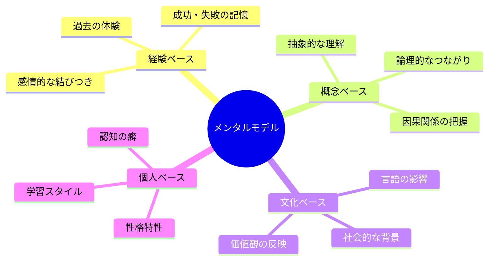

## 🏗️ 人間とAIの思考構造 {#思考構造}

人間とAIは、まったく違う方法で情報を処理します。

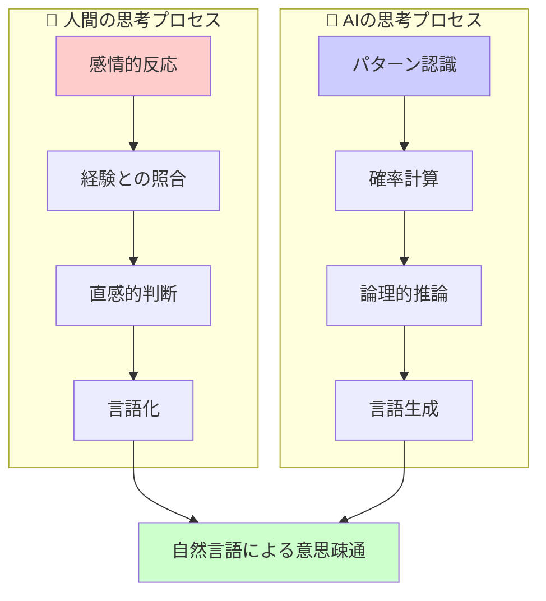

### 思考の違いを理解する

| 要素 | 人間 | AI |
|------|------|-----|
| **処理速度** | 遅い（熟考型） | 高速（瞬時） |
| **判断基準** | 感情・経験・価値観 | データ・確率・パターン |
| **エラー特性** | 感情的バイアス | 学習データの偏り |
| **創造性** | 経験から飛躍 | 既存パターンの組み合わせ |

## ⚡ 自然言語インターフェースの核心 {#自然言語の核心}

自然言語インターフェースは、人間とAIの間の「通訳者」の役割を果たします。

### インターフェースの3つの層

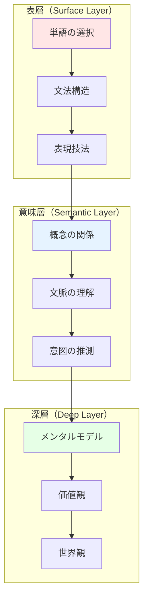

### 効果的なインプット・アウトプットの原則

**📥 インプット（人間 → AI）**
1. **具体性**: 抽象的な要求を具体例で補強
2. **文脈提供**: 背景情報の共有
3. **段階的説明**: 複雑な概念の分解

**📤 アウトプット（AI → 人間）**
1. **メンタルモデル対応**: 人間の理解パターンに合わせた説明
2. **視覚的補助**: 図表や例示の活用
3. **フィードバック設計**: 理解度確認の仕組み

## 📜 コミュニケーションの進化史 {#進化史}

人間とコンピューターの対話は、大きく4つの時代を経て進化してきました。

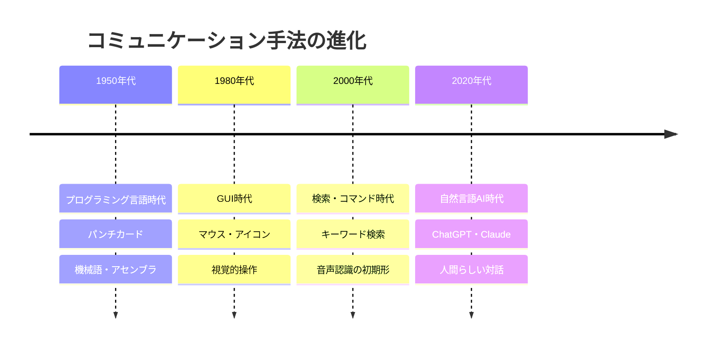

### 各時代の特徴

**🔧 プログラミング言語時代**
- 人間がコンピューターの言葉を学ぶ必要があった
- 高い専門知識が必要
- エラーの許容度が低い

**🖱️ GUI時代**
- 直感的な操作が可能になった
- しかし、複雑な指示は困難
- 予め用意された機能に限定

**🔍 検索時代**
- キーワードベースの意思疎通
- 情報の検索は得意、創造は苦手
- 人間側の言葉選びが重要

**🤖 自然言語AI時代**
- 人間の自然な表現に対応
- 文脈を理解した対話
- 創造的なタスクも可能

## 🎨 メンタルモデルの種類と特徴 {#種類と特徴}

人間のメンタルモデルは、大きく4つのタイプに分類できます。
- このガイドで提示されているメンタルモデルの定義「頭の中にある世界の設計図」は、認知科学における一般的な定義と一致します。しかし、構造型、プロセス型、機能型、因果型という分類は、特定の学術分野の標準的な分類というよりは、LLM（大規模言語モデル）の応答生成における思考パターンを説明するために独自に考案されたものと見られます。これは、心理学や認知科学で広く使用されている「メンタルモデル」の分類とは異なります。
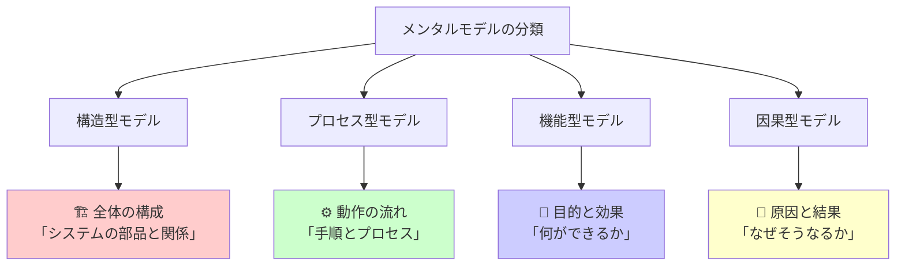

### それぞれの特徴と活用法

**🏗️ 構造型（Structure Model）**
- **特徴**: システム全体の構成要素と関係性を重視
- **AI対話での活用**: 「〇〇システムの構成要素を教えて」
- **例**: 「ウェブサイトはヘッダー、メイン、フッターで構成される」

**⚙️ プロセス型（Process Model）**  
- **特徴**: 時系列での変化や手順を重視
- **AI対話での活用**: 「〇〇の手順を段階的に説明して」
- **例**: 「料理は材料準備→調理→盛り付けの順番」

**🎯 機能型（Function Model）**
- **特徴**: 「何ができるか」という機能面を重視  
- **AI対話での活用**: 「〇〇の機能とメリットを教えて」
- **例**: 「スマートフォンは通話、ネット、カメラ機能がある」

**🔄 因果型（Causal Model）**
- **特徴**: 原因と結果の関係性を重視
- **AI対話での活用**: 「なぜ〇〇が起こるのか原因を分析して」  
- **例**: 「雨が降るのは大気中の水蒸気が冷やされるから」

## 📗 関連する重要概念 {#関連概念}

### 同義語・類義語
- **自然言語処理（NLP）**: コンピューターが人間の言葉を理解する技術
- **ヒューマンマシンインターフェース（HMI）**: 人間と機械の接点設計
- **認知科学**: 人間の思考プロセスを研究する学問
- **ユーザーエクスペリエンス（UX）**: 利用者の体験設計

### 対義語・対比概念
- **形式言語 vs 自然言語**: プログラミング言語 vs 日常会話
- **明示的知識 vs 暗黙知**: 言葉で説明できる vs 感覚的な理解
- **論理思考 vs 直感思考**: 段階的推論 vs 瞬間的判断

### 多義語の整理
**「インターフェース」の意味**
1. **技術的意味**: システム間の接続部分
2. **心理学的意味**: 人間の認知と外界の接点
3. **デザイン的意味**: 使いやすさを追求した設計

## 💡 上手な言葉の使い方のメリットとデメリット {#メリットデメリット}

### ✅ メリット

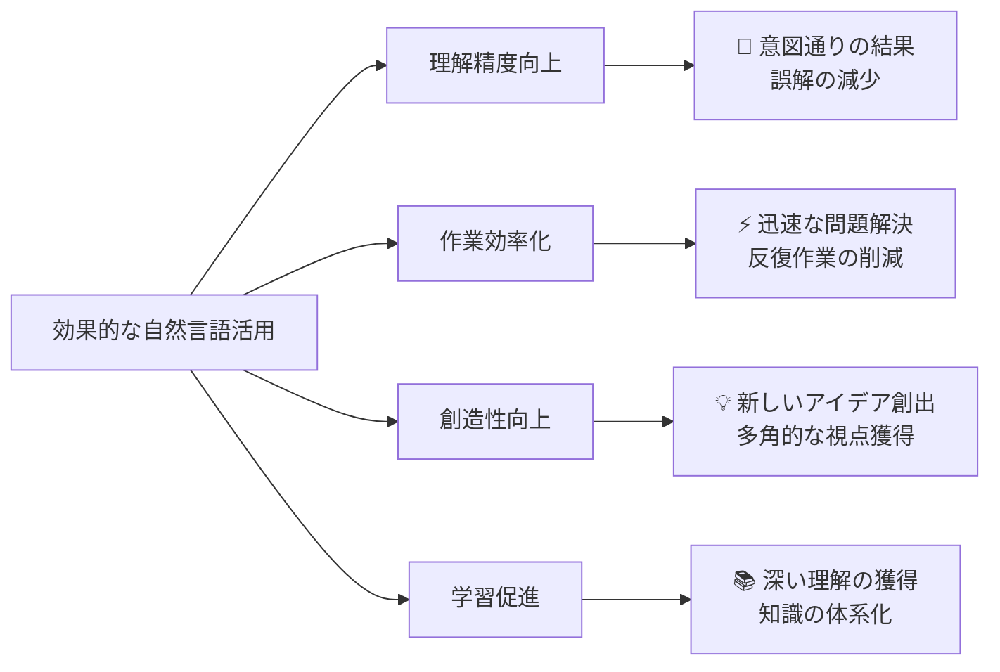

**具体的なメリット**
- **時間短縮**: 複雑な操作が言葉一つで完了
- **アクセシビリティ向上**: 専門知識不要でAI活用可能
- **個人化**: 自分の思考スタイルに合わせた対話
- **拡張性**: 新しいタスクに柔軟に対応

### ❌ デメリットと注意点

**🔍 精度の問題**
- 曖昧な表現による誤解
- 文化的背景の違いによる齟齬
- 専門用語の不正確な使用

**⚡ 効率性の問題**
- 詳細な説明が必要な場合の冗長性
- 繰り返し説明の必要性
- 学習コストの発生

**🔒 依存性の問題**
- AI能力への過度の依存
- 自己思考力の低下リスク
- プライバシーへの配慮不足

## 🚀 実践的な応用例 {#応用例}

### 場面別の効果的な自然言語活用法

**📚 学習支援での活用**

*従来の方法*:
「機械学習について教えて」

*メンタルモデルを考慮した方法*:
「私は料理が得意です。機械学習を料理のレシピ作りに例えて、初心者にもわかるように段階的に説明してください。特に、データの前処理を材料の下準備として説明してもらえますか？」

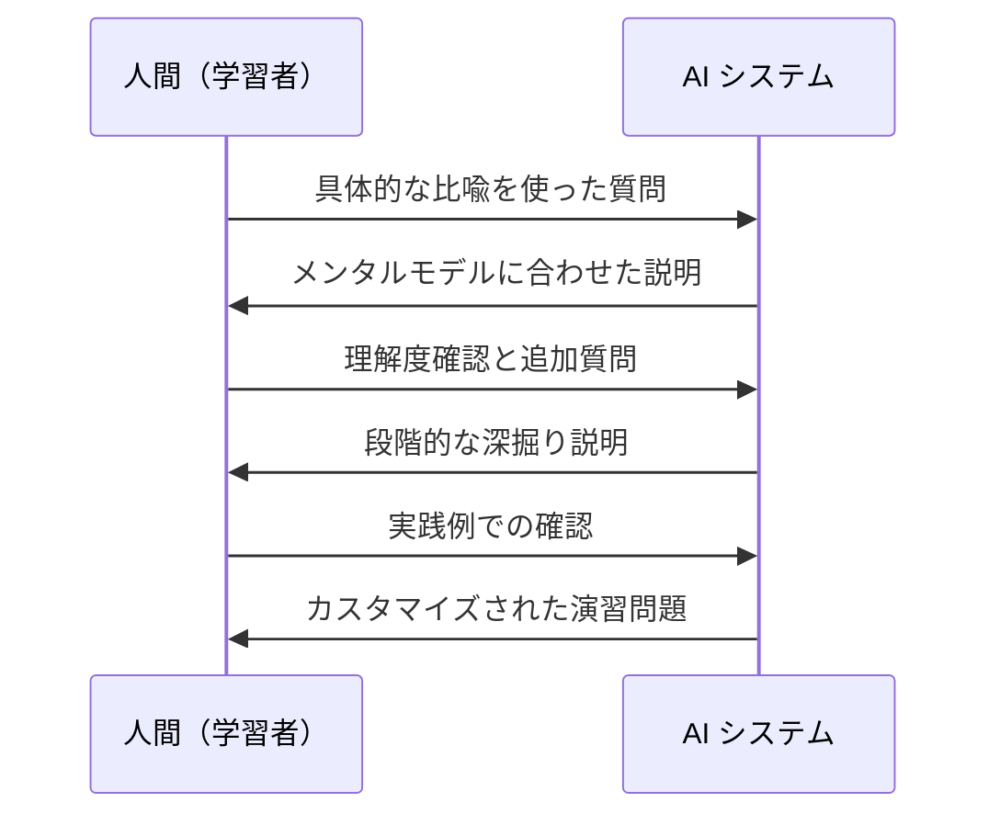

**💼 業務効率化での活用**

*従来の方法*:
「プレゼン資料を作って」

*メンタルモデルを考慮した方法*:
「次週の部長会議で新規事業提案をします。私は論理的な構成よりもストーリー性を重視する傾向があります。聞き手は保守的な50代の管理職です。彼らのメンタルモデルに響く、安全性と収益性を前面に出した構成で資料を作成してください」

### 成功パターンと失敗パターン

**✅ 成功パターン**
- 自分の知識レベルを明確に伝える
- 具体的な文脈と目的を共有する  
- 段階的な確認とフィードバックを行う
- 自分の思考スタイルを考慮してもらう

**❌ 失敗パターン**
- 抽象的すぎる依頼
- 文脈情報の不足
- 一方的な要求（対話の欠如）
- 結果の検証不足

## 🔄 従来手法からの変遷 {#変遷}

### 何を置き換えたか

**🔄 GUI操作の部分的置換**
- マウスクリックの連続 → 言葉による指示
- メニュー階層の探索 → 直接的な要求表現
- 複数アプリの連携作業 → 統合的な自然言語コマンド

**🔄 専門知識の学習プロセスの変革**
- 分厚いマニュアル → 対話的な質疑応答
- 試行錯誤による習得 → ガイド付きの段階的学習
- 一方向的な情報取得 → 双方向的な理解構築

### 継承したもの・されるもの

**🔗 継承したもの**
- 人間の言語能力（文法、語彙、表現力）
- 対話の文化的慣習（礼儀、配慮、文脈理解）
- 教育・学習の基本原理（段階性、反復、確認）

**🔗 将来継承されるもの**
- より高度なAIとの対話技術
- 多言語・多文化対応の基盤技術
- 感情・意図理解の発展した形

### 変遷の過程

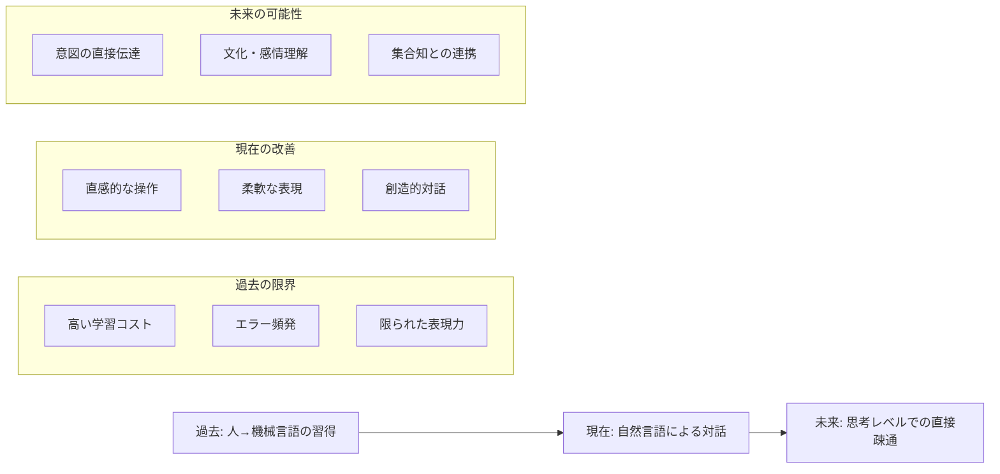

## 🆚 他の手法との比較 {#比較}

### 代替可能な手法との比較

**🆚 グラフィカルユーザーインターフェース（GUI）**

| 要素 | 自然言語IF | GUI |
|------|------------|-----|
| **学習コスト** | 低（日常言語活用） | 中（操作方法習得） |
| **表現力** | 高（無限の組み合わせ） | 中（予定された機能） |
| **精度** | 中（解釈の幅あり） | 高（明確な操作） |
| **創造性** | 高（新しい要求対応） | 低（既存機能内） |

**🆚 音声インターフェース**

音声は自然言語インターフェースの一形態ですが、テキストとは異なる特徴があります：

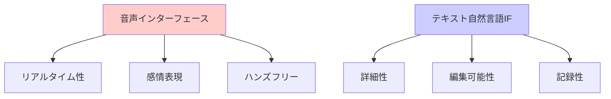

### 競合する手法

**🔄 ローコード・ノーコードプラットフォーム**
- **共通点**: 専門知識なしでの開発
- **差異**: 視覚的設計 vs 言語的指示
- **補完関係**: 設計は視覚的、調整は言語的

**🔄 拡張現実（AR）・仮想現実（VR）インターフェース**  
- **競合領域**: 直感的な操作体験
- **協調可能性**: 空間内での自然言語コマンド
- **未来統合**: マルチモーダルインターフェース

## 🌍 未来社会への影響 {#未来への影響}

### 短期的影響（2025-2030年）

**📈 社会変化**
- デジタルデバイドの縮小（言語能力があれば技術活用可能）
- 教育方法の革新（AIとの協働学習の普及）
- 働き方の変化（創造的作業へのシフト加速）

**🔧 技術発展**
- マルチモーダル対話（音声+テキスト+画像）
- リアルタイム翻訳の完全化
- 個人適応型インターフェース

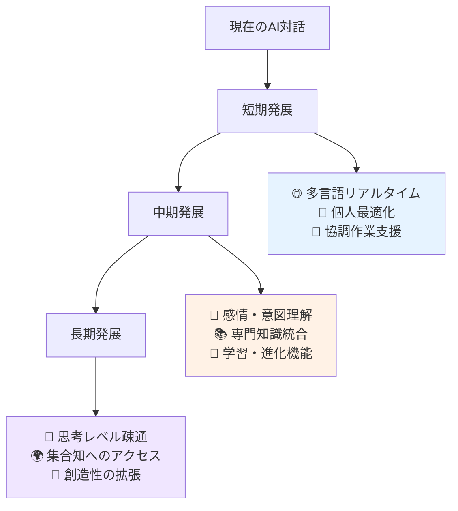

### 長期的展望（2030年以降）

**🧠 認知能力の拡張**
- 人間の記憶・計算能力の実質的向上
- 複数の視点を同時に理解する能力
- 創造的思考プロセスの効率化

**🌐 社会構造の変化**
- 知識ワーカーの役割再定義
- グローバルコミュニケーションの障壁除去  
- 新たな格差問題（AI活用スキル格差）

**🔮 想定される課題と対策**
- **プライバシー保護**: 思考内容の機密性確保
- **依存症対策**: 自立的思考能力の維持
- **文化多様性**: 画一化への対抗策

### 社会実装への提言

**🏛️ 政策面**
- AI対話リテラシー教育の標準化
- 倫理ガイドラインの策定
- セキュリティ基準の確立

**🏫 教育面**  
- メンタルモデル理解教育の導入
- 批判的思考力の強化
- 創造性育成カリキュラム

**🏢 企業面**
- 従業員のAI活用スキル向上支援  
- 業務プロセスの再設計
- 新たな価値創造モデルの構築

---

このガイドは、人間とAIの対話における自然言語インターフェースの重要性を、メンタルモデルという独特の視点から体系的に解説しています。初学者でも理解できる平易な表現を心がけながら、深い洞察と実践的な価値を提供することを目指しました。
