# メンタルモデル 完全理解ガイド 🧠

## 一言要約
**「頭の中の地図を見える化して、思考の仕組みを理解し、より良い判断ができるようになる技術」**

## 目次
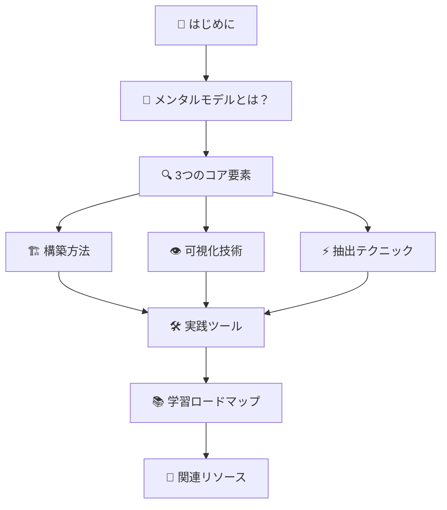

## はじめに

想像してください。あなたが新しい街に引っ越したとき、最初は迷子になってしまいます。でも時間が経つにつれて、頭の中に「この角を曲がれば駅」「あの建物の向こうにコンビニ」という**心の地図**ができあがります。

この心の地図こそが「**メンタルモデル**」です。私たちは日常生活のあらゆる場面で、無意識にメンタルモデルを使って世界を理解し、予測し、行動しています。

### なぜメンタルモデルが重要なのか？

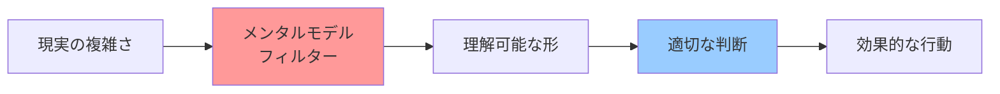

- **複雑さの削減**: 無限の情報を扱いやすい形に変換
- **予測の向上**: パターンを理解して未来を予測
- **意思決定の質**: より良い判断のための思考フレームワーク
- **コミュニケーション**: 他者との共通理解の構築

🧠 メンタルモデルとは？

#定義：頭の中の「作業仮説」
メンタルモデルとは、私たちが世界をどのように理解し、解釈するかの**内的表現**です。

**日常例で理解しよう：**

| 場面 | メンタルモデルの例 |
|------|-------------------|
| 🚗 運転 | 「この道は朝混む」「雨の日はブレーキが効きにくい」 |
| 👥 人間関係 | 「彼は論理的に話すと納得する」「彼女は感情を大切にする」 |
| 💼 ビジネス | 「顧客は価値を重視する」「競合は価格で勝負してくる」 |
| 📱 技術 | 「このボタンを押すとメニューが出る」「ファイルはフォルダに整理される」 |

#メンタルモデルの特徴

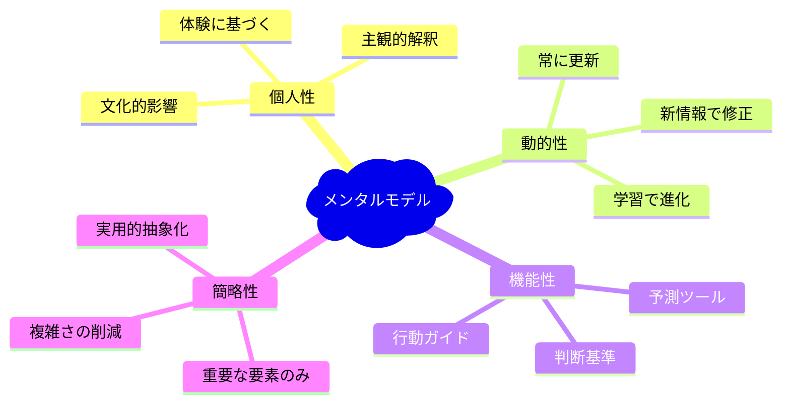

🔍 3つのコア要素

メンタルモデルの研究と活用には、3つの核となる要素があります：

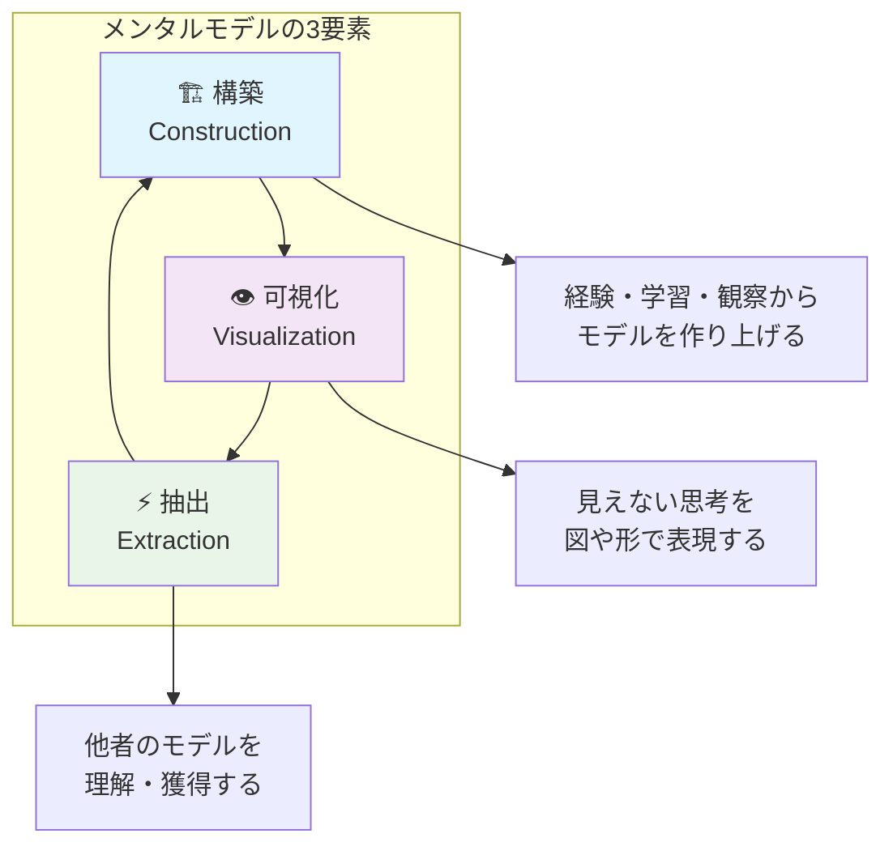

#なぜこの3つが重要なのか？

**料理に例えると：**
- **構築** = レシピを開発する（試行錯誤して美味しい作り方を見つける）
- **可視化** = レシピを文字や図で表現する（他の人に伝えられる形にする）
- **抽出** = 他の人のレシピを学ぶ（新しい技術や味を獲得する）

🏗️ 構築方法

#フェーズ1：観察と体験

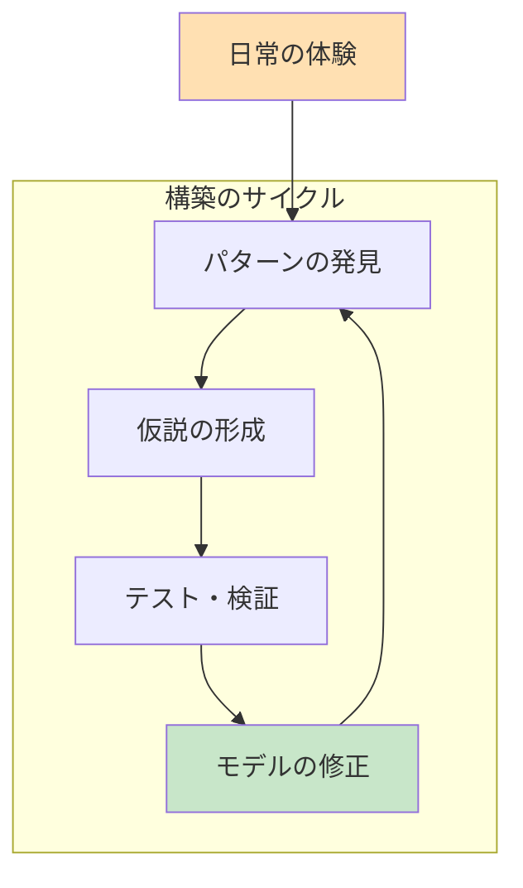

**実践的ステップ：**

1. **観察日記をつける**
   - 毎日の体験で気づいたパターンを記録
   - 「なぜこうなったのか？」を自問

2. **仮説を立てる**
   - 観察したパターンから「もしかすると...」という仮説を作る
   - 具体例：「雨の日は電車が遅れやすい」

3. **小さなテストをする**
   - 仮説が正しいか実際に確かめる
   - データを集める、実験してみる

4. **モデルを更新する**
   - 新しい情報で既存のモデルを修正
   - より正確で実用的なモデルに進化させる

#フェーズ2：構造化と体系化

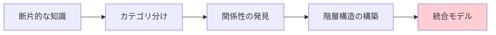

**ツールと技法：**

| 技法 | 説明 | 使用例 |
|------|------|---------|
| **マインドマップ** | 中心テーマから枝状に展開 | アイデアの整理、知識の体系化 |
| **概念図** | 要素間の関係を矢印で表現 | プロセス理解、因果関係の把握 |
| **階層図** | 上下関係や包含関係を表現 | 組織構造、分類体系の理解 |
| **フローチャート** | 手順やプロセスの流れを表現 | 作業手順、判断プロセスの理解 |

## 可視化技術

### なぜ可視化が必要なのか？

**「見えないものは管理できない」**

頭の中にあるメンタルモデルを外に出すことで：
- 他の人と共有できる
- 客観的に検証できる
- 改善点が見つかる
- 複雑な関係性が整理される

### 可視化の5つのレベル

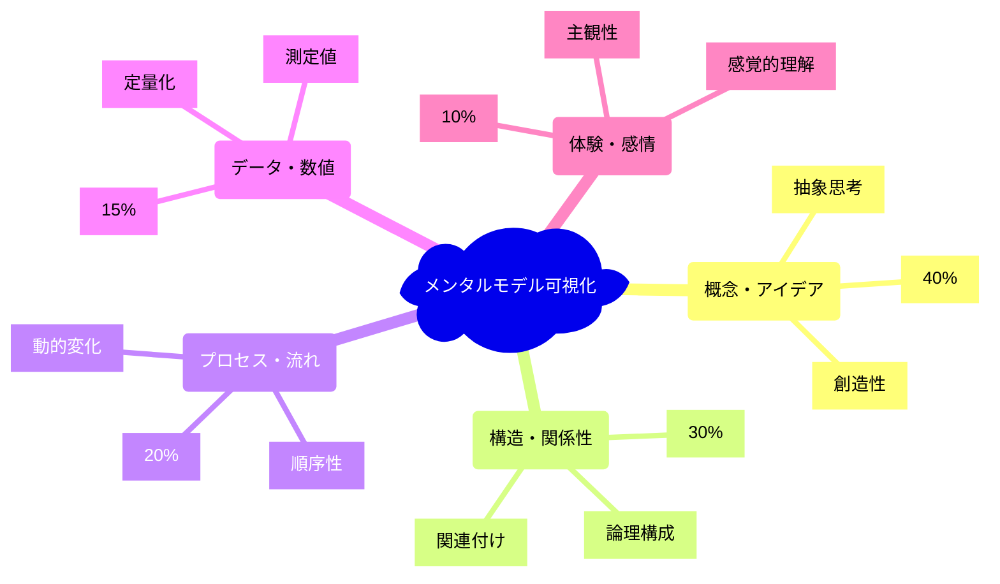

#### レベル1：概念・アイデアの可視化

**マインドマップの実践例：**

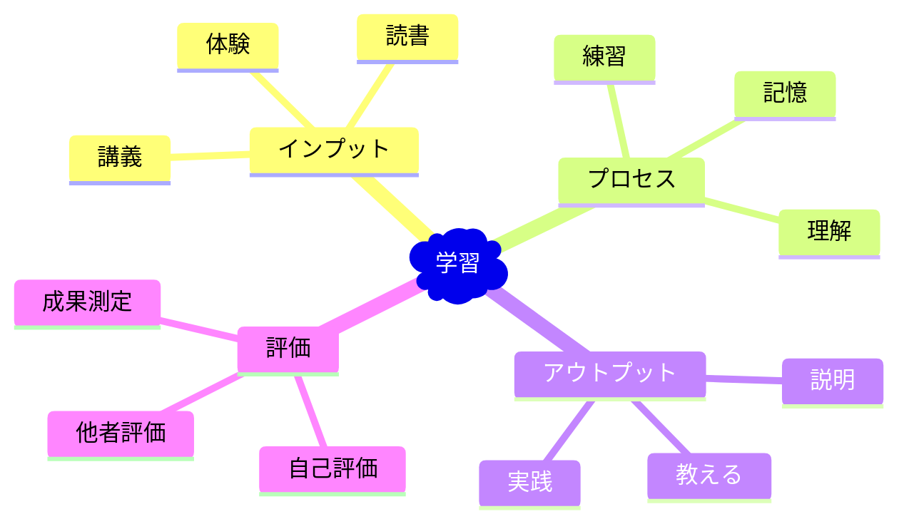

#### レベル2：構造・関係性の可視化

**システム思考ダイアグラム：**

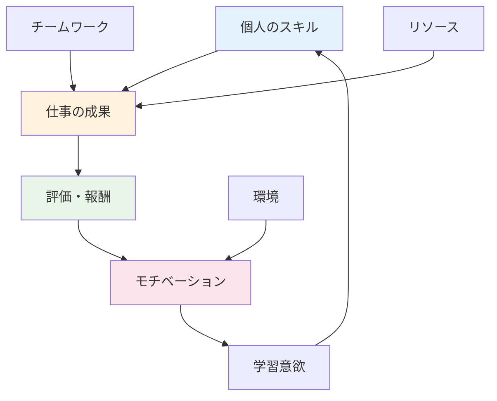

#### レベル3：プロセス・流れの可視化

**プロセスマップの例：**

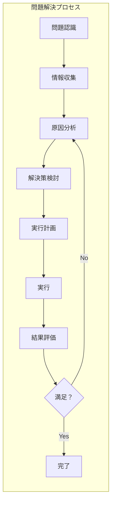

### 可視化ツールの選択指針

| 目的 | 推奨ツール | 特徴 |
|------|------------|------|
| **ブレインストーミング** | マインドマップ | 自由度高、発散的思考 |
| **システム理解** | システムマップ | 相互関係、フィードバックループ |
| **プロセス設計** | フローチャート | 順序、条件分岐 |
| **データ分析** | グラフ・チャート | 定量的関係、トレンド |
| **ストーリー** | ジャーニーマップ | 時系列、体験の流れ |

## 抽出テクニック

### 他者のメンタルモデルを理解する技術

他の人がどのように世界を理解しているかを知ることで、自分のモデルを豊かにできます。

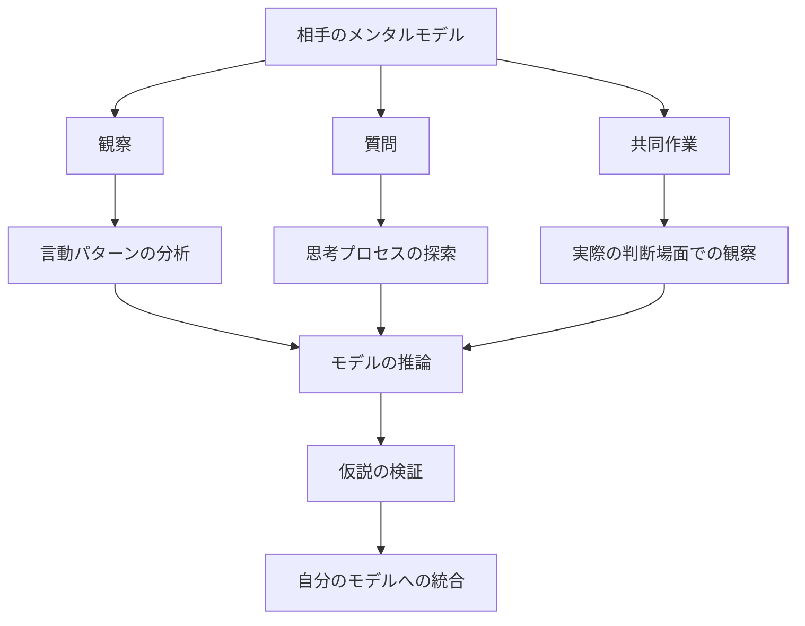

### 抽出の3つの手法

#### 1. 観察による抽出

**何を観察するか：**
- 判断の傾向とパターン
- 優先順位のつけ方
- 問題解決のアプローチ
- 情報の処理方法

**実践例：**
```
「彼はいつも数字を最初に確認する」
→ データドリブンなメンタルモデル

「彼女は関係者の気持ちを気にかける」
→ 人間関係重視のメンタルモデル
```

#### 2. 質問による抽出

**効果的な質問例：**

| 質問の種類 | 質問例 | 抽出できること |
|------------|---------|----------------|
| **理由探索** | 「なぜそう判断したのですか？」 | 判断基準、価値観 |
| **プロセス探索** | 「どのような手順で考えましたか？」 | 思考の流れ、手法 |
| **仮定探索** | 「どんな前提で考えていますか？」 | 基本的な信念、仮定 |
| **比較探索** | 「他の選択肢と比べてなぜ？」 | 優先順位、評価軸 |

#### 3. 共同作業による抽出

**協働学習の設計：**

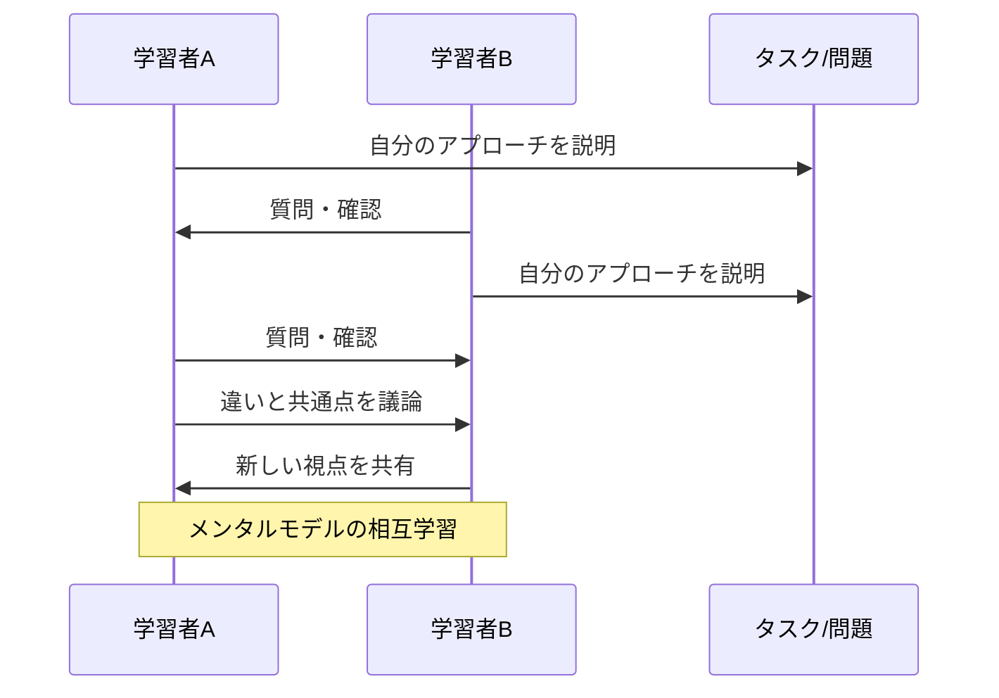

### 抽出したモデルの活用法

1. **自分のモデルとの比較**
   - 違いと共通点を明確化
   - 盲点や改善点の発見

2. **統合と拡張**
   - 有効な部分を自分のモデルに組み込み
   - より豊かで実用的なモデルに発展

3. **状況別の使い分け**
   - 場面に応じて最適なモデルを選択
   - 複数の視点からの問題解決

## 実践ツール

### デジタルツール

### アナログツール

**なぜアナログも重要なのか？**
- 手を動かすことで思考が活性化
- デジタルの制約から自由
- 即座にアイデアを表現可能

**効果的なアナログツール：**
- **付箋紙**: アイデアの整理、グルーピング
- **大きな紙**: 全体像の把握、自由な表現
- **色ペン**: 分類、重要度の表現
- **ホワイトボード**: 協働作業、動的な変更

### 実践的な使い分け

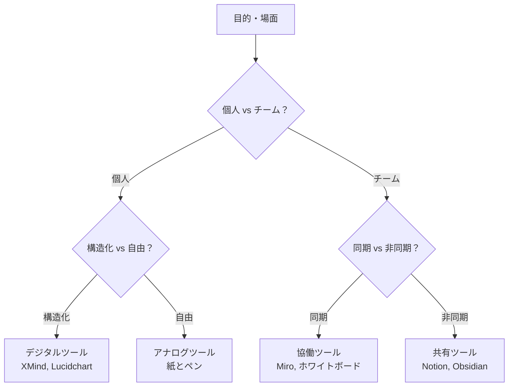

## 学習ロードマップ

### 🌱 初級レベル（0-3ヶ月）
**目標：メンタルモデルの基本概念を理解し、簡単な可視化ができる**

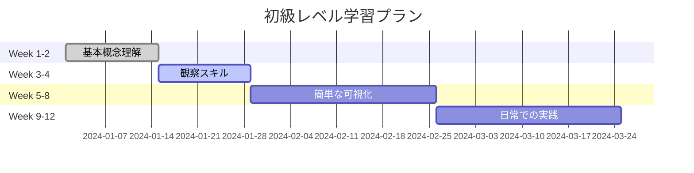

**学習内容：**
1. **Week 1-2: 概念理解**
   - メンタルモデルとは何か
   - 日常生活での例を見つける
   - 基本的な可視化手法を学ぶ

2. **Week 3-4: 観察力向上**
   - 自分の思考パターンを観察
   - 他者の判断パターンを観察
   - 観察日記の開始

3. **Week 5-8: 基本的な可視化**
   - マインドマップの作成
   - 簡単なフローチャートの作成
   - 一つのツールに習熟

4. **Week 9-12: 実践と定着**
   - 週1回のモデル見直し
   - 小さな改善の積み重ね
   - 成果の記録

### 🌿 中級レベル（3-9ヶ月）
**目標：複雑なモデルの構築と、他者との協働ができる**

**学習内容：**
- システム思考の導入
- 複数の可視化手法の使い分け
- チームでのモデル構築
- 抽出技術の習得

### 🌳 上級レベル（9ヶ月以上）
**目標：メンタルモデルを教育や組織変革に活用できる**

**学習内容：**
- 組織レベルのモデル分析
- 文化や価値観の可視化
- チェンジマネジメントへの応用
- 研究・開発への活用

## 関連リソース


### 🛠️ 実践プロジェクト

**スキル向上のためのプロジェクト案：**

1. **個人プロジェクト**
   - 自分の職業スキルのメンタルモデル構築
   - 日常の意思決定プロセスの可視化
   - 学習方法の最適化

2. **チームプロジェクト**
   - チームの協働パターンの分析
   - プロジェクト管理手法の改善
   - コミュニケーションモデルの構築

3. **組織プロジェクト**
   - 企業文化の可視化
   - 業務プロセスの改善
   - 変革管理の設計

---

## 次のステップ

このガイドを読み終えたあなたは、メンタルモデルの全体像を理解できました。さあ、実際に始めてみましょう！

**今すぐできること：**

1. **5分間の観察**: 今日一日の自分の判断を振り返る
2. **簡単な図を描く**: 何か一つのプロセスを図に表現してみる
3. **質問してみる**: 誰かに「なぜそう思うのか？」を聞く

**1週間以内に：**
- 一つのツールをダウンロードして使ってみる
- 観察日記を開始する
- 小さなメンタルモデルを一つ作ってみる

**1ヶ月以内に：**
- より複雑なモデルに挑戦
- 他の人とモデルを共有する
- フィードバックを求めて改善する

メンタルモデルの世界は奥深く、一生をかけて探求できる分野です。しかし、その第一歩を踏み出すことで、あなたの思考と判断は確実に向上するでしょう。

**頭の中の地図を、一緒に描いていきましょう！** 🗺️✨
