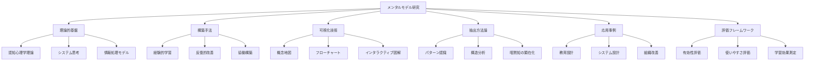
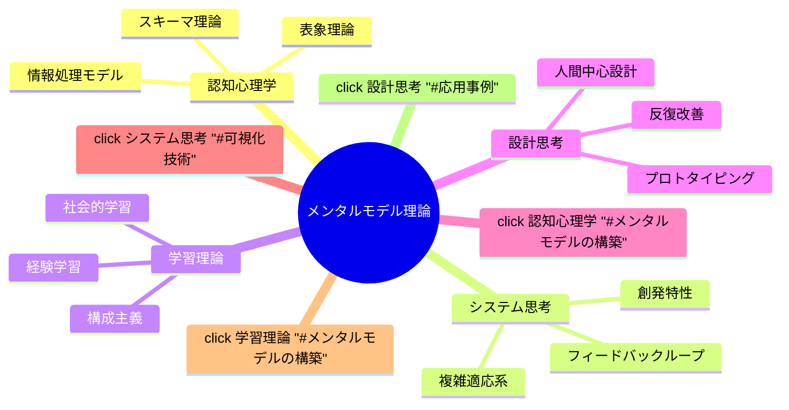
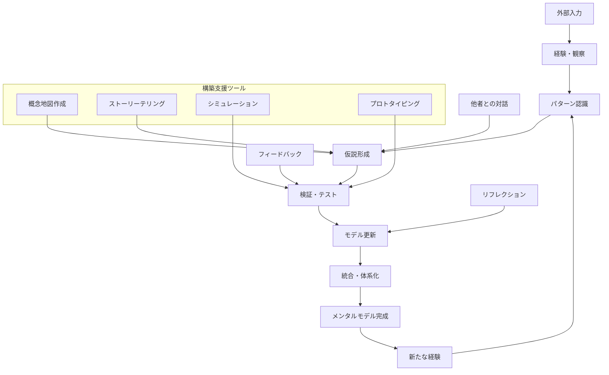
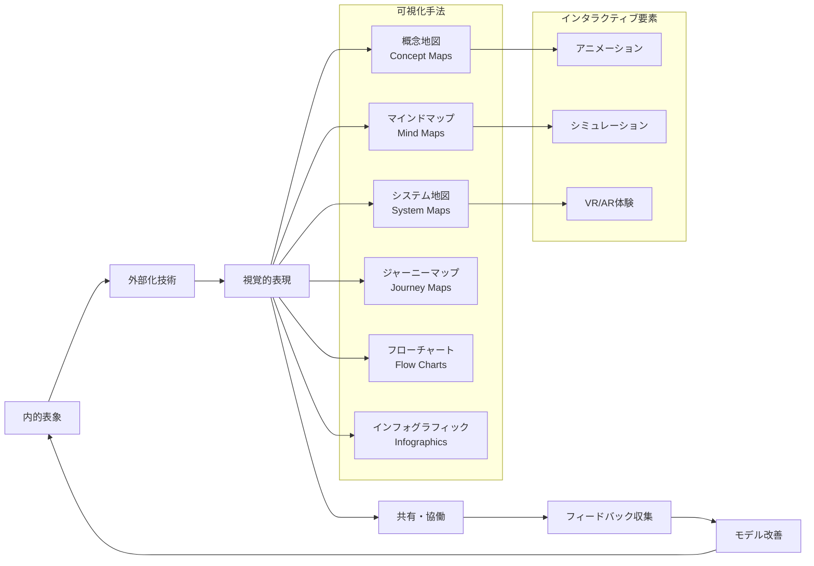
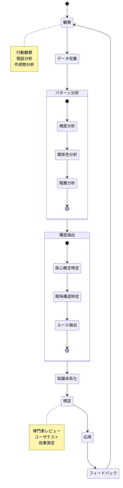
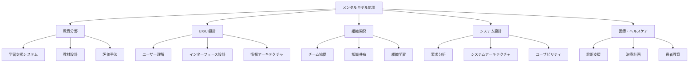
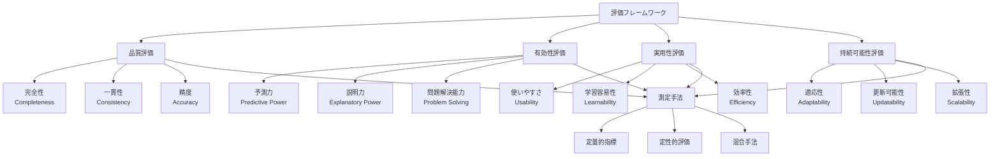
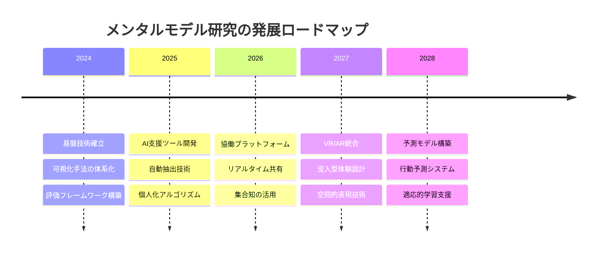

# doc_genai_Exploring_mental_model_construction_visualization_and_extraction
メンタルモデルの構築と可視化と抽出の探求

# メンタルモデルの構築と可視化と抽出の探求

## 全体戦略

本プロジェクトは、人間の認知プロセスにおけるメンタルモデルの**構築（Construction）→可視化（Visualization）→抽出（Extraction）**という一連のサイクルを体系的に探求し、実践可能な方法論として確立することを目指します。

## 目次

1. [理論的基盤](#理論的基盤)
2. [メンタルモデルの構築](#メンタルモデルの構築)
3. [可視化技術](#可視化技術)
4. [抽出方法論](#抽出方法論)
5. [応用事例](#応用事例)
6. [評価フレームワーク](#評価フレームワーク)
7. [ツールとリソース](#ツールとリソース)
8. [今後の研究方向](#今後の研究方向)

---

## 理論的基盤

メンタルモデルの探求における学術的・理論的基盤を提供します。認知心理学、システム思考、情報処理理論の統合的理解を構築します。

### 主要概念

- **メンタルモデル**: 人間が現実世界を理解し予測するために内的に構築する認知的表象
- **スキーマ**: 知識や経験を整理・統合する認知的枠組み
- **システム思考**: 要素間の関係性や全体的パターンに着目する思考法

---

## メンタルモデルの構築

個人および集団におけるメンタルモデルの形成プロセスと構築手法を体系化します。

### 構築手法

1. **経験的学習サイクル**: 体験→省察→概念化→実験の循環
2. **協働的構築**: 複数の視点を統合したモデル形成
3. **反復的改善**: 継続的なフィードバックによる精緻化

---

## 可視化技術

メンタルモデルを外部化し、他者と共有可能な形式で表現する技術と手法を探求します。

### 可視化の原則

- **明確性**: 複雑な概念をシンプルに表現
- **一貫性**: 統一されたビジュアル言語の使用
- **インタラクティビティ**: 動的な探索と操作の提供

---

## 抽出方法論

既存のメンタルモデルから有用な知見や パターンを抽出し、再利用可能な知識として体系化する手法を開発します。

### 抽出技術

1. **プロトコル分析**: 思考過程の言語化分析
2. **行動観察**: 実際の行動パターンからの推論
3. **構造化インタビュー**: 体系的な知識抽出

---

## 応用事例

メンタルモデル研究の実践的応用例を分野別に整理し、成功要因と課題を分析します。

### 応用の成功要因

- **文脈の理解**: 適用領域の特性に応じたカスタマイズ
- **反復的改善**: 継続的なフィードバックと改善
- **多様性の尊重**: 異なる視点やバックグラウンドの統合

---

## 評価フレームワーク

メンタルモデルの品質、有効性、実用性を評価するための体系的枠組みを提供します。

### 評価指標

- **定量的指標**: 精度、効率性、学習時間の測定
- **定性的評価**: ユーザビリティ、満足度の評価
- **長期的影響**: 学習効果、行動変容の追跡

---

## ツールとリソース

研究と実践を支援するツール、データセット、参考文献を整理します。

### 開発・可視化ツール

- **Mermaid**: フローチャート・図表作成
- **Draw.io/Lucidchart**: 概念地図作成
- **Kumu**: システム地図・ネットワーク分析
- **Gephi**: ネットワーク可視化・分析

### 分析ツール

- **R/Python**: データ分析・統計処理
- **ATLAS.ti/NVivo**: 質的データ分析
- **Cytoscape**: ネットワーク分析

### データセット

- 教育領域のメンタルモデル事例
- UXデザインプロセスの記録
- 組織学習の事例研究

---

## 今後の研究方向

メンタルモデル研究の発展方向と新たな課題を整理します。

### 重点研究領域

1. **AI支援**: 機械学習によるパターン抽出の自動化
2. **協働技術**: リアルタイム共有・編集プラットフォーム
3. **没入型体験**: VR/ARを活用した立体的表現
4. **個人化**: ユーザー特性に応じた最適化

---

## 貢献とライセンス

### 貢献方法

1. **Issue報告**: バグや改善要求の報告
2. **Pull Request**: 新機能や修正の提案
3. **ドキュメント**: 文書の改善・翻訳
4. **事例共有**: 応用事例の投稿

## 設計思想

本プロジェクトは以下の原則に基づいて設計されています：

- **人間中心**: 人間の認知プロセスを尊重した設計
- **オープンサイエンス**: 知識の共有と協働の促進
- **実践指向**: 理論と実践の緊密な結合
- **持続可能性**: 長期的な発展を見据えた設計

---
