プロンプトエンジニアリングにおける、自分のメンタルモデルから自分の意図を言語化する重要性について

# プロンプトエンジニアリング - 初学者のための完全ガイド

## 🔍 一言要約
**心の中の考えを正確にAIに伝える技術**

## 📚 目次
1. [🌟 はじめに](#-はじめに)
2. [🧠 メンタルモデルとは](#-メンタルモデルとは)
3. [🏗️ プロンプトエンジニアリングの基本構造](#️-プロンプトエンジニアリングの基本構造)
4. [⚡ 意図の言語化プロセス](#-意図の言語化プロセス)
5. [📜 技術発展の歴史](#-技術発展の歴史)
6. [🎨 プロンプトの種類と特徴](#-プロンプトの種類と特徴)
7. [📗 関連する用語](#-関連する用語)
8. [💡 メリットとデメリット](#-メリットとデメリット)
9. [🚀 応用技術と実用化の例](#-応用技術と実用化の例)
10. [🌍 実世界への影響とその後の発展](#-実世界への影響とその後の発展)

## 🌟 はじめに

想像してください。あなたが海外の友人に日本料理の作り方を電話で教えているシーンを。相手は日本語が分からず、あなたも相手の言語が分からない。でも、なんとか美味しい料理を作ってもらいたい。

これがまさに**プロンプトエンジニアリング**の本質です。私たちの頭の中にある「こうしてほしい」という願いを、AIが理解できる形に翻訳する技術なのです。


AIとの対話で「思っていたのと違う答えが返ってきた」経験はありませんか？それは、あなたの心の中にある**メンタルモデル**（考えの設計図）を正確に言葉にできていないからかもしれません。

## 🧠 メンタルモデルとは

メンタルモデルとは、**あなたの頭の中にある「世界の理解の仕方」**です。まるで心の中の地図のようなものです。

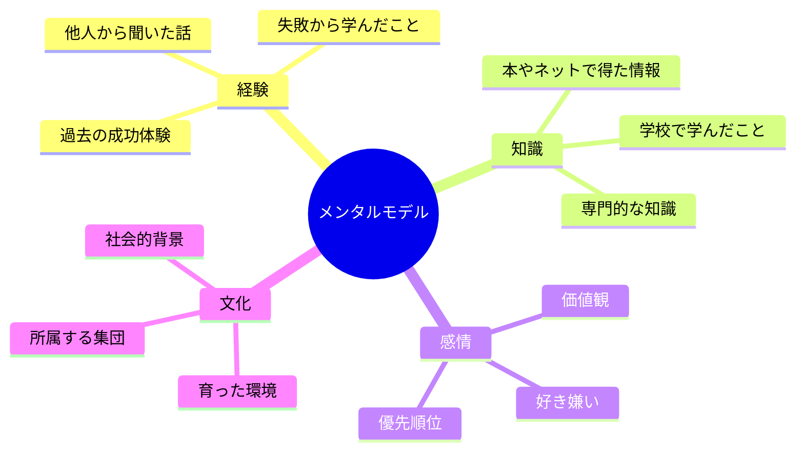

### 日常例で理解するメンタルモデル

**例：「美味しいラーメン」を友人に説明する場合**

- **Aさんのメンタルモデル**: 「美味しい＝濃厚な豚骨スープ」
- **Bさんのメンタルモデル**: 「美味しい＝あっさりした塩スープ」
- **Cさんのメンタルモデル**: 「美味しい＝麺の食感が重要」

同じ「美味しいラーメン」でも、人によって頭の中の設計図が違うのです。

## 🏗️ プロンプトエンジニアリングの基本構造

プロンプトエンジニアリングは、**翻訳の芸術**です。心の言葉を、AIの言葉に変換する技術です。

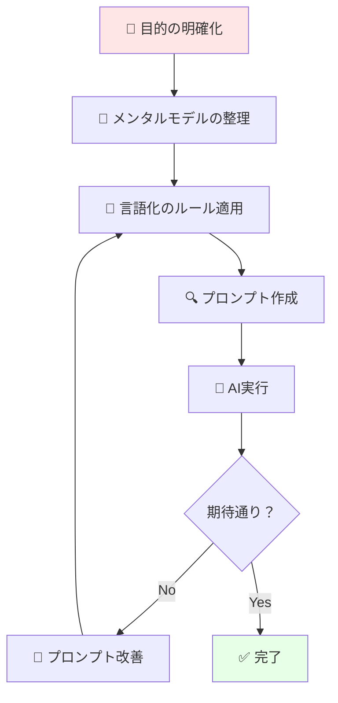

### 構造の詳細解説

1. **目的の明確化**: 何を達成したいかをハッキリさせる
2. **メンタルモデルの整理**: 自分の考えを整理する
3. **言語化のルール適用**: AIが理解しやすい形に変換
4. **改善サイクル**: うまくいかなかったら修正

## ⚡ 意図の言語化プロセス

意図の言語化は、**心の通訳**です。以下の5段階で進めます。

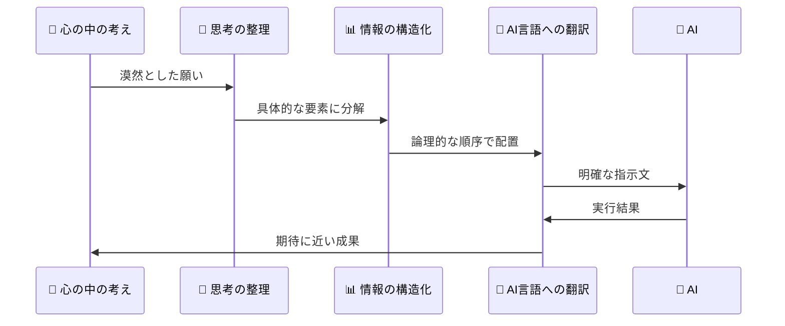

### 実践例：「面白い記事を書いて」の言語化

❌ **悪い例（曖昧）**：
```
面白い記事を書いてください
```

✅ **良い例（具体的）**：
```
【対象読者】：20代の社会人女性
【テーマ】：時短レシピ
【文体】：親しみやすく、実用的
【文量】：800文字程度
【構成】：問題提起→解決策→具体例→まとめ
【求める反応】：「今日試してみよう！」と思ってもらいたい
```

## 📜 技術発展の歴史

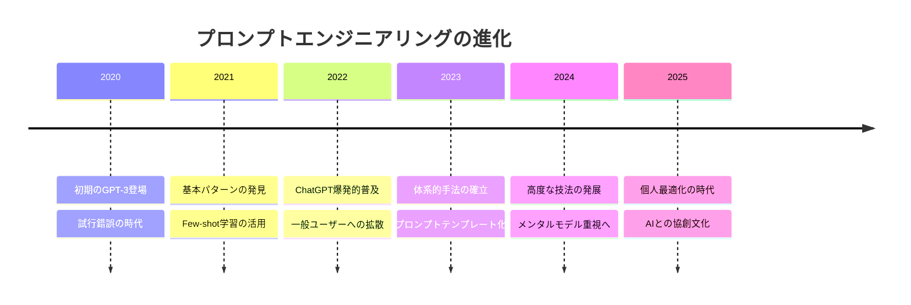

### 発見に至った経緯

2020年、OpenAIのGPT-3が登場したとき、多くの人が困惑しました。「どう話しかければいいかわからない」という声が続出。まるで、突然現れた天才だが癖のある助手に、どう仕事を頼めばいいかわからない状況でした。

初期の利用者たちが試行錯誤を重ねる中で、「AIには人間とは違う伝え方が必要」ということが判明。そこから、人間の意図をAIに正確に伝える技術として**プロンプトエンジニアリング**が体系化されました。

## 🎨 プロンプトの種類と特徴

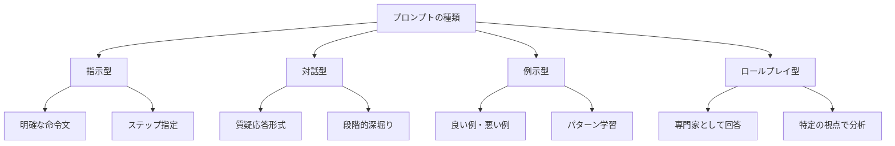

### 種類別特徴表

| 種類 | 適用場面 | メリット | 注意点 |
|------|----------|----------|---------|
| **指示型** | 明確な作業依頼 | 効率的、再現性高 | 創造性に制限 |
| **対話型** | 探索的な議論 | 柔軟性、発見性 | 時間がかかる |
| **例示型** | 品質の統一 | 理解しやすい | 例に引っ張られる |
| **ロールプレイ型** | 専門的分析 | 深い洞察 | 設定が重要 |

## 📗 関連する用語

### 核となる概念群

**プロンプト（Prompt）**
- **意味**: AIへの指示文
- **日常例**: レストランでの注文のようなもの
- **同義語**: 指示、命令、リクエスト

**メンタルモデル（Mental Model）**
- **意味**: 頭の中の理解の枠組み
- **日常例**: 心の中の地図や設計図
- **類似概念**: 思考の枠組み、認知モデル

**意図（Intent）**
- **意味**: 本当に実現したい目的
- **日常例**: 旅行で「楽しみたい」という根本的な願い
- **対比語**: 表面的な要求

### 技術用語の比較

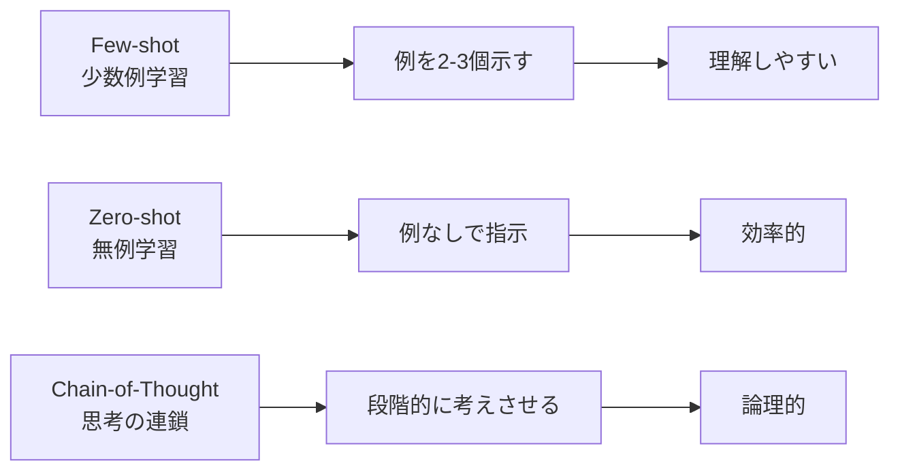

## 💡 メリットとデメリット

### ✅ メリット

**1. コミュニケーション精度の向上**
- 望む結果が得られる確率が大幅アップ
- 試行錯誤の時間が短縮

**2. 思考の整理効果**
- 自分の考えが明確になる
- 問題の本質が見えてくる

**3. AIとの協創関係**
- AIを単なる道具から相棒へ
- 創造的な作業のパートナー

### ❌ デメリット

**1. 学習コストの負担**
- 最初は時間がかかる
- 技法の習得が必要

**2. 過度の構造化リスク**
- 自発的な発想を制限する可能性
- 型にはまりすぎる危険

**3. AI依存の懸念**
- 自分で考える力の低下
- クリティカルシンキングの衰退

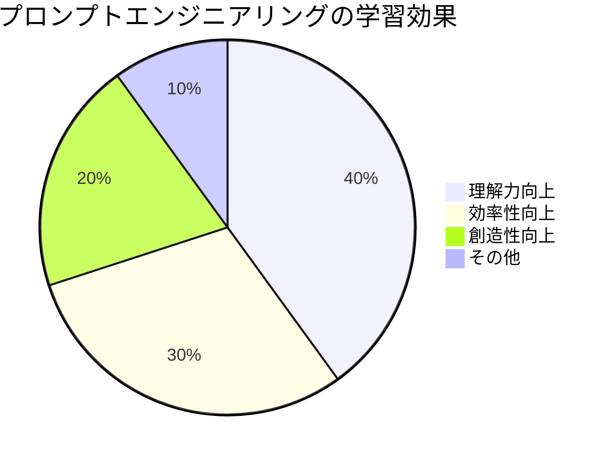

## 🚀 応用技術と実用化の例

### 身近な活用シーン

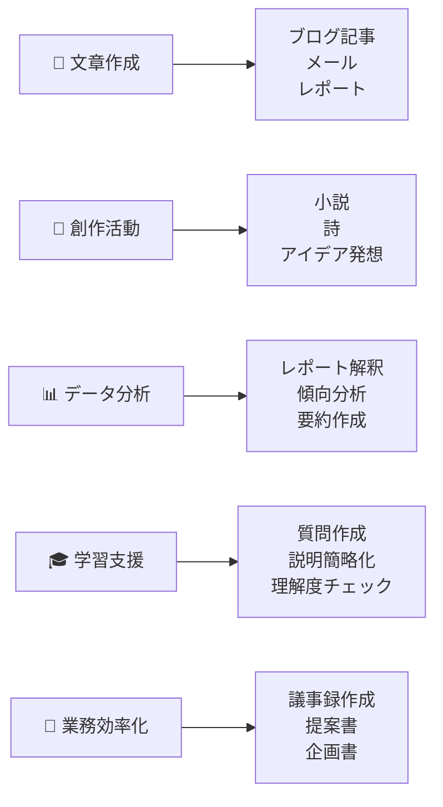

### 実際の応用フロー

**例：マーケティング資料作成**

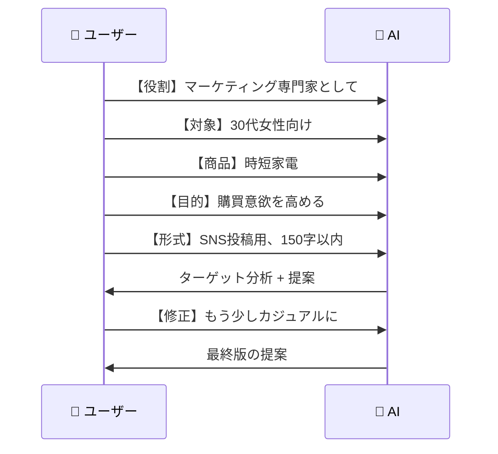

## 🌍 実世界への影響とその後の発展

### 現在の影響マップ

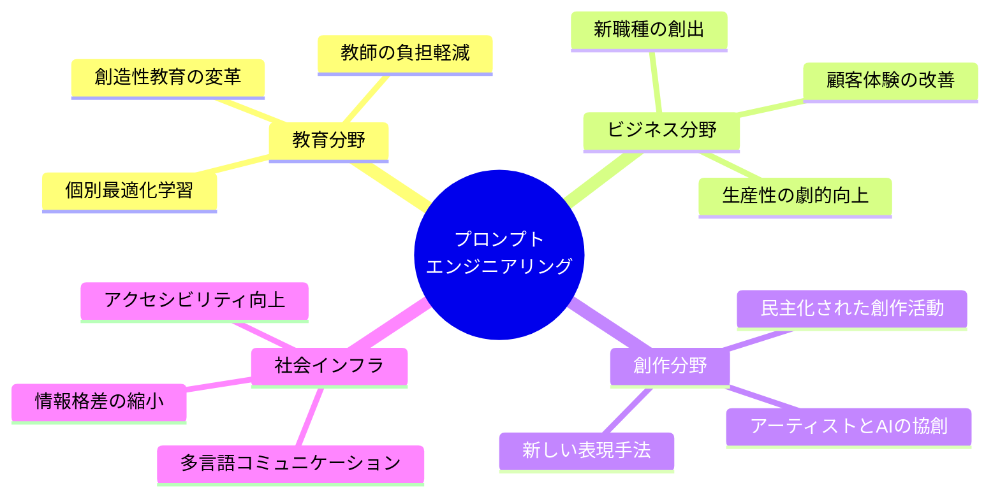

### 未来展望（2025-2030年）

**🔮 予想される発展**

1. **パーソナル化の進化**
   - 個人の思考パターンを学習するAI
   - 「阿吽の呼吸」レベルでの意思疎通

2. **マルチモーダル対応**
   - 音声、画像、動画を組み合わせたプロンプト
   - 感情や文脈を読み取る技術

3. **協創プラットフォーム**
   - 人間とAIが共同で作品を生み出す環境
   - リアルタイムでの意図の共有

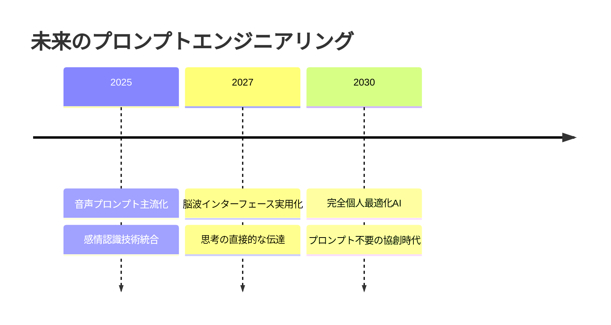

---


この資料により、初学者がプロンプトエンジニアリングの本質である「メンタルモデルの言語化」を体系的に理解し、実践できるようになることを目指しました。
