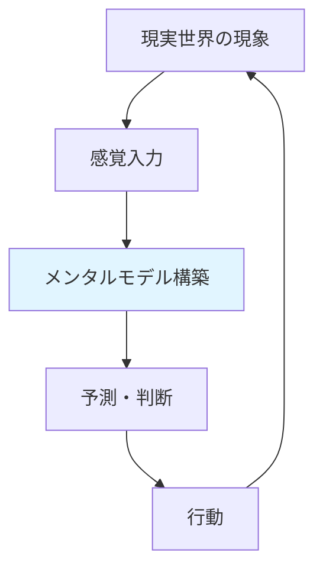
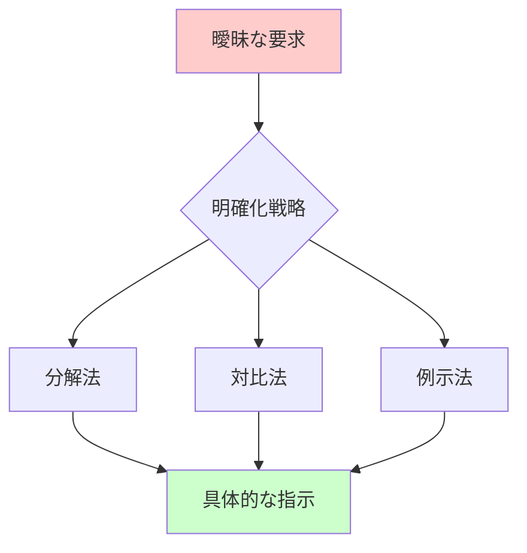
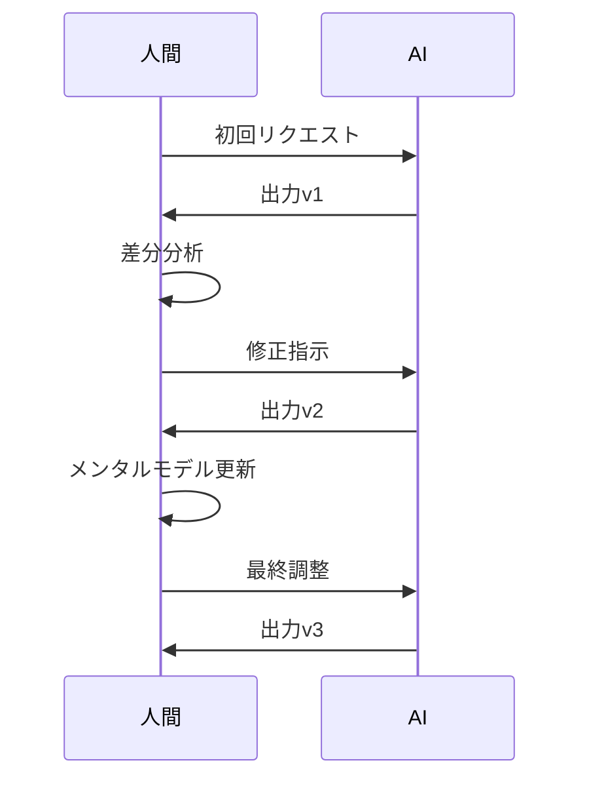
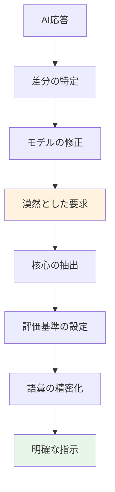

# 自然言語インタフェースとメンタルモデル

## 概要

人間とAIの対話において、自然言語は両者をつなぐ唯一の架け橋である。しかし、この橋が機能するかは、人間が自身の思考構造（メンタルモデル）をどれだけ言語化できるかにかかっている。本稿では、メンタルモデルの特性を理解し、それを効果的に言語へ変換する技術の重要性を解説する。

---

## 1. メンタルモデルとは何か

### 1.1 定義と機能

**メンタルモデル**とは、人間が世界を理解するために脳内に構築する簡略化された表現である。これは物理的現実の「地図」のようなもので、完全な再現ではなく、必要な情報を抽出した実用的な模型といえる。

人間の思考はこのモデルに基づいて動作する。たとえば「ファイルを保存する」という行為を理解する際、実際のストレージ機構を知らなくても、「書類を引き出しにしまう」という既存のモデルを援用して操作できる。

### 1.2 メンタルモデルの特性

メンタルモデルには三つの重要な特性がある。第一に**個人性**：同じ現象でも、経験や文化によって異なるモデルが形成される。第二に**暗黙性**：モデルの多くは無意識下で機能し、言語化されていない。第三に**不完全性**：現実の簡略版であるため、必然的に欠落や歪みを含む。

これらの特性が、AI対話における課題の源泉となる。

---

## 2. 自然言語という変換器

### 2.1 思考から言語への変換プロセス

思考を言語化するプロセスは、三次元の立体を二次元の図面に変換することに似ている。脳内では並列的・非線形的に存在する概念を、時系列に並ぶ単語の列へと変換しなければならない。

この変換過程で情報の損失は避けられない。「嬉しい」という単語は、その瞬間の複雑な感情状態の一部しか伝えない。

### 2.2 AIとの対話における固有の課題

AIは人間と異なり、共有された身体経験や文化的文脈を持たない。人間同士なら「あの感じ」で通じる暗黙知も、AIには明示的に説明する必要がある。

たとえば「自然な文章を書いて」という指示は、「自然」の基準が話者のメンタルモデル内にしか存在しないため、AI側で解釈の幅が生じる。これは、共有メンタルモデルの不在が生む典型的な問題である。

---

## 3. インプット技術：要求の明確化

### 3.1 メンタルモデルの外部化戦略

効果的なAI対話の第一歩は、自分のメンタルモデルを観察可能な形に変換することである。これには三つのアプローチがある。

**分解法**：漠然とした要求を構成要素に分割する。「良い提案書」→「説得力がある」+「簡潔」+「視覚的に整理」のように。

**対比法**：望むものと望まないものを並べて示す。「このような形式ではなく、あのような形式で」という指定は、曖昧さを大幅に削減する。

**例示法**：抽象的な説明より、具体例を提示する。「カジュアルなトーン」より「友人へのメール程度の丁寧さ」のほうが伝わりやすい。

### 3.2 文脈情報の提供

AIは会話の文脈を一部保持するが、人間の頭の中にある背景情報は知らない。「前提条件」「制約」「目的」を明示することで、AI側のメンタルモデル構築を助ける。

「資料を作って」ではなく「社内の非技術職向けに、15分で読める技術概要資料を作って」と指定すれば、AIは適切なメンタルモデルを推定できる。

---

## 4. アウトプット技術：解釈と評価

### 4.1 AIの出力を読み解く

AIからの応答を受け取る際、それが自分の意図と一致するかを判断する必要がある。ここで重要なのは、**差分の特定**である。

期待とのズレが生じたとき、それは三つの原因のいずれかに起因する：①入力の不明瞭さ、②AIの解釈の限界、③自分のメンタルモデルの曖昧さ。③のケースは特に重要で、AIとの対話を通じて初めて「自分が何を求めていたか」が明確になることがある。

### 4.2 反復的洗練プロセス

効果的な対話は一往復では完結しない。初回の出力を叩き台として、「ここはもっと具体的に」「この部分は不要」と修正を重ねる。

このプロセスは、人間側のメンタルモデルも洗練させる。何を求めているかが対話を通じて明確化されるのだ。

---

## 5. メンタルモデルの限界と拡張

### 5.1 認知バイアスの影響

人間のメンタルモデルは完璧ではない。**確証バイアス**（自分の信念を支持する情報を優先する傾向）や**利用可能性ヒューリスティック**（思い出しやすい例を過大評価する傾向）など、認知バイアスが判断を歪める。

AIに「客観的な評価」を求める際、実は自分の偏ったメンタルモデルを押し付けていないか、メタ認知的な注意が必要である。

### 5.2 対話による相互学習

AIとの対話は一方向的な指示ではなく、双方向の学習プロセスと捉えるべきだ。人間はAIの応答から新しい視点を得てメンタルモデルを更新し、その更新されたモデルでより良い質問を投げる。

この循環が成立すると、対話は単なる情報取得を超えて、思考の拡張ツールとなる。

---

## 6. 実践的ガイドライン

### 6.1 効果的なインプットのチェックリスト

- **目的の明示**：何のためにこの情報が必要か
- **制約の列挙**：長さ、形式、トーンなどの制限
- **文脈の提供**：読者、状況、前提知識
- **期待の具体化**：抽象語を避け、測定可能な基準を示す
- **例の活用**：理想像を具体例で補強

### 6.2 メンタルモデルの可視化演習

自分の思考構造を意識するため、以下の問いを習慣化する：

- 「この要求の本質は何か？」（核心の抽出）
- 「どのような条件を満たせば成功か？」（評価基準の明確化）
- 「なぜこの表現を選んだか？」（語彙選択の意図確認）

---

## 7. 典型的な失敗パターン

### 7.1 過度の暗黙性

「良い感じで」「適当に」といった指示は、人間同士でも誤解を生む。AIには共有文脈がないため、このような暗黙性は確実に失敗を招く。

### 7.2 メンタルモデルの押し付け

「当然これは分かるはず」という前提で対話すると、AIは異なる解釈をする。人間の「常識」はAIの「常識」ではない。

### 7.3 一発完璧主義

初回の指示で完璧な結果を期待するのは非現実的である。反復的改善を前提とした対話設計が重要だ。

---

## 8. 高度なテクニック

### 8.1 メタ認知的対話

自分の思考プロセス自体をAIに説明する手法である。「私はXという目的でYを求めているが、そのために必要な情報は何か？」とAIに問うことで、自分のメンタルモデルの盲点を発見できる。

### 8.2 ロールプレイング法

AIに特定の役割を与える（「あなたは批判的な読者です」）ことで、自分とは異なる視点からのフィードバックを得る。これは人間のメンタルモデルを多角化する訓練となる。

---

## 9. 組織・社会への応用

### 9.1 チーム内でのメンタルモデル共有

個人のAI対話技術は、チームのコミュニケーション品質向上にも寄与する。「自分の意図を明確に言語化する」習慣は、同僚との対話でも有効だ。

### 9.2 教育への示唆

従来の教育は知識の伝達に重点を置いたが、AI時代には「自分の思考を明確化し、外部化する能力」がより重要になる。メンタルモデルの可視化は、21世紀の基礎リテラシーといえる。

---

## 10. 今後の展望

### 10.1 AIの進化と対話の変化

AIがより高度な文脈理解能力を獲得すれば、人間側の明示化負担は減るかもしれない。しかし、メンタルモデルの個人性は不変であり、「自分が何を求めているか」を言語化する能力の価値は失われない。

### 10.2 人間の認知能力の拡張

AIとの対話を通じて、人間は自身の思考の構造を客観視する機会を得る。これは単なるツール使用を超えて、メタ認知能力の向上という認知的成長をもたらす可能性がある。

---

## まとめ

自然言語は人間とAIをつなぐインタフェースだが、その効果は人間側のメンタルモデルをどれだけ正確に言語化できるかに依存する。メンタルモデルは個人的・暗黙的・不完全であるため、意識的な外部化努力が必要となる。

効果的な対話には、①自分の要求を構成要素に分解する、②文脈情報を明示する、③反復的に洗練する、という三つの技術が核心となる。これらは単にAI利用の技術ではなく、自己の思考を明確化するメタ認知能力の訓練でもある。

AI時代において、自分の思考構造を言語という「外部記憶装置」に正確に写し取る能力は、新たな基礎リテラシーとなるだろう。

**次のステップ**: 実際のAI対話で、自分の指示を「分解」「対比」「例示」の三つの観点から見直し、明確化の練習を始めることを推奨する。
