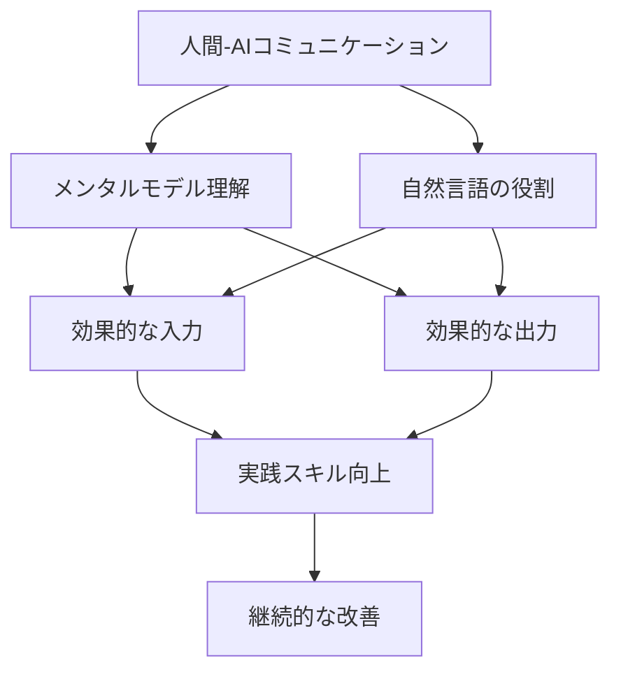
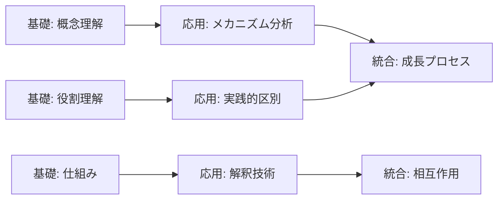
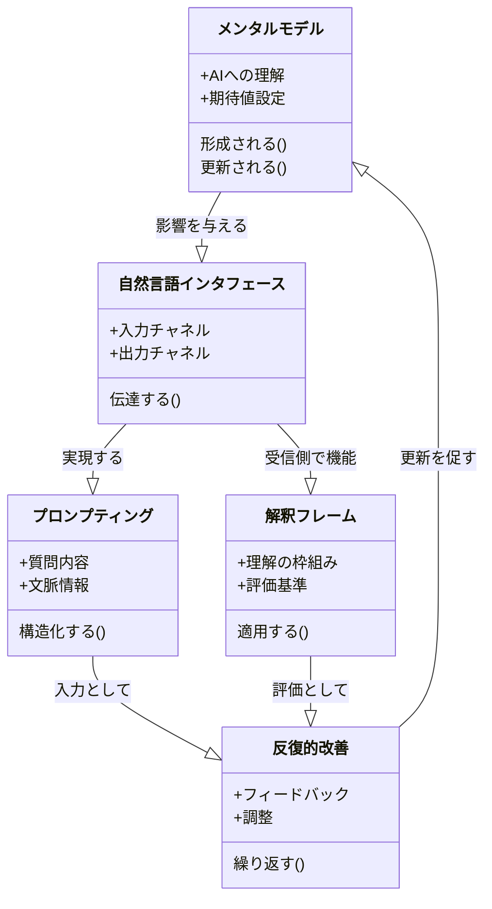
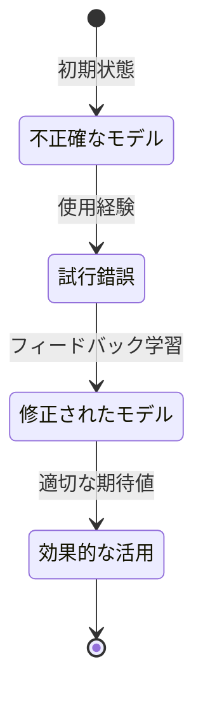
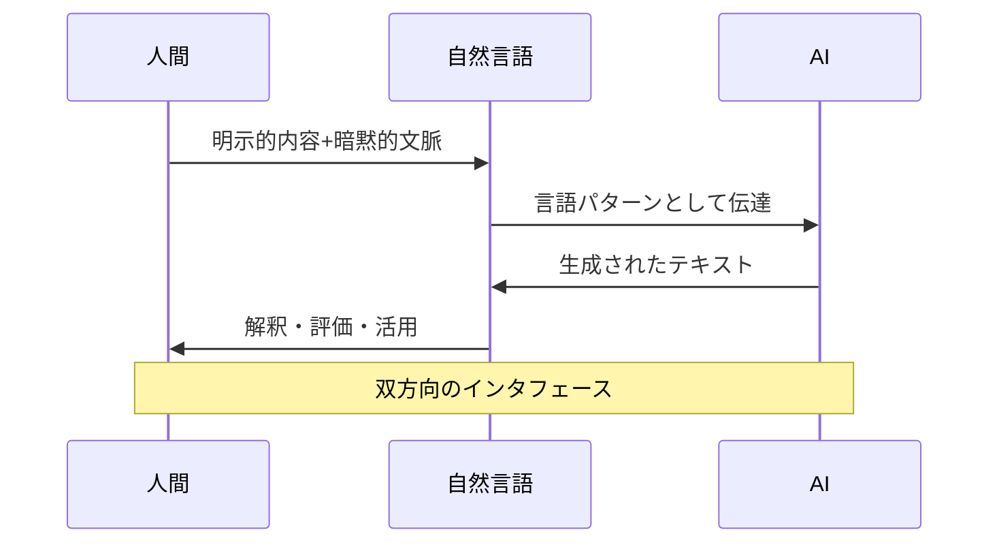
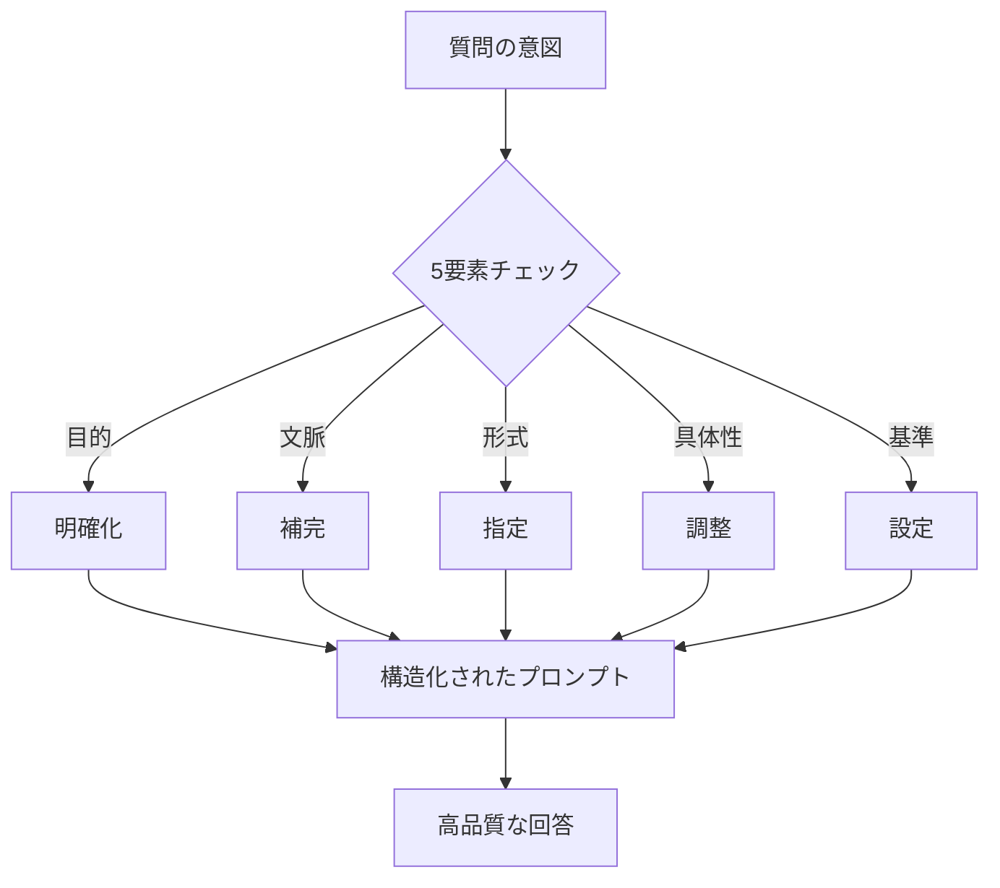
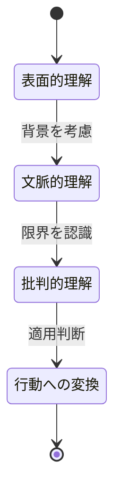
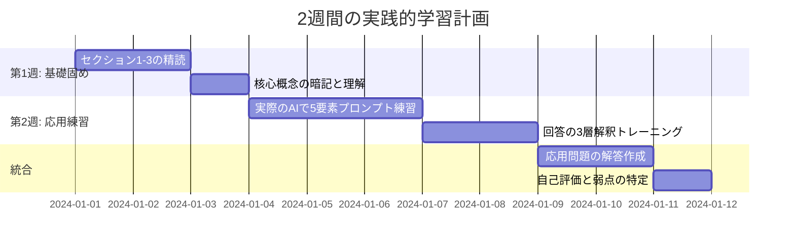
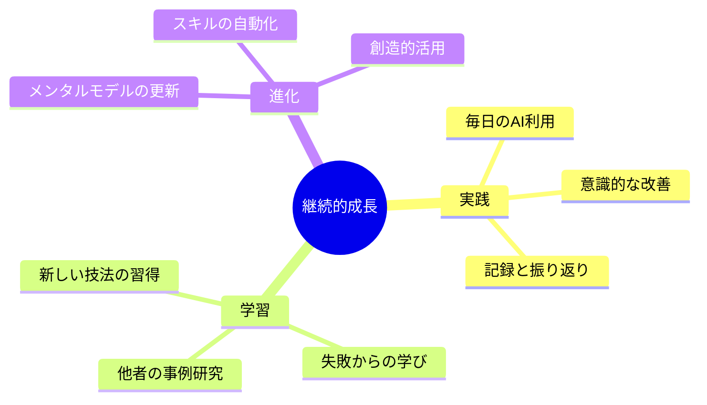

# 自然言語による人間-AI間コミュニケーション: メンタルモデルからの理解ガイド

> **学習目標**: メンタルモデルの観点から、AIと効果的にコミュニケーションするための自然言語運用の重要性を理解する
> **推奨学習時間**: 2.5時間
> **前提知識**: なし（初学者向け）

## 1. 全体マップ

自然言語は人間とAIをつなぐ唯一のインタフェースです。この資料では、人間の「メンタルモデル」（頭の中の理解の枠組み）がAIとのやり取りにどう影響するかを中心に、効果的なコミュニケーション方法を学びます。

**学習範囲**:
- **含む内容**: メンタルモデルの基礎、自然言語の役割、入力・出力の質的向上、実践的テクニック
- **含まない内容**: AIの内部技術詳細、プログラミング言語、専門的な言語学理論

**主要トピック**:
1. メンタルモデルとは何か
2. 人間-AI間のコミュニケーション構造
3. 効果的な言語入力（プロンプティング）
4. 効果的な言語出力（解釈と活用）
5. メンタルモデルの更新と成長

**図の説明**: このマップは、メンタルモデルと自然言語が基盤となり、入出力スキルを通じて実践的能力へと発展する学習の流れを示しています。

---

## 2. ガイド質問

これらの質問は学習の道しるべです。読み進める中で答えを探してみましょう。

### 基礎理解（★☆☆）
- **Q1**: メンタルモデルとは何であり、なぜAIとの対話で重要なのか?
- **Q2**: 自然言語が人間-AI間の「インタフェース」と呼ばれる理由は?
- **Q3**: AIは人間の意図をどのように理解しているのか?

### 応用理解（★★☆）
- **Q4**: 曖昧なプロンプトが誤解を生む具体的なメカニズムは?
- **Q5**: 効果的な質問と非効果的な質問の違いは何か?
- **Q6**: AIの回答を正しく解釈するために必要な視点は?

### 統合理解（★★★）
- **Q7**: メンタルモデルの更新がAI活用スキルをどう向上させるか?
- **Q8**: 入力と出力の質的向上が相互にどう影響し合うか?

**図の説明**: 質問は基礎から応用、そして統合へと認知的複雑さが増していく構造になっています。

---

## 3. 核心概念

以下の5つの核心概念を理解することが、この学習の鍵となります。

### 🔑 **メンタルモデル（Mental Model）**
人間が世界を理解するために頭の中に持つ「簡略化された仕組みの表現」です。AIについても、私たちは無意識のうちに「AIとは何か、どう動くか」というメンタルモデルを形成しています。

### 🔑 **自然言語インタフェース（Natural Language Interface）**
人間とAIが情報をやり取りするための「接点」となる日常的な言葉のことです。キーボード入力やプログラミング言語ではなく、普段話す言葉そのものがインタフェースとなります。

### 🔑 **プロンプティング（Prompting）**
AIに対する「質問や指示の入力」行為です。単なる質問文ではなく、文脈、意図、期待する回答形式を含んだコミュニケーション全体を指します。

### 🔑 **解釈フレーム（Interpretation Frame）**
AIの出力を受け取る際に、人間が持つ「理解の枠組み」です。同じ回答でも、解釈フレームによって受け取り方が異なります。

### 🔑 **反復的改善（Iterative Refinement）**
入力と出力を繰り返しながら、徐々にコミュニケーションの質を高めていくプロセスです。一度で完璧を目指すのではなく、段階的に精度を上げます。

**概念間の関係**:
メンタルモデルが基盤となり、自然言語インタフェースを通じてプロンプティングを行います。AIの回答は解釈フレームを通して理解され、反復的改善によって双方の精度が向上します。

**図の説明**: 5つの核心概念が循環的に関係し、継続的な学習サイクルを形成しています。

**記憶補助**: **「メ・自・プ・解・反」** = メンタルモデルを基に、自然言語でプロンプトし、解釈して、反復改善

---

## 4. 段階的詳細展開

### 4.1 メンタルモデルの理解

#### 層1: 導入
メンタルモデルは、人間が複雑な世界を理解可能にするために脳内に構築する「簡略化された地図」です。例えば、自動車の運転にエンジンの詳細な仕組みを知らなくても、「アクセルを踏めば進む」というシンプルなモデルで十分機能します。

#### 層2: 展開
**AIに対するメンタルモデルの重要性**

人間はAIと対話する際、無意識に次のようなメンタルモデルを持ちます:
- 「AIは人間のように考える」（誤解の例）
- 「AIは全知全能のデータベース」（過大評価の例）
- 「AIは入力されたパターンから応答を生成する言語処理システム」（より正確なモデル）

**実世界での応用例**:
検索エンジンに「美味しいレストラン」と入力する人と、「新宿駅から徒歩5分以内のイタリアンレストラン、予算3000円、静か」と入力する人では、後者がより精密なメンタルモデル（検索エンジンは具体的条件で絞り込む仕組み）を持っています。

**一般的な誤解**:
「AIは文脈を完全に理解している」という誤解があります。実際にはAIは提供された情報のみから推論するため、暗黙の前提を補完する必要があります。

#### 層3: 要約
正確なメンタルモデルを持つことで、AIへの期待値が適切になり、効果的な質問設計が可能になります。次のセクションでは、このメンタルモデルが自然言語インタフェースを通じてどう機能するかを見ていきます。

**図の説明**: メンタルモデルは使用経験とフィードバックを通じて段階的に精緻化されていきます。

---

### 4.2 自然言語の二重の役割

#### 層1: 導入
自然言語は、人間がAIに情報を「入力」し、AIが人間に情報を「出力」する唯一の共通媒体です。プログラミング言語のような専門知識なしに、日常的な言葉でコミュニケーションが成立する点が革新的です。

#### 層2: 展開
**入力側の役割（人間→AI）**

自然言語入力では以下の情報が伝達されます:
- **明示的内容**: 直接書かれた質問や指示
- **暗黙的文脈**: 文化的背景、前提知識
- **意図**: 何を達成したいのか

例: 「今日の天気は?」という質問には、「私の現在地の」「今日という日の」「天候状況を知りたい」という暗黙の文脈が含まれます。

**出力側の役割（AI→人間）**

AIの応答も自然言語で返されますが、人間は次の処理を行います:
- **情報抽出**: 必要な部分を取り出す
- **信頼性評価**: 内容の妥当性を判断
- **行動への変換**: 実際の行動に落とし込む

**実世界での応用例**:
医療相談AIに「頭が痛い」と入力した場合、AIは一般的な情報を提供しますが、人間は「自分の具体的な症状との関連性」「医師に相談すべきかの判断」という出力側の処理を行う必要があります。

#### 層3: 要約
自然言語は双方向の橋渡しとして機能し、その品質が直接コミュニケーション効果に影響します。次は入力側の技術、つまりプロンプティングの技法を詳しく見ていきます。

**図の説明**: 自然言語は人間とAIの間で情報を変換・伝達する中間層として機能します。

---

### 4.3 効果的な言語入力の技法

#### 層1: 導入
プロンプティング（AIへの入力）の質は、出力の質を決定します。曖昧な質問は曖昧な回答を、具体的な質問は具体的な回答を引き出します。

#### 層2: 展開
**効果的なプロンプトの5要素**

1. **明確な目的**: 何を知りたいのか、何を作りたいのか
   - 非効果的: 「マーケティングについて教えて」
   - 効果的: 「SNSマーケティングの初心者向け3ステップを教えて」

2. **必要な文脈**: 前提条件、制約事項
   - 非効果的: 「良いプレゼン方法は?」
   - 効果的: 「技術者向け、10分間、専門用語を避けた製品説明のプレゼン方法は?」

3. **期待する形式**: 箇条書き、段落、コード等
   - 「表形式で比較してほしい」「ステップバイステップで説明してほしい」

4. **具体性のレベル**: 概要か詳細か
   - 「概要だけでいい」「具体的な手順まで知りたい」

5. **評価基準**: 何を重視するか
   - 「初心者でも分かる説明で」「学術的な正確さを重視して」

**メンタルモデルとの関連**:
効果的なプロンプトは、「AIは与えられた情報のみから推論する」というメンタルモデルに基づいています。暗黙の前提を明示化することで、AIの処理精度が向上します。

**一般的な誤解**:
「AIは賢いから短く聞いても分かるはず」は誤りです。人間同士でも、初対面の相手には詳しく説明するのと同様に、AIにも十分な情報提供が必要です。

#### 層3: 要約
プロンプトの構造化は、メンタルモデルを外部化する行為です。次は出力側、つまりAIの回答をどう解釈・活用するかを学びます。

**図の説明**: 効果的なプロンプトは5つの要素を体系的にチェックすることで構築されます。

---

### 4.4 効果的な言語出力の解釈

#### 層1: 導入
AIからの回答を受け取った後、人間は「解釈」「評価」「活用」という3段階の処理を行います。この処理の質が、最終的な成果を左右します。

#### 層2: 展開
**解釈フレームの3層構造**

**第1層: 表面的理解**
- 文字通りの意味を把握
- 「何が書かれているか」を読み取る
- 例: 「気温は25度です」→ 25度という数値情報

**第2層: 文脈的理解**
- 背景を考慮した解釈
- 「なぜその回答か」を考える
- 例: 「気温は25度です」→ 季節、地域、時間帯を踏まえると快適/暑い

**第3層: 批判的理解**
- 信頼性と限界の評価
- 「どこまで信用できるか」を判断
- 例: 「気温は25度です」→ リアルタイムデータか予報か、情報源は何か

**実世界での応用例**:
AIに「健康的な食事法」を尋ねた場合:
- 第1層: 「野菜を多く摂る」という提案を理解
- 第2層: 自分の生活習慣、好み、予算と照らし合わせる
- 第3層: 一般論であり個別の医学的助言ではないと認識

**メンタルモデルとの関連**:
「AIは確率的に最も適切な応答を生成する」というメンタルモデルを持つことで、盲信せず批判的に評価する姿勢が生まれます。

#### 層3: 要約
出力の質的活用には、段階的な解釈プロセスが不可欠です。最後に、この入出力サイクルを通じたメンタルモデルの成長について学びます。

**図の説明**: AIの出力は3段階の解釈プロセスを経て、実際の行動や意思決定に変換されます。

---

### 4.5 継続的な改善サイクル

#### 層1: 導入
人間-AIコミュニケーションは一度で完結せず、反復を通じて精度が向上します。この過程で、人間のメンタルモデルも更新され続けます。

#### 層2: 展開
**反復的改善の4ステップ**

**ステップ1: 初期入力**
- 現在のメンタルモデルに基づいたプロンプト
- 例: 「効率的な学習方法は?」

**ステップ2: 出力評価**
- 期待と実際の差異を分析
- 例: 「一般論すぎて自分の状況に合わない」

**ステップ3: モデル修正**
- なぜ期待と違ったかを考察
- 例: 「文脈情報が不足していた」と気づく

**ステップ4: 再入力**
- 改善されたプロンプトで再試行
- 例: 「社会人が平日夜30分で続けられる、プログラミング学習の効率的な方法は?」

**メンタルモデルの進化パターン**:
- **初期段階**: 「AIは何でも答える魔法の箱」
- **試行段階**: 「思ったより使いにくい」(失望)
- **理解段階**: 「適切に質問すれば有用な回答が得られる」
- **熟練段階**: 「AIの特性を理解し、最適な使い方を知っている」

**実世界での応用例**:
プログラミング学習でAIを活用する場合:
1. 「Pythonを教えて」(漠然)
2. 回答が広すぎると気づく
3. 「AIには段階を指定する必要がある」と学ぶ
4. 「Python初心者向け、データ分析目的、Jupyter Notebook使用、最初の3ステップ」(具体化)

#### 層3: 要約
入力と出力の質は相互に影響し合い、螺旋的に向上します。このサイクルの中核にあるのが、常に更新されるメンタルモデルです。

**図の説明**: メンタルモデルは反復サイクルの中で継続的に洗練され(色の変化で表現)、より効果的なコミュニケーションを可能にします。

---

## 5. 統合・実践

### ガイド質問への模範回答

**Q1: メンタルモデルとは何であり、なぜAIとの対話で重要なのか?**

メンタルモデルは、人間が複雑なシステムを理解するために脳内に構築する簡略化された表現です。AIとの対話では、「AIがどのように機能するか」についてのメンタルモデルが、質問の仕方、回答の解釈、期待値の設定すべてに影響します。正確なモデルを持つことで、効果的なプロンプトを作成でき、AIの限界も理解した上で活用できます。

**Q4: 曖昧なプロンプトが誤解を生む具体的なメカニズムは?**

AIは入力された言葉のパターンから最も確率的に適切な応答を生成します。曖昧なプロンプトには複数の解釈可能性があるため、AIは「統計的に最も一般的な解釈」を選択します。例えば「良い本は?」には、ジャンル、目的、読者レベルなど無数の文脈が欠けています。結果として、質問者の意図とは異なる、平均的・一般的な回答が生成されます。文脈を明示することで、AIの推論空間を適切に制約し、意図に沿った応答を引き出せます。

**Q7: メンタルモデルの更新がAI活用スキルをどう向上させるか?**

メンタルモデルは「AIへの期待値」と「質問設計の戦略」を決定します。初期の不正確なモデル(例: AIは人間のように考える)から、より正確なモデル(例: AIはパターン認識で応答を生成する)へ更新されることで、以下の変化が起きます: ①暗黙の前提を明示する習慣がつく、②AIの限界を理解し適切な範囲で活用する、③回答の信頼性を批判的に評価できる、④反復的改善の必要性を認識する。これらが組み合わさり、全体的なAI活用の質が向上します。

---

### 統合応用問題

**問題1: シナリオ分析**

あなたは料理初心者で、AIに夕食のレシピを尋ねようとしています。以下の2つのプロンプトを比較し、なぜ(B)が効果的か、5つの要素(目的・文脈・形式・具体性・基準)の観点から説明してください。

- (A) 「簡単な料理のレシピ教えて」
- (B) 「料理初心者、30分以内、材料3つまで、冷蔵庫にある卵・玉ねぎ・チーズを使った、写真付きステップガイド形式の夕食レシピを教えて」

**模範回答**:
- **目的**: (A)は曖昧、(B)は「初心者向け夕食レシピ取得」と明確
- **文脈**: (B)は時間制約(30分)、スキルレベル(初心者)、利用可能材料を提示
- **形式**: (B)は「写真付きステップガイド」と具体的に指定
- **具体性**: (B)は材料数(3つまで)や具体的食材名を明示
- **基準**: (B)は「初心者でも失敗しない」という暗黙の基準が含まれる

(B)は5要素すべてを満たし、AIが推論に必要な情報を過不足なく提供しています。

---

**問題2: 批判的思考**

AIに「最も健康的なダイエット方法」を尋ね、「糖質制限が効果的」という回答を得ました。3層の解釈フレーム(表面的・文脈的・批判的理解)を適用し、この回答をどう評価・活用すべきか説明してください。

**模範回答**:
- **表面的理解**: 「糖質制限という方法が推奨されている」と認識
- **文脈的理解**: 「なぜ効果的か」のメカニズム(エネルギー源の変化)を理解し、自分の生活パターン(運動量、食習慣)と照らし合わせる
- **批判的理解**: ①これは一般論であり個人差がある、②医学的助言ではなく情報提供、③「最も健康的」は文脈依存で絶対的ではない、④実行前に専門家(医師・栄養士)への相談が必要、と限界を認識

**活用方針**: 糖質制限の基本概念を学ぶ出発点としては有用だが、自分に適用する前に医療専門家に相談し、個別の健康状態を考慮した判断を行う。

---

### 自己評価チェックリスト

以下の項目で自己評価してみましょう(各項目5点満点、合計30点):

**知識理解**
- [ ] メンタルモデルの定義と役割を説明できる (5点)
- [ ] 自然言語がインタフェースとして機能する仕組みを理解している (5点)

**実践スキル**
- [ ] 効果的なプロンプトの5要素を意識して質問を作成できる (5点)
- [ ] AIの回答を3層(表面・文脈・批判)で解釈できる (5点)

**応用能力**
- [ ] 曖昧なプロンプトを具体化する改善案を提示できる (5点)
- [ ] 反復的改善サイクルを実際のAI利用に適用できる (5点)

**評価の目安**:
- 25-30点: 優秀 - 実践的なAI活用が可能
- 18-24点: 良好 - 基本は理解、実践で洗練が必要
- 12-17点: 合格 - 概念理解はOK、応用練習を推奨
- 0-11点: 要復習 - 核心概念から再学習を推奨

---

### 推奨学習計画

**図の説明**: 理論学習(1-3日目)から実践(4-8日目)、そして統合評価(9-11日目)へと段階的に進む2週間プランです。

---

## 学習の次のステップ

この資料で基礎を築いた皆さんは、以下の発展的テーマに進むことができます:

### 推奨発展トピック

**1. プロンプトエンジニアリング応用**
- Chain-of-Thought（思考の連鎖）プロンプティング
- Few-shot learning（例示による学習）
- ロールプレイと人格設定の技法

**2. AIの認知的限界の理解**
- ハルシネーション（幻覚）のメカニズムと対処
- トレーニングデータのバイアス認識
- 知識のカットオフと時間的制約

**3. ドメイン特化型活用**
- 専門分野（プログラミング、ライティング、分析）での最適化
- マルチモーダルAI（画像・音声統合）との対話
- エージェント型AIとの協働ワークフロー

**4. メタ認知スキル向上**
- 自分の思考プロセスの言語化
- 質問設計の反省的実践
- AIとの対話記録の分析と改善

---

## 最後に

自然言語による人間-AIコミュニケーションは、単なる「質問と回答」ではなく、**メンタルモデルを媒介とした相互理解のプロセス**です。この資料で学んだ5つの核心概念を実践し、反復的改善サイクルを回すことで、AIは強力な思考のパートナーとなります。

重要なのは、完璧を目指すことではなく、**意識的に継続すること**です。日々のAI利用の中で、「今のプロンプトには文脈が足りていたか?」「この回答をどう批判的に解釈すべきか?」と自問する習慣が、長期的な成長につながります。

**図の説明**: AI活用スキルの継続的成長は、実践・学習・進化の3つの柱が支えています。

---

**学習完了おめでとうございます!** 
ここで得た知識を、明日からのAI活用に活かしてください。
