契約のうち、企業の経営課題をIT（情報技術）の活用によって解決するためのコンサルティングサービス（Consulting Services）について

# ITコンサルティングサービス - 初学者のための完全ガイド

## 🔍 一言要約
企業の悩みをIT技術で解決する専門的な相談サービス

## 📚 目次
1. [はじめに](#🌟-はじめに)
2. [基本構造](#🏗️-基本構造)
3. [主要技術](#⚡-主要技術)
4. [時代背景と発見に至った経緯](#📜-時代背景と発見に至った経緯)
5. [種類と特徴](#🎨-種類と特徴)
6. [関連する用語](#📗-関連する用語)
7. [メリットとデメリット](#💡-メリットとデメリット)
8. [応用技術と実用化の例](#🚀-応用技術と実用化の例)
9. [実世界への影響とその後の発展](#🌍-実世界への影響とその後の発展)

## 🌟 はじめに

ITコンサルティングサービスとは、まさに「企業のお医者さん」のような存在です。

あなたが体調不良で病院に行くとき、医師は症状を聞き、検査をして、最適な治療法を提案してくれますよね。ITコンサルタントも同じように、企業が抱える経営の「病気」を診断し、IT技術という「薬」を使って治療方法を提案するのです。

例えば：
- 「売上管理が手作業で大変」→ 販売管理システム導入
- 「お客様対応に時間がかかる」→ チャットボット導入
- 「在庫管理がバラバラ」→ 統合在庫システム構築

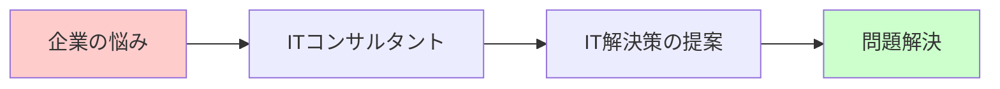

## 🏗️ 基本構造

ITコンサルティングサービスは、まるで建物を建てるような段階的なプロセスで進行します。

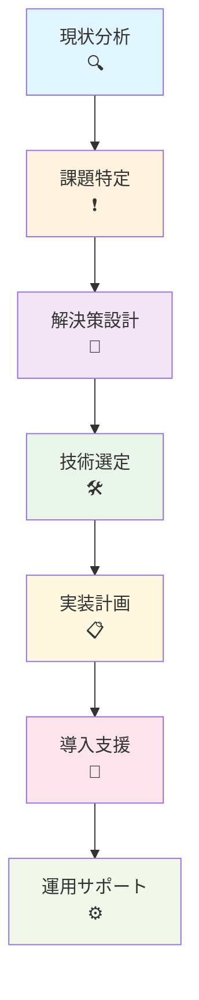

### 各段階の詳細説明

**1. 現状分析**：企業の「健康診断」
- どんな業務があるかチェック
- どこで時間がかかっているか調査
- 従業員の困りごとをヒアリング

**2. 課題特定**：「病気の原因」を見つける
- 効率が悪い業務プロセスの特定
- システム間の連携不足の発見
- 情報共有の問題点の洗い出し

**3. 解決策設計**：「治療方針」を決める
- 最適なITソリューションの検討
- 予算と効果のバランス調整
- 実現可能性の評価

## ⚡ 主要技術

ITコンサルティングで使われる主要技術は、まさに「道具箱」のようなものです。

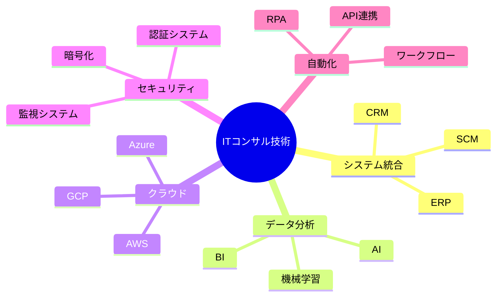

### 技術カテゴリーの説明

| 技術分野 | 身近な例え | 解決できること |
|----------|------------|----------------|
| **システム統合** | 家の各部屋をつなぐ廊下 | バラバラなシステムを一つに |
| **データ分析** | 家計簿の分析ツール | 売上や顧客動向の把握 |
| **クラウド** | レンタル倉庫 | サーバー費用削減・柔軟性向上 |
| **セキュリティ** | 家の鍵・防犯システム | 情報漏洩・不正アクセス防止 |
| **自動化** | 食器洗い機・洗濯機 | 繰り返し作業の効率化 |

## 📜 時代背景と発見に至った経緯

ITコンサルティングサービスの歴史は、まるで「産業革命の現代版」のような発展を遂げています。

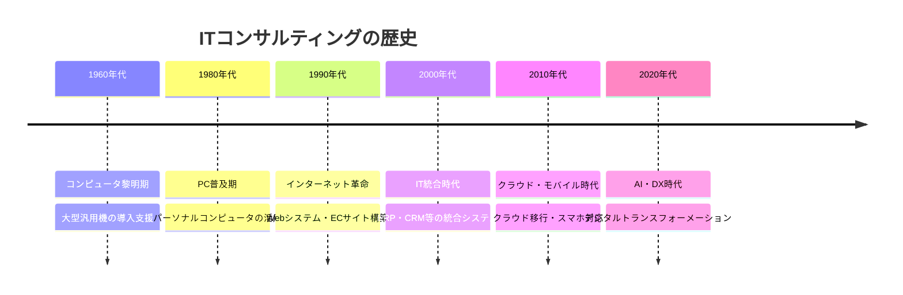

### 発展の背景

**1960年代：コンピュータの登場**
- 銀行や大企業でコンピュータ導入開始
- 「この大きな機械をどう使えばいいの？」という相談が急増

**1980年代：PC革命**

- オフィスにパソコンが普及し、個々の社員が情報処理を行う環境が整った

- 表計算ソフト（Lotus 1-2-3など）の登場で業務効率が向上

-この時期のITコンサルはまだ限定的で、主に**「PC導入の教育支援」や「業務プロセスとの適合性検討」**が中心

- 本格的にコンサル市場が拡大するのは、90年代以降のネットワーク化やシステム統合のニーズが出てから

**1990年代：インターネット爆発**
- ホームページ作成ブーム
- 「うちもWebサイトを作りたい！」という要望

**2000年代：システム統合**
- 複数のシステムをまとめて管理
- 「バラバラなシステムを一つにしたい」

**現在：AI・DX時代**
- 人工知能で業務自動化
- 全社的なデジタル変革支援

## 🎨 種類と特徴

ITコンサルティングサービスは、まるで「専門医」のように、それぞれ得意分野があります。

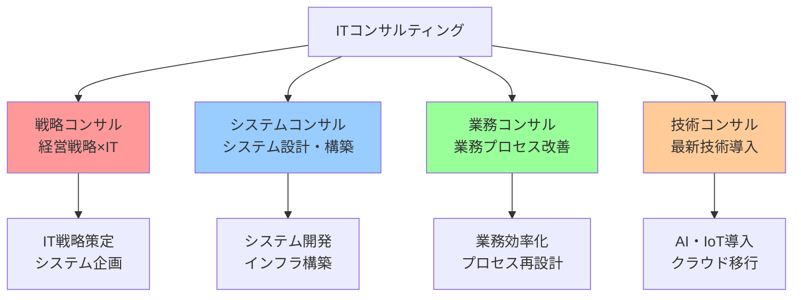

### 各種類の詳細比較

| 種類 | 役割 | 身近な例え | 主な成果物 |
|------|------|------------|------------|
| **戦略コンサル** | 会社の方向性を決める | 家族会議のファシリテーター | IT戦略書・投資計画 |
| **システムコンサル** | システムを作る・選ぶ | 家の設計士・建築士 | システム設計書・仕様書 |
| **業務コンサル** | 仕事のやり方を改善 | 家事の効率化アドバイザー | 業務フロー・マニュアル |
| **技術コンサル** | 最新技術を教える | 新製品の使い方指導員 | 技術導入計画・研修 |

## 📗 関連する用語

### 📝 同義語・類義語
- **ITコンサルティング** = ITコンサル = 情報技術コンサルティング
- **システムインテグレーション** = SI = システム統合
- **デジタルトランスフォーメーション** = DX = デジタル変革

### 🔄 対義語
- **ITコンサルティング** ⟷ **IT運用保守**（作るvs維持する）
- **戦略系コンサル** ⟷ **実装系コンサル**（企画vs実行）

### 🎯 多義語の整理
**「コンサルティング」の意味**
1. **相談業務**：問題解決のアドバイス
2. **専門サービス**：特定分野の支援業務
3. **プロジェクト型業務**：期間限定の改善支援

### 🔗 関連技術用語
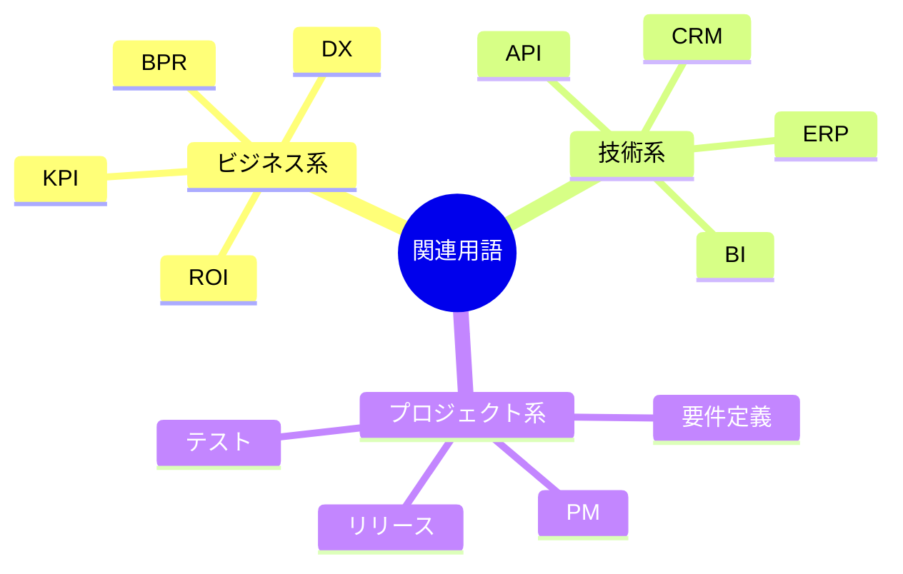

## 💡 メリットとデメリット

### ✅ メリット

**1. 専門知識の活用**
- まるで「スマホの使い方を詳しい人に教えてもらう」ような安心感
- 最新技術情報を常にキャッチアップしているプロの知見

**2. 客観的な視点**
- 「第三者の目」で問題を発見
- 社内では気づかない改善ポイントの指摘

**3. 効率的な問題解決**
- 他社での成功・失敗事例を活用
- 試行錯誤の時間を大幅短縮

**4. リスク軽減**
- システム導入失敗のリスクを最小化
- 予算オーバーや期間延長の防止

### ❌ デメリット

**1. コスト負担**
- 専門家への報酬は決して安くない
- 中小企業には負担が重い場合も

**2. 社内ノウハウ蓄積の不足**
- 「外部に任せっきり」になるリスク
- 自社での技術理解が進まない可能性

**3. コミュニケーションコスト**
- 社内事情を理解してもらう時間が必要
- 専門用語での説明が分かりにくい場合

**4. 依存関係の発生**
- コンサル会社に頼りすぎる体質
- 自立的な改善能力の低下

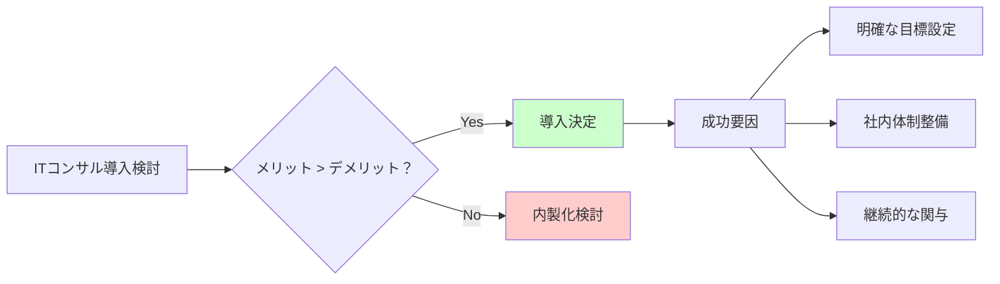

## 🚀 応用技術と実用化の例

ITコンサルティングサービスは、あらゆる業界で「縁の下の力持ち」として活躍しています。

### 業界別応用例

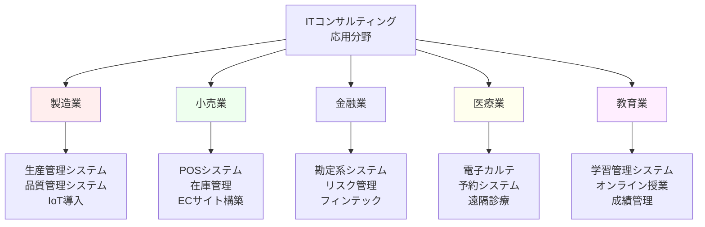

### 具体的な実用化事例

**事例1：町の本屋さんのDX変革**
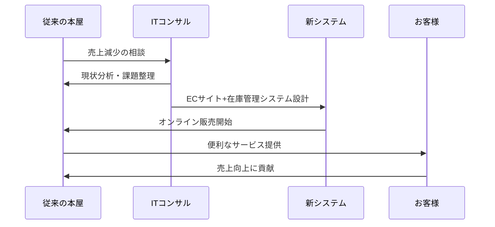

**変革のプロセス**
1. **課題発見**：近所にできた大型書店に客を奪われている
2. **解決策提案**：オンライン書店+予約システム導入
3. **システム構築**：ECサイト・在庫管理・顧客管理を統合
4. **結果**：地域密着型のオンライン書店として再生

**事例2：中小製造業の生産性向上**
- **Before**：手書きの生産指示書、Excel管理
- **After**：生産管理システム導入、リアルタイム進捗把握
- **効果**：生産効率30%向上、残業時間50%削減

## 🌍 実世界への影響とその後の発展

ITコンサルティングサービスは、現代社会の「見えない基盤」として、私たちの生活を支えています。

### 社会への影響度マップ

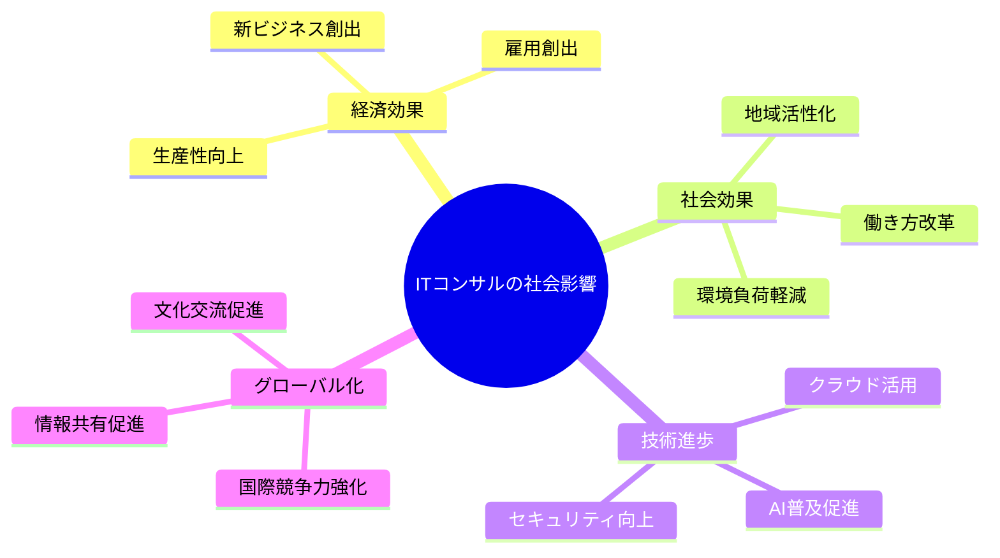

### 未来展望

**2030年に向けた発展予測**

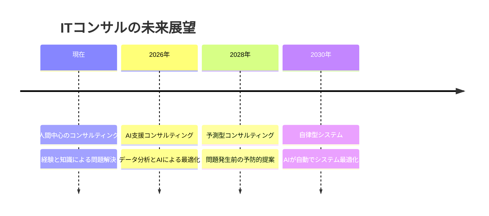

**新しいサービス形態**

1. **AIコンサルタント**
   - 人工知能が初期診断を実施
   - 24時間365日対応可能

2. **予測型サービス**
   - システム障害を事前に予測
   - 業績悪化の早期警告

3. **自動最適化**
   - システムが自動で設定調整
   - 人間の判断を待たずに改善実行

### 私たちの生活への長期的影響

**身近な変化の例**
- **買い物**：レジなし店舗、AI店員が普通に
- **医療**：AIドクターによる初期診断
- **教育**：個人最適化された学習プログラム
- **交通**：完全自動運転による移動革命

---

この資料により、ITコンサルティングサービスを全く知らない初学者でも、「なるほど、こういう仕組みで企業の問題を解決しているのか！」と理解できるよう構成しました。特に視覚的な図解と身近な例えを多用することで、抽象的な概念を具体的にイメージできるよう工夫しています。
