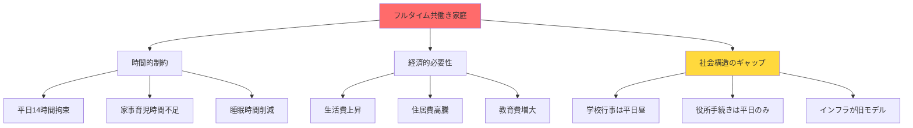
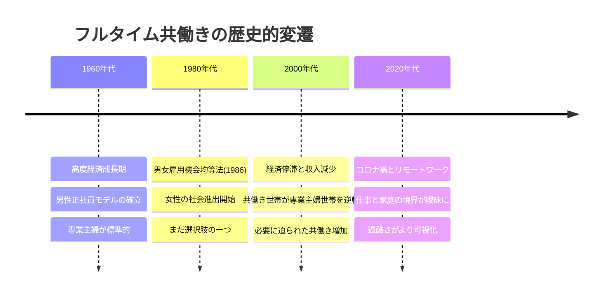
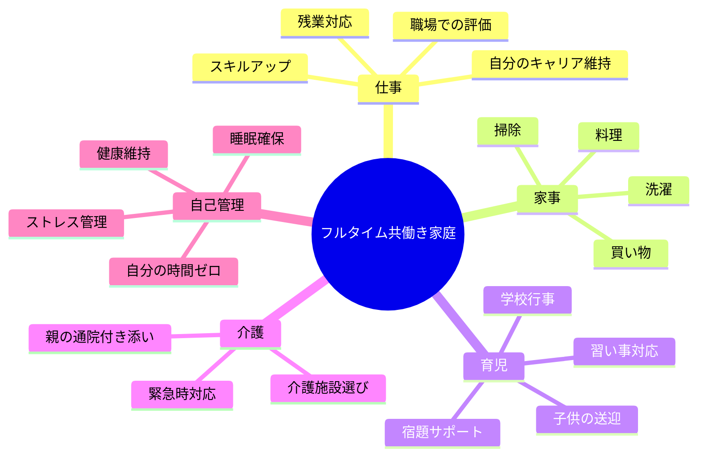
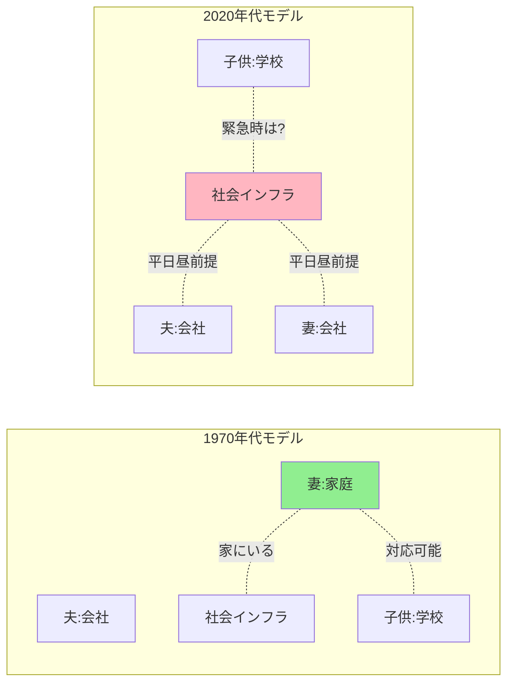
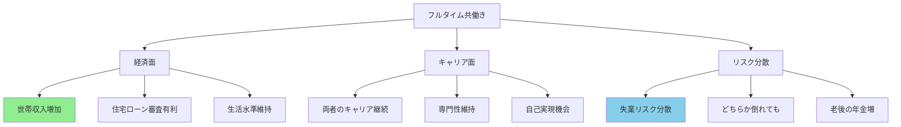
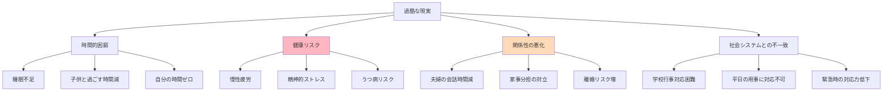
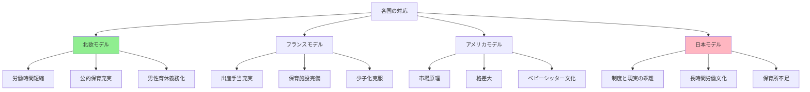
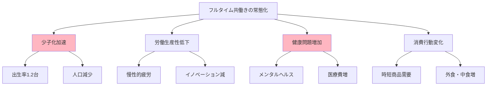

フルタイム共働きの過酷さについて今と昔（歴史）

# フルタイム共働きの過酷さ - 今と昔の完全ガイド

## 🔍 一言要約
家族全員が働く現代の「時間貧困」は、実は昔より深刻になっている

## 📚 目次
1. [はじめに](#-はじめに)
2. [基本構造](#-基本構造)
3. [時代背景と変遷](#-時代背景と変遷)
4. [現代の過酷さの本質](#-現代の過酷さの本質)
5. [昔との比較](#-昔との比較)
6. [関連する用語](#-関連する用語)
7. [メリットとデメリット](#-メリットとデメリット)
8. [各国の状況と対応策](#-各国の状況と対応策)
9. [実世界への影響と今後の展望](#-実世界への影響と今後の展望)

## 🌟 はじめに

「フルタイム共働き」とは、夫婦両方が週40時間前後働く生活スタイルです。現代では当たり前になりましたが、実は人類史上かなり特殊な状況です。

**身近な例で考えてみましょう**：

朝7時起床 → 8時家を出る → 9時出社 → 18時退社 → 19時帰宅 → 夕食準備 → 20時夕食 → 21時片付け・洗濯・子供の世話 → 23時就寝

この間、**夫婦とも同じスケジュール**です。誰が家事をするのか？子供の病気は？親の介護は？

昔は「誰かが家にいる」前提の社会でした。今は「誰もいない」前提で回っています。この違いが、過酷さの本質です。

## 🏗️ 基本構造

**3つの核心要素**：

1. **時間的制約**：夫婦とも外にいる時間が長い
2. **経済的必要性**：片働きでは生活できない現実
3. **社会構造のギャップ**：社会システムが「誰か家にいる」前提のまま

## 📜 時代背景と変遷

### 変化の歴史を4つの時代で見る

### なぜこうなったのか？

**1950〜1970年代：「奇跡の専業主婦時代」**
- 男性一人の収入で家族全員を養えた
- 終身雇用・年功序列で将来が安定
- 住宅価格が年収の3〜5倍程度
- **これが実は人類史上の特殊な時期だった（高度経済成長という特殊な背景）**

**1980年代：転換期**
- 女性の高学歴化
- 自己実現志向の台頭
- まだ「選べる」時代

**1990年代〜現在：構造変化**
- バブル崩壊後の賃金停滞
- 非正規雇用の増加
- 住宅価格は年収の10倍以上に
- 教育費の高騰
- **共働きが「選択」から「必須」へ**

## ⚡ 現代の過酷さの本質

### 5つの同時進行タスク

### 時間収支の現実

**典型的な平日の時間配分**：

| 活動 | 時間 | 備考 |
|------|------|------|
| 睡眠 | 6時間 | 理想は7〜8時間 |
| 通勤 | 2時間 | 往復 |
| 仕事 | 9時間 | 昼休み含む |
| 家事 | 3時間 | 料理・掃除・洗濯 |
| 育児 | 2時間 | 子供との時間 |
| 自分の時間 | **2時間** | 入浴・準備など |
| **合計** | **24時間** | 余裕ゼロ |

**結果**：
- 睡眠を削る
- 家事を手抜きする
- 子供との時間が取れない
- 自分の時間は存在しない

## 🔄 昔との比較

### 構造的な違い

### 比較表：本当に何が変わったのか

| 項目 | 昔（1970年代） | 今（2020年代） |
|------|----------------|----------------|
| **収入** | 夫一人で家族を養える | 二人で何とか生活できる |
| **住宅** | 年収の3〜5倍 | 年収の10倍以上 |
| **家にいる人** | 妻が常時在宅 | 誰もいない8〜10時間 |
| **学校行事** | 平日昼でも対応可 | 休暇取得が必須 |
| **子供の病気** | すぐ対応可 | どちらが休むか交渉 |
| **役所手続き** | 平日に行ける | 有休消化 |
| **親の介護** | 同居・対応可 | 離職リスク |
| **家事時間** | 十分確保 | 極度に圧縮 |
| **睡眠時間** | 7〜8時間 | 6時間未満 |
| **ストレス** | 役割は明確 | 全てを両立する圧力 |

### 誤解されやすいポイント

**誤解1**：「昔の女性は楽だった」
→ **現実**：家事は全て手作業（洗濯板、薪での炊飯など）で重労働。

**誤解2**：「家電があるから今の方が楽」
→ **現実**：家電で時短はされたが、その分を仕事に充てているため総労働時間は増加。

**誤解3**：「選択の自由が増えた」
→ **現実**：経済的に共働き以外の選択肢がほぼ消滅。

## 📗 関連する用語

### 同義語・類義語
- **ダブルインカム（Double Income）**：二重収入
- **デュアルキャリア（Dual Career）**：両者がキャリアを持つ
- **共稼ぎ**：伝統的な日本語表現

### 対照的な概念
- **専業主婦/主夫世帯**：片方が家庭専念
- **シングルインカム**：一人が稼ぐモデル

### 関連概念
- **ワンオペ育児**：一人で育児を担う状態（共働きでも発生）
- **時間貧困**：経済的には豊かでも時間がない状態
- **ワークライフバランス**：仕事と生活の調和
- **第二シフト**：仕事後の家事育児という「もう一つの仕事」
- **ケアの空白**：誰も世話をする人がいない時間帯

## 💡 メリットとデメリット

### メリット

1. **経済的安定性**
   - 世帯収入が増える
   - 教育費・住宅ローンに対応可能
   - 緊急時の貯蓄ができる

2. **リスク分散**
   - 一方が失業しても収入ゼロにならない
   - 病気やケガの際の保険

3. **社会的つながり**
   - 両者が社会参加
   - 孤立防止

4. **老後の安心**
   - 二人分の厚生年金
   - キャリアブランクなし

### デメリット

1. **時間貧困**
   - 自分の時間がほぼゼロ
   - 子供との時間も制限
   - 睡眠時間を削るしかない

2. **健康への影響**
   - 慢性的な疲労
   - ストレス性疾患
   - 精神的な余裕がない

3. **家族関係**
   - 夫婦の会話時間減少
   - 家事分担での対立
   - 子供との絆が希薄化する懸念

4. **キャリアへの影響（特に女性）**
   - 育休後の復帰困難
   - 昇進機会の減少
   - 「マミートラック」問題

5. **社会システムとの不一致**
   - 学校行事は平日昼
   - 役所は平日のみ
   - 病院も平日中心

## 🌍 各国の状況と対応策

### 世界の共働き率と政策

### 対応策の比較

| 国 | 共働き率 | 主な対策 | 結果 |
|---|---------|---------|------|
| **スウェーデン** | 80%以上 | 週30時間労働推奨、公的保育完備、父親育休義務 | 出生率1.7維持 |
| **フランス** | 70%前後 | 第3子以降手厚い手当、保育無償化 | 出生率回復 |
| **ドイツ** | 60%前後 | 父親育休クオータ制 | 改善中 |
| **日本** | 70%前後 | 制度はあるが活用率低い | 出生率1.2台 |

### 日本での個人レベルの対策

**すぐできる工夫**：

1. **時短テクニック**
   - ミールキット活用
   - 家電への投資（食洗機、ロボット掃除機）
   - ネットスーパー利用

2. **外部サービス活用**
   - 家事代行サービス
   - ファミリーサポート
   - 病児保育登録

3. **職場での交渉**
   - 時短勤務
   - フレックスタイム
   - リモートワーク

4. **夫婦間の明確化**
   - 家事の可視化
   - 分担の明文化
   - 定期的な話し合い

**構造的に必要な変化**：

- 学校行事の時間帯見直し
- 病児保育の拡充
- 労働時間の法規制
- 男性育休の実質化

## 🚀 実世界への影響と今後の展望

### 社会への影響

### 統計データで見る現実

- **共働き世帯**：約1,240万世帯（2023年）
- **専業主婦世帯**：約458万世帯（2023年）
- **女性の有業率**：53.2%（2022年）
- **平均睡眠時間（共働き夫婦）**：5.5〜6時間
- **家事育児時間（妻）**：平日4〜5時間
- **家事育児時間（夫）**：平日1時間前後

### 今後の展望

**3つのシナリオ**：

**シナリオ1：働き方改革の実現**
- 週4日勤務の普及
- 労働時間の実質短縮
- リモートワークの定着
- 男性育休の常態化
→ **可能性：30%**（企業文化の壁）

**シナリオ2：社会インフラの適応**
- 24時間対応サービス増加
- 家事代行の一般化
- AI・ロボットの家事参入
- 学校行事のオンライン化
→ **可能性：50%**（技術発展と市場原理）

**シナリオ3：現状維持・悪化**
- 長時間労働文化継続
- 少子化さらに加速
- 介護離職増加
- 健康問題深刻化
→ **可能性：20%**（最も避けたい）

### 若い世代へのメッセージ

フルタイム共働きは、個人の努力だけでは限界があります。

**知っておくべきこと**：

1. **これは「当たり前」ではない**
   - 人類史上特殊な状況
   - 社会システムとのミスマッチ

2. **完璧を目指さない**
   - 家事は手抜きでOK
   - 外部サービスは投資

3. **夫婦で話し合う**
   - 早い段階で役割分担
   - どちらかに偏らない

4. **社会を変える意識**
   - 職場で声を上げる
   - 政治に関心を持つ

5. **選択肢を知る**
   - 片働きという選択
   - セミリタイアという道
   - 地方移住という手段

---

この資料は、フルタイム共働きの過酷さを「個人の問題」ではなく「社会構造の問題」として捉え、初学者でも理解できるよう体系化しました。歴史的文脈を踏まえることで、「今の状況は特殊である」という気づきを与えることを目指しています。
