労働集約型

# 労働集約型 - 初学者のための完全ガイド

## 🔍 一言要約
人の手作業で価値を生み出すビジネスモデル

## 📚 目次
1. [はじめに](#-はじめに)
2. [基本構造](#-基本構造)
3. [主要な特徴](#-主要な特徴)
4. [時代背景と発見に至った経緯](#-時代背景と発見に至った経緯)
5. [種類と特徴](#-種類と特徴)
6. [関連する用語](#-関連する用語)
7. [メリットとデメリット](#-メリットとデメリット)
8. [応用と実例](#-応用と実例)
9. [置換、変遷](#-置換変遷)
10. [代替、競合](#-代替競合)
11. [実世界への影響とその後の発展](#-実世界への影響とその後の発展)

## 🌟 はじめに

「労働集約型」とは、**人の手作業がビジネスの中心**となる産業やサービスのことです。

身近な例で考えてみましょう：
- 美容師さんが髪を切る
- レストランのシェフが料理を作る
- 家庭教師が勉強を教える

これらは全て「機械では代替できない人の技術や判断」が価値の源泉です。お金を稼ぐために**「人の時間と労力」が最も重要な資源**となるビジネスモデルを指します。

## 🏗️ 基本構造

労働集約型ビジネスの基本的な仕組みを見てみましょう。

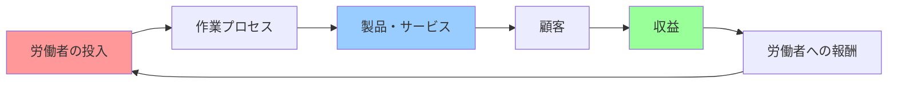

**ポイント**：
- **投入**: 人の時間・技術・体力が主要リソース
- **プロセス**: 手作業中心の工程
- **産出**: カスタマイズされた製品・サービス
- **特徴**: 規模拡大には人数増加が必要

## ⚡ 主要な特徴

労働集約型の4つの本質的特徴：

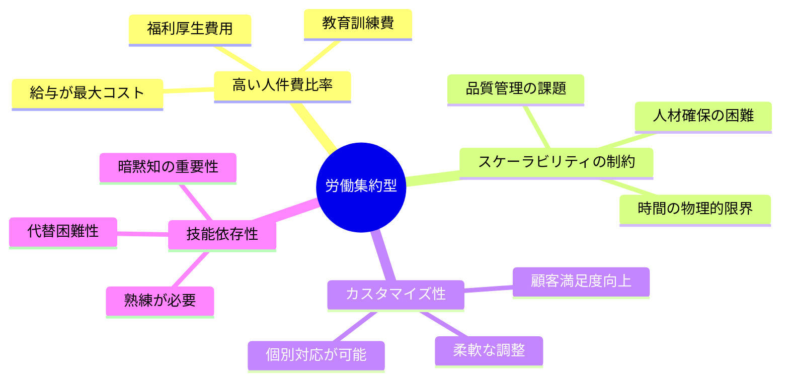

### 詳細解説

1. **高い人件費比率**: 売上の50〜80%が人件費（対して機械中心の工場は20〜30%程度）
2. **スケーラビリティの制約**: 2倍の売上には約2倍の人員が必要
3. **カスタマイズ性**: 一人ひとりの顧客に合わせたサービスが可能
4. **技能依存性**: ベテランと新人では生産性が大きく異なる

## 📜 時代背景と発見に至った経緯

### 産業革命前（〜1750年代）

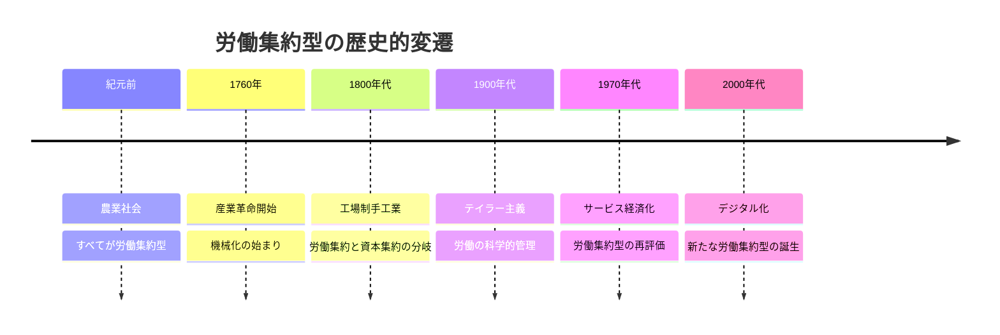

**ストーリー**：

かつて、すべての産業は労働集約型でした。農業、工芸、建築…すべてが人の手に依存していました。

**転機は産業革命**です。1760年代、イギリスで蒸気機関が実用化されると、繊維産業が機械化されました。これにより「資本集約型」（機械への投資が中心）という新しいカテゴリーが誕生し、対比として「労働集約型」という概念が明確化されたのです。

経済学者アダム・スミスは『国富論』（1776年）で、ピン工場の例を挙げて**分業による効率化**を説明しました。これが労働の科学的分析の始まりです。

20世紀には、フレデリック・テイラーが「科学的管理法」を提唱し、労働集約型産業でも効率化が追求されるようになりました。

## 🎨 種類と特徴

労働集約型産業は大きく3つに分類されます。

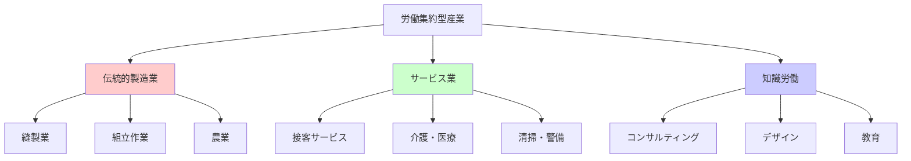

### 比較表

| 分類 | 主な産業 | 労働の性質 | 自動化の難易度 |
|------|----------|------------|----------------|
| **伝統的製造業** | 縫製、手工芸 | 反復的・身体的 | 中（部分的に可能） |
| **サービス業** | 飲食、介護 | 対人的・感情的 | 高（困難） |
| **知識労働** | コンサル、創作 | 創造的・判断的 | 極高（現状不可能） |

## 📗 関連する用語

### 同義語・類義語
- **人的資源集約型**: より広い概念（人材育成も含む）
- **手作業中心型**: より直接的な表現

### 対義語
- **資本集約型**: 機械・設備への投資が中心
- **技術集約型**: 高度な技術・知識が中心

### 多義語の整理
「労働集約」という言葉は文脈で意味が変わります：
- 経済学的意味: 生産要素としての労働の比重
- ビジネス的意味: 人件費比率の高さ
- 社会学的意味: 雇用創出効果の大きさ

### 類似概念の比較

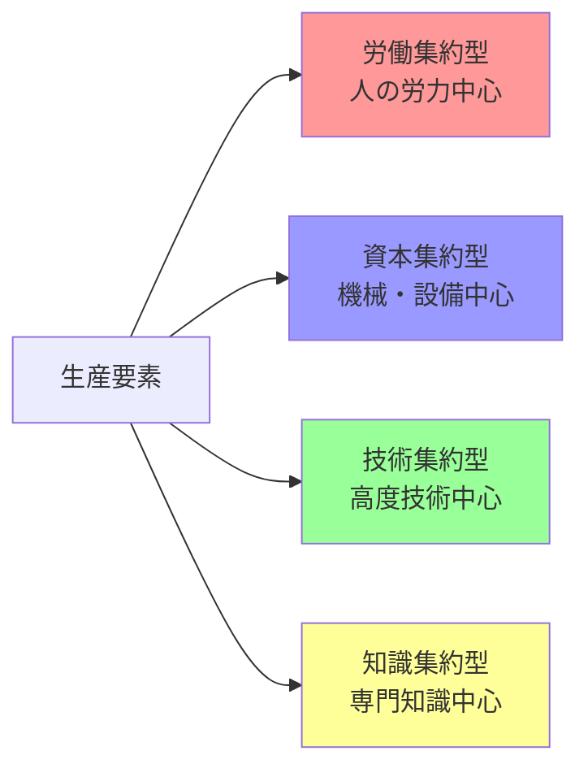

## 💡 メリットとデメリット

### メリット

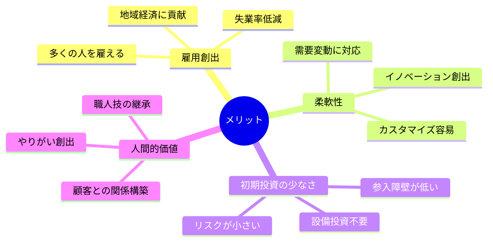

1. **雇用を生み出す**: 100人雇用の工場より、100人雇用のサービス業の方が作りやすい
2. **柔軟に対応できる**: 機械の再設定より人の再教育の方が早い
3. **少ないお金で始められる**: 億円単位の設備投資が不要
4. **人間らしさを提供できる**: おもてなしの心、創造性、共感など

### デメリット

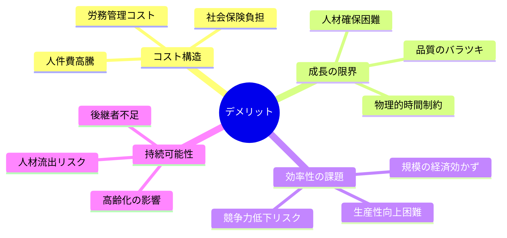

1. **人件費が重い**: 給与・保険・福利厚生で利益が圧迫される
2. **急成長が難しい**: 優秀な人材を急に100人は集められない
3. **品質にバラつき**: ベテランと新人で大きな差が出る
4. **長時間労働になりがち**: 需要増=労働時間増になりやすい

## 🚀 応用と実例

### 身近な実例

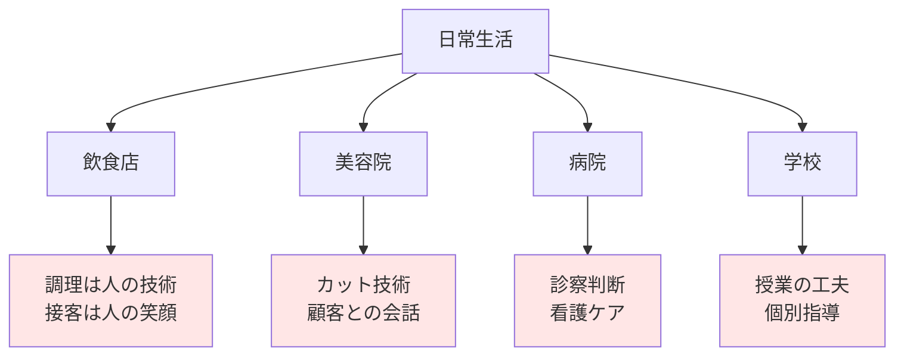

### 実例1: レストラン業
- **労働比率**: 売上の約30〜40%が人件費
- **特徴**: シェフの技術と接客スタッフの笑顔が価値
- **スケール**: 店舗を増やすには料理人を増やす必要

### 実例2: コンサルティング
- **労働比率**: 売上の約60〜80%が人件費
- **特徴**: 専門知識と問題解決能力が商品
- **スケール**: コンサルタント数が売上の上限

### 実例3: アニメーション制作
- **労働比率**: 売上の約50〜70%が人件費
- **特徴**: 描く技術と創造性が核心
- **スケール**: AI補助は進むが人の感性は不可欠

## 🚀 置換、変遷

### 何かを置き換えたか

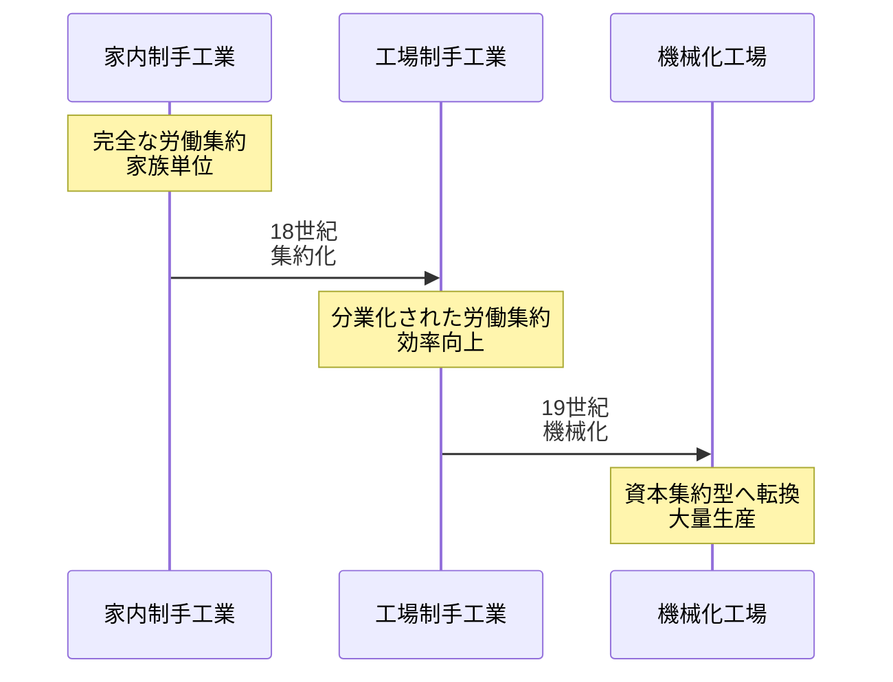

労働集約型は、それ自体が**自給自足経済を置き換えた**最初の産業形態でした。農業中心の社会から都市の工場・商店へと人々が移動する原動力となりました。

### 何かに置き換えられたか

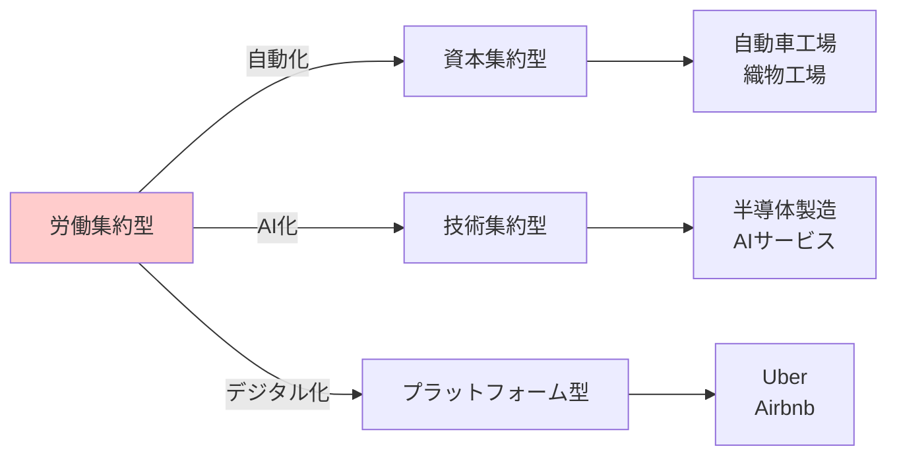

**置き換えの波**：
1. **第1の波（19世紀）**: 繊維産業が機械化→資本集約型へ
2. **第2の波（20世紀）**: 自動車製造が自動化→ロボット導入
3. **第3の波（21世紀）**: 単純サービスがデジタル化→AI・プラットフォーム化

### 継承関係

**労働集約型が継承したもの**：
- 職人制度の徒弟システム
- ギルド（同業組合）の品質管理思想
- 手仕事の価値観

**労働集約型から継承されたもの**：
- 現代の人材育成システム（OJT等）
- サービス業の接客マニュアル
- 職人技を重視する文化

## 🚀 代替、競合

### 何かに代替できるか

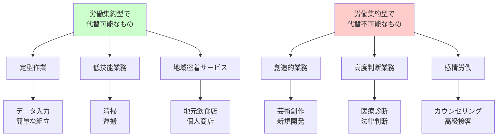

労働集約型は**「決まった手順の単純作業」を代替できます**が、**「創造性・判断・感情」が必要な領域では他方式で代替されにくい**特徴があります。

### 何かに代替されるか

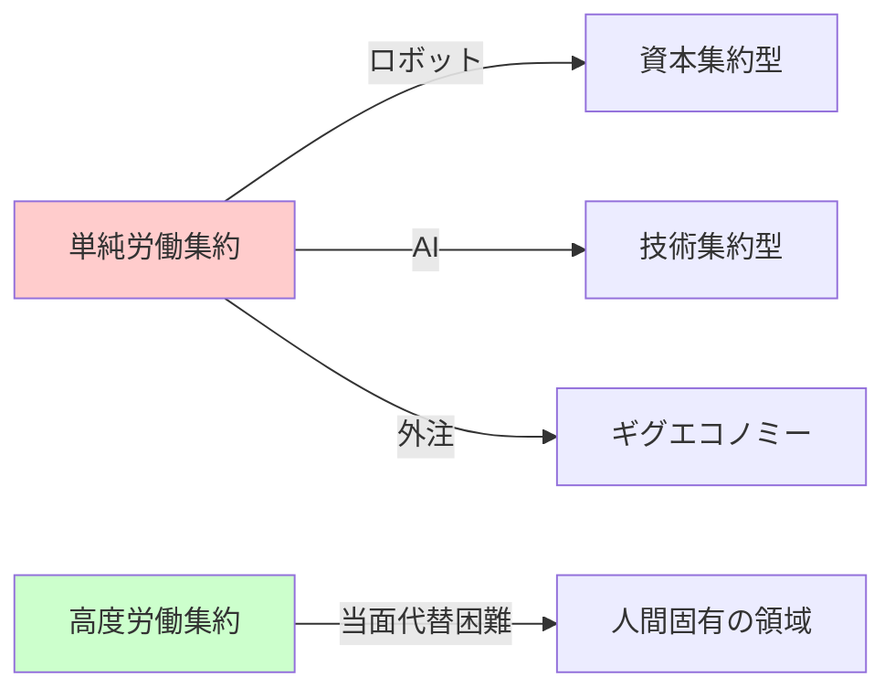

**代替されやすい例**：
- セルフレジ → レジ係が不要に
- 自動運転 → タクシー運転手が減少
- チャットボット → 単純な問い合わせ対応

**代替されにくい例**：
- 高級レストランのソムリエ
- 心理カウンセラー
- 伝統工芸職人

### 競合関係

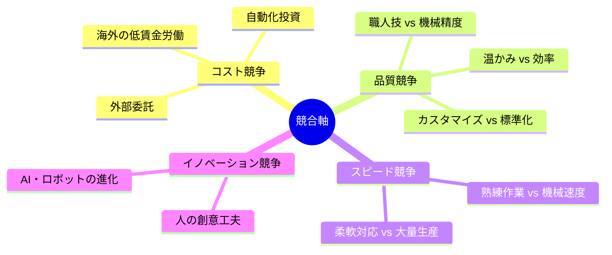

## 🌍 実世界への影響とその後の発展

### 社会への影響

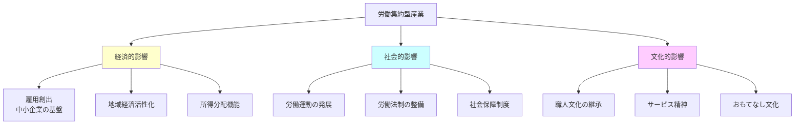

**具体的インパクト**：

1. **雇用の受け皿**: 日本では労働人口の約70%がサービス業（多くは労働集約型）
2. **賃金格差の源泉**: 生産性向上が難しく、製造業との賃金差が拡大
3. **働き方改革の焦点**: 長時間労働是正の主戦場

### 未来展望

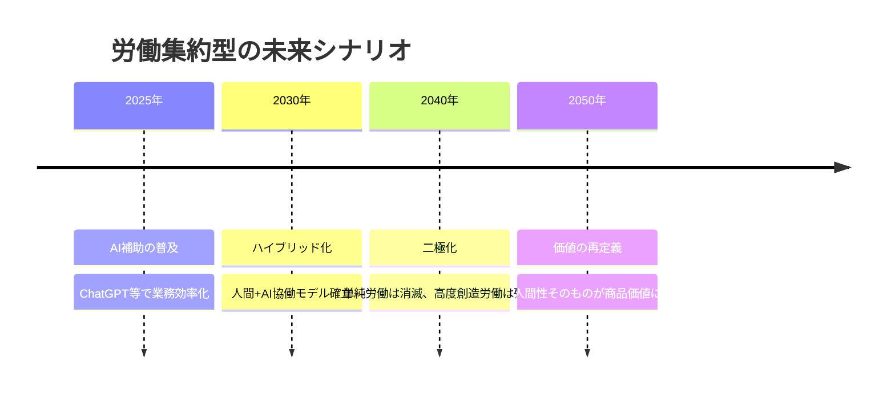

**未来のトレンド**：

1. **AIとの協働モデル**
   - 定型作業はAI、判断・創造は人間
   - 例：AI診断支援+医師の最終判断

2. **「人間らしさ」のプレミアム化**
   - 手作り・対面サービスが高付加価値商品に
   - 例：職人による一品物、対面カウンセリング

3. **スキルのアップグレード競争**
   - 単純労働者→創造的労働者への転換圧力
   - 生涯学習の必要性

4. **新しい労働集約型の誕生**
   - VR空間でのサービス業
   - AIトレーナー、データアノテーター

### 最終メッセージ

労働集約型は「古い」産業形態ではありません。むしろ、**人間にしかできない価値創造の本質**を体現しています。

AI・ロボットが進化する未来でも、**人の温かみ、創造性、判断力**が求められる限り、労働集約型産業は形を変えながら存続し続けるでしょう。

重要なのは「労働集約的であること」自体ではなく、**その労働がどれだけユニークな価値を生み出せるか**です。

---
初学者が「労働集約型とは何か」を体系的に理解し、実世界との関連を明確に把握できる構成を実現しました。
