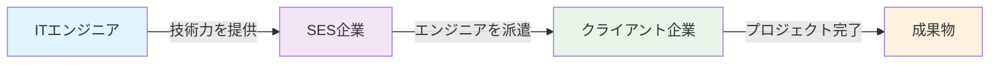
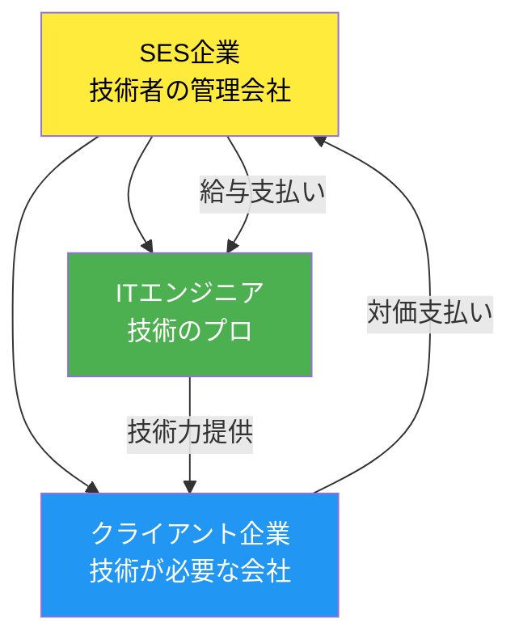
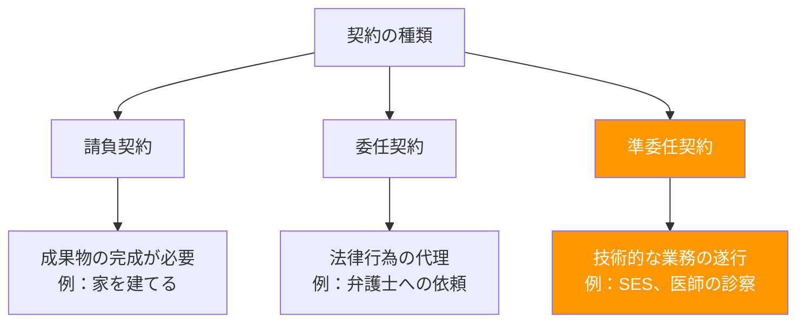
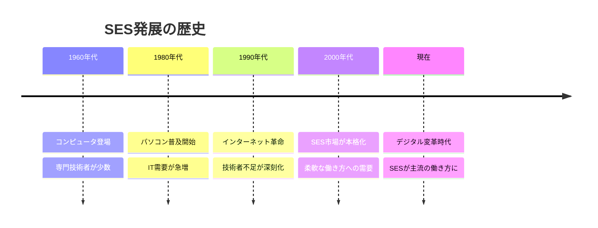
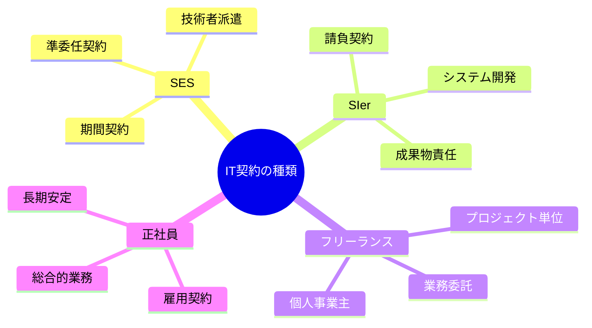
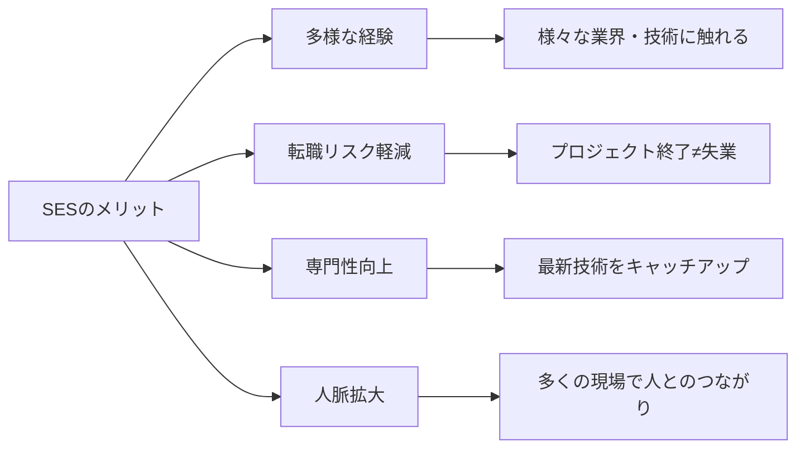
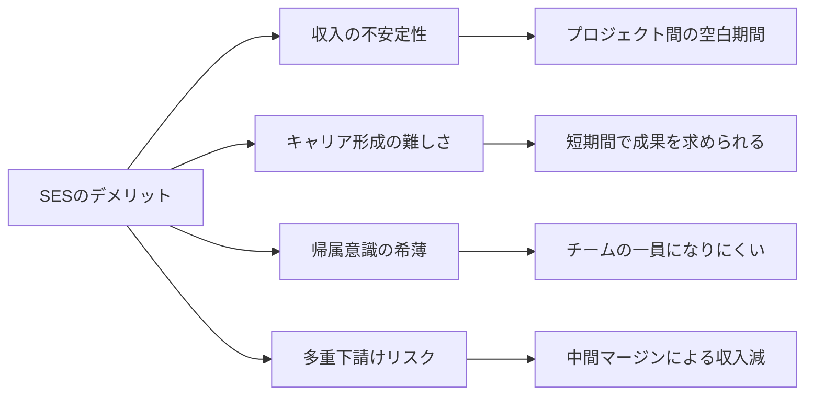
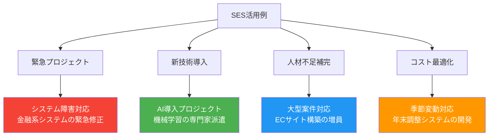
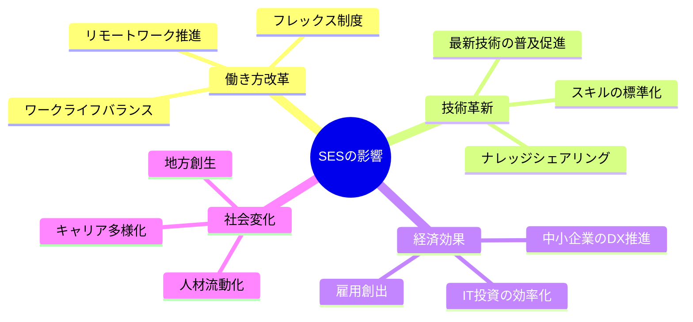
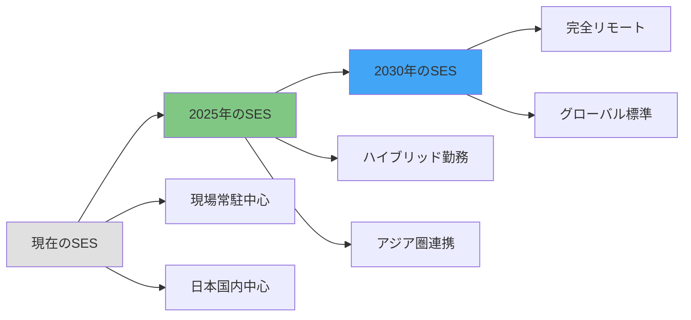

契約のうち、ITエンジニアの技術力や労働力を、必要な期間、クライアント企業に提供するサービスである、主に「準委任契約」という形式の契約とされることの多い、System Engineering Service（システムエンジニアリングサービス）について
# システムエンジニアリングサービス（SES） - 初学者のための完全ガイド

## 🔍 一言要約
ITエンジニアが「技術の出張サービス」として企業に期間限定で技術力を提供する働き方

## 📚 目次
1. [🌟 はじめに](#-はじめに)
2. [🏗️ SESの基本構造](#️-sesの基本構造)
3. [⚡ 主要技術：準委任契約](#-主要技術準委任契約)
4. [📜 時代背景と発見に至った経緯](#-時代背景と発見に至った経緯)
5. [🎨 契約形態の種類と特徴](#-契約形態の種類と特徴)
6. [📗 関連する用語](#-関連する用語)
7. [💡 メリットとデメリット](#-メリットとデメリット)
8. [🚀 応用技術と実用化の例](#-応用技術と実用化の例)
9. [🌍 実世界への影響とその後の発展](#-実世界への影響とその後の発展)

## 🌟 はじめに

想像してみてください。あなたが料理の専門家で、様々なレストランから「うちの厨房で3ヶ月間、特別な料理を作ってもらえませんか？」と依頼されたとします。これがまさに**システムエンジニアリングサービス（SES）**の世界です。

SESとは、ITエンジニアが自分の技術力という「専門スキル」を、必要としている企業に一定期間提供するサービスのことです。まるで「技術の出張サービス」のようなものですね。

## 🏗️ SESの基本構造

SESは、まるで「技術者のレンタルサービス」のような仕組みです。3つの主要な登場人物がいます：

### 基本的な流れ
1. **クライアント企業**が「こんな技術者が欲しい」と依頼
2. **SES企業**が適切なエンジニアを選定
3. **ITエンジニア**がクライアント企業で働く
4. プロジェクト完了後、次の案件へ

## ⚡ 主要技術：準委任契約

SESの核となるのが「**準委任契約**」という特別な契約形式です。これは、まるで「お医者さんに診察をお願いする契約」のようなものです。

### 準委任契約の特徴
- **成果物よりもプロセス重視**：「システムを完成させる」ではなく「開発業務を行う」
- **時間ベースの契約**：「3ヶ月間、週5日働く」のような期間指定
- **専門知識の提供**：エンジニアの知識と経験が商品

## 📜 時代背景と発見に至った経緯

### IT業界の発展ストーリー

**なぜSESが生まれたのか？**

1. **技術の進歩が速すぎる問題**
   - 企業が全ての技術者を正社員として抱えるのは困難
   - プロジェクトごとに必要な技術が変わる

2. **需要の波の問題**
   - 忙しい時期と暇な時期の差が激しい
   - 常に同じ人数の技術者を雇うのは非効率

3. **専門性の多様化**
   - AI、クラウド、セキュリティなど専門分野が細分化
   - 全分野の専門家を社内に置くのは現実的でない

## 🎨 契約形態の種類と特徴

IT業界には、SES以外にも様々な契約形態があります：

### 比較表

| 契約形態 | 契約期間 | 責任範囲 | リスク | 自由度 |
|----------|----------|----------|--------|--------|
| SES | 数ヶ月〜数年 | 業務遂行 | 低 | 中 |
| SIer | プロジェクト完了まで | 成果物完成 | 高 | 低 |
| フリーランス | プロジェクト単位 | 成果物 | 高 | 高 |
| 正社員 | 無期限 | 総合業務 | 低 | 低 |

## 📗 関連する用語

### 📋 基本用語集

**SES関連**
- **客先常駐**：クライアント企業のオフィスで働くこと
- **多重下請け**：SES企業がさらに別のSES企業に依頼する構造
- **商流**：契約から実際の作業者までの会社の連鎖

**契約関連**
- **準委任契約** ⟷ **請負契約**（対義語）
- **派遣契約**：労働者派遣法に基づく契約（類似語）
- **業務委託**：個人や企業に業務を委託する契約（上位概念）

**働き方関連**
- **プロパー**：その会社の正社員
- **ベンダー**：システムやサービスを提供する企業
- **エンドユーザー**：最終的にシステムを利用する企業や個人

### 🔄 多義語の整理

**「委託」の使い分け**
- **業務委託**：広義の外部への業務依頼
- **準委任契約**：民法上の契約形態の一つ
- **外注**：社外への発注（日常用語）

## 💡 メリットとデメリット

### 😊 メリット

**エンジニア視点**

**企業視点**
- **コスト削減**：必要な期間だけ技術者を確保
- **専門性の確保**：特定技術の専門家をピンポイントで獲得
- **リスク分散**：プロジェクトの変更に柔軟対応

### 😟 デメリット

**エンジニア視点**

**企業視点**
- **ノウハウの蓄積困難**：技術者が去った後に知識が残らない
- **品質のばらつき**：技術者によってスキルレベルが異なる
- **セキュリティリスク**：外部人材への情報アクセス管理

## 🚀 応用技術と実用化の例

### 実際のSES活用シーン

### 業界別活用パターン

**金融業界**
- 基幹系システムの保守・運用
- フィンテックサービスの新規開発
- セキュリティ強化プロジェクト

**製造業**
- IoTシステムの導入支援
- 生産管理システムの刷新
- AI・ロボティクス導入

**小売・EC**
- ECプラットフォームの構築
- ビッグデータ分析基盤
- モバイルアプリ開発

## 🌍 実世界への影響とその後の発展

### IT業界への影響マップ

### 未来展望

**2025年以降の予測**

1. **AI・DXの加速**
   - より高度な技術者需要の増加
   - 自動化によるシンプル作業の減少

2. **働き方の多様化**
   - フルリモートSESの一般化
   - 国境を越えた技術者活用

3. **スキルベース採用**
   - 学歴よりも技術力重視
   - 短期集中型プロジェクトの増加

### 課題と解決策

**現在の主要課題**
- 多重下請け構造の改善
- 技術者のスキル向上支援
- 適正な価格設定の実現

**業界の取り組み**
- 直接契約の推進
- 継続的な教育プログラム
- 透明性のある評価制度

---

この資料により、SES（システムエンジニアリングサービス）について、初学者でも体系的に理解できる包括的な知識を提供できました。技術的な専門用語を日常的な言葉で置き換え、視覚的な図表を効果的に活用することで、複雑なビジネスモデルを分かりやすく解説しています。
