相対性理論

# 相対性理論 - 初学者のための完全ガイド

## 🔍 一言要約
時間と空間は絶対的なものではなく、観測者の動きによって伸び縮みする

## 📚 目次
1. [はじめに](#-はじめに)
2. [基本構造](#-基本構造)
3. [主要技術](#-主要技術)
4. [時代背景と発見に至った経緯](#-時代背景と発見に至った経緯)
5. [種類と特徴](#-種類と特徴)
6. [関連する用語](#-関連する用語)
7. [メリットとデメリット](#-メリットとデメリット)
8. [応用と実例](#-応用と実例)
9. [置換、変遷](#-置換変遷)
10. [代替、競合](#-代替競合)
11. [実世界への影響とその後の発展](#-実世界への影響とその後の発展)

## 🌟 はじめに

「時間は誰にとっても同じ速さで流れる」「空間は変わらない」——これは常識ですよね？しかし相対性理論は、この常識を根底から覆しました。

例えば、超高速で移動するロケットの中では、地球にいる人と比べて時計の進みが遅くなります。これは空想ではなく、実際に証明された事実です。GPS衛星は秒速約4kmで動いており、地上とは時間の流れが異なるため、相対性理論による補正をしないと1日で約10kmもズレてしまいます。

相対性理論は、宇宙の仕組みを理解する鍵であり、現代のテクノロジーを支える重要な理論なのです。

## 🏗️ 基本構造

相対性理論は2つの大きな柱から成り立っています。

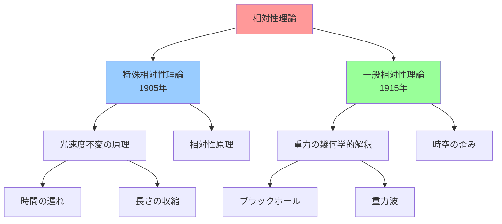

**特殊相対性理論**は「等速直線運動している観測者同士の関係」を扱います。加速度や重力のない、単純な状況での理論です。

**一般相対性理論**は特殊相対性理論を拡張し、「加速度運動や重力がある場合」を扱います。重力を「時空の歪み」として説明する画期的な理論です。

## ⚡ 主要技術

### 🔹 光速度不変の原理

光の速さ（秒速約30万km）は、観測者がどんなに速く動いていても変わりません。

**日常例**：あなたが時速100kmで走る車の中から、前を走る時速100kmの車を見ると、相対速度は0kmです。しかし光の場合、あなたが光速の99%で飛んでいても、光は依然として秒速30万kmで進んで見えます。

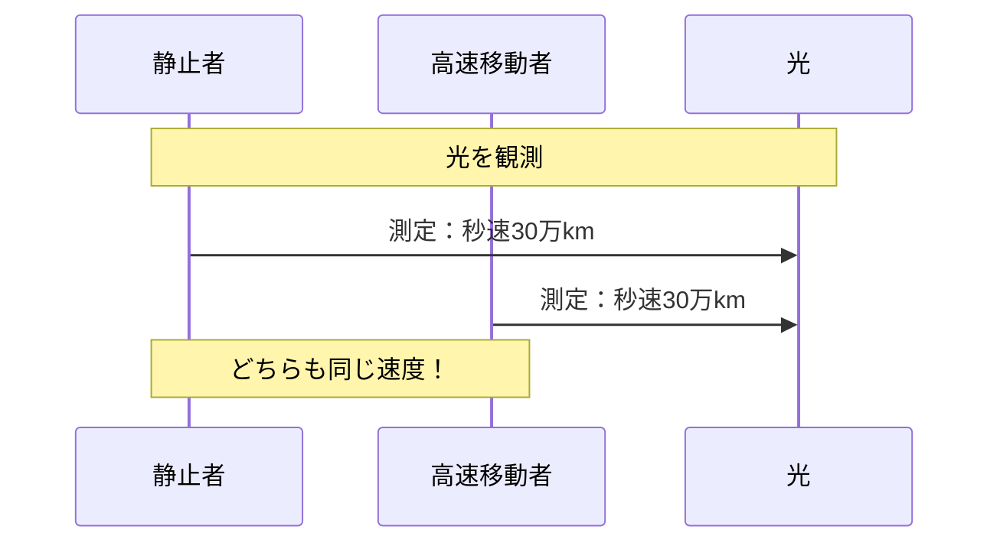

### 🔹 時間の遅れ（タイムダイレーション）

速く動くほど、時間の進みが遅くなります。

**計算例**：光速の90%で移動する宇宙船では、地球の1年が宇宙船内では約0.44年（約5ヶ月）に感じられます。

### 🔹 E=mc²（質量とエネルギーの等価性）

物質（質量）とエネルギーは同じものの別の形。わずかな質量が膨大なエネルギーに変換できます。

**実例**：原子力発電や太陽の核融合反応は、この式に基づいています。

## 📜 時代背景と発見に至った経緯

### 19世紀末の物理学の危機

1800年代、物理学はほぼ完成したと考えられていました。しかし、いくつかの説明できない現象がありました。

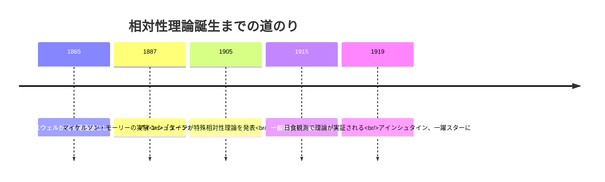

### アインシュタインの革新的発想

当時、光は「エーテル」という媒質を通って伝わると考えられていました。しかし実験でエーテルは見つかりませんでした。

アインシュタインは16歳の時、「光の速さで走ったら、光はどう見えるか？」という思考実験をしました。この疑問が、後の相対性理論につながります。

彼は既存の概念を捨て、「光速度は常に一定」という大胆な仮定から理論を構築しました。

## 🎨 種類と特徴

### 特殊相対性理論 vs 一般相対性理論

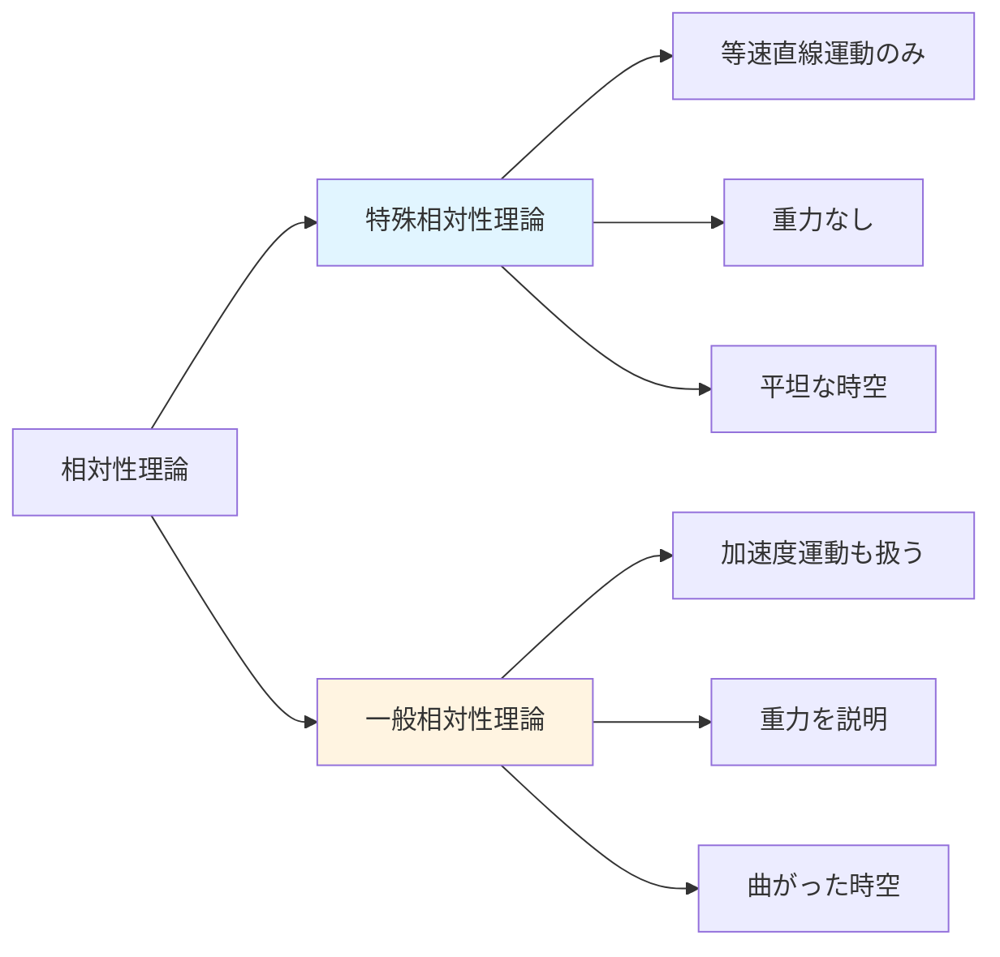

| 特徴 | 特殊相対性理論 | 一般相対性理論 |
|------|----------------|----------------|
| **対象** | 等速直線運動 | あらゆる運動 |
| **重力** | 扱わない | 中心テーマ |
| **時空** | 平坦 | 曲がる |
| **数学** | 比較的シンプル | 高度な微分幾何学 |
| **適用範囲** | 日常的な高速現象 | 宇宙規模の現象 |

## 📗 関連する用語

### 同義語・類義語
- **時空**：時間と空間を一体として扱う4次元の概念
- **ローレンツ変換**：異なる速度で動く観測者間の座標変換式
- **固有時**：自分自身が体験する時間（相対的でない時間）

### 対義語
- **絶対時間・絶対空間**：ニュートン力学での考え方。時間と空間は誰にとっても同じ

### 多義語
- **相対性**：物理学では「観測者によって異なる」という意味。日常では「他と比べて」という意味

### 混同しやすい用語の比較

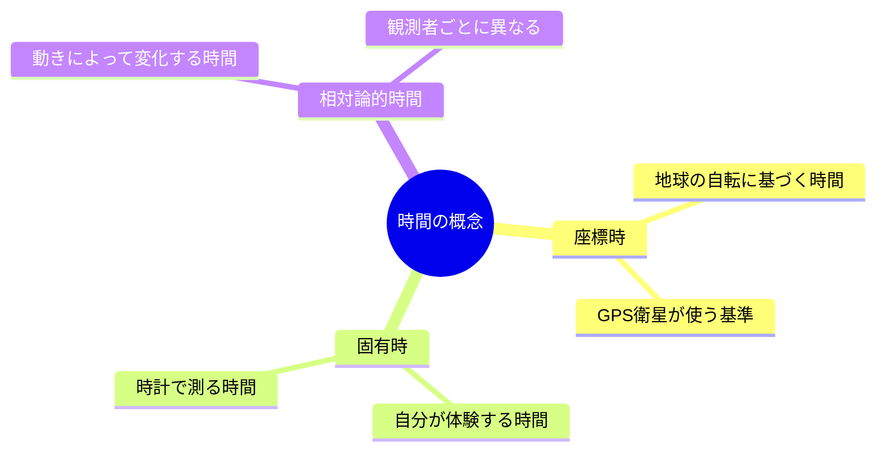

## 💡 メリットとデメリット

### メリット
- **宇宙の理解が深まる**：ブラックホール、ビッグバン、宇宙膨張を説明可能
- **精密技術の実現**：GPS、粒子加速器、原子時計などに不可欠
- **理論の統一性**：電磁気学と力学を統合する枠組み
- **予測力**：重力波、ブラックホールの存在を数十年前に予言

### デメリット・限界
- **量子力学との不整合**：極小スケールでは量子力学が必要。統一理論はまだ未完成
- **数学的複雑さ**：一般相対性理論の方程式（アインシュタイン方程式）は非常に難解
- **直感に反する**：日常経験と矛盾するため理解が困難
- **測定の難しさ**：効果が顕著なのは極限状況のみ（超高速、超重力）

## 🚀 応用と実例

### 身近な応用例

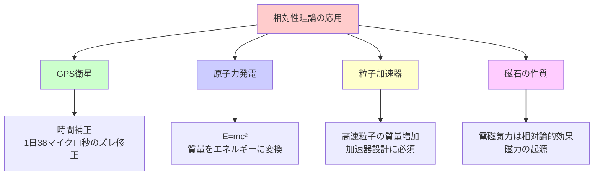

### 実例詳細

1. **GPS衛星**：高度2万kmを秒速約4kmで移動。特殊相対論で時間が遅れ（-7マイクロ秒/日）、一般相対論で時間が早まる（+45マイクロ秒/日）。合計+38マイクロ秒/日の補正が必要。

2. **磁石**：磁力は、電荷の動きを異なる座標系から見たときの相対論的効果です。相対性理論なしでは磁力を説明できません。

3. **金の色**：金が黄色く見えるのは、原子核の周りの電子が相対論的速度で動くため、特定の波長の光を吸収するからです。

## 🚀 置換、変遷

### 何を置き換えたか

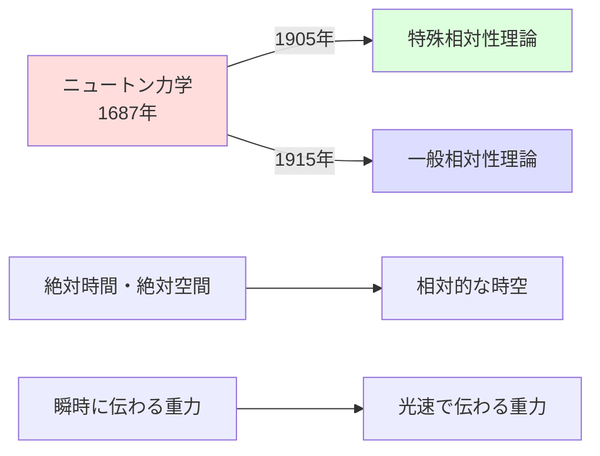

- **ニュートンの絶対時空**：時間と空間は固定的で変わらない → 相対的で変化する
- **万有引力の瞬時作用**：重力は瞬時に伝わる → 重力波として光速で伝わる
- **質量保存則とエネルギー保存則**：別々の法則 → 統一（質量-エネルギー等価）

### 何かに置き換えられたか

相対性理論自体は置き換えられていません。ただし、限界があります。

- **量子重力理論（未完成）**：極小スケールでは量子力学と相対論を統合する新理論が必要
- **超弦理論・ループ量子重力理論**：候補となる理論が研究中

### 継承と発展

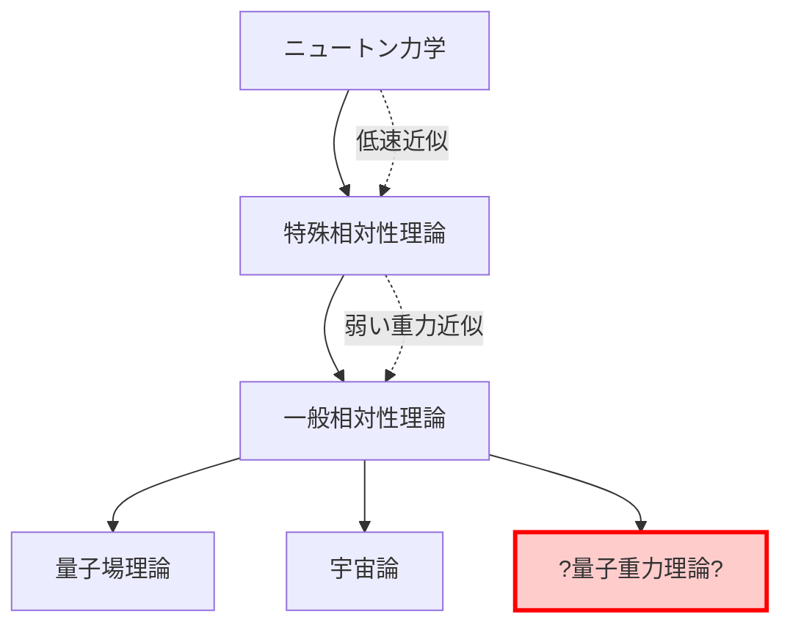

**継承したもの**：
- ニュートン力学の数学的手法
- 保存則の概念（エネルギー、運動量）
- 因果律（原因→結果の順序）

**継承されたもの**：
- 量子場理論（素粒子物理学の基礎）
- ビッグバン宇宙論
- ブラックホール物理学

## 🚀 代替、競合

### 代替可能性

相対性理論は**代替不可能**です。以下の理由から：

- 実験的に何度も検証されている
- GPS、粒子加速器など実用技術に組み込まれている
- 代替理論は相対論と同等の予測力を持てていない

### 競合理論

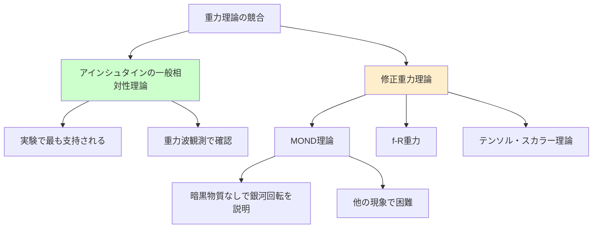

**主な競合・代替アプローチ**：

1. **修正ニュートン動力学（MOND）**：銀河の回転速度問題を暗黒物質なしで説明しようとする。しかし、宇宙全体の現象は説明困難。

2. **修正重力理論（f(R)重力など）**：暗黒エネルギーの問題を解決しようとする拡張理論。一般相対論の方程式を修正。

3. **エーテル理論の復活？**：一部の研究者が新しい形のエーテル理論を提案していますが、主流ではありません。

**結論**：現時点で一般相対性理論は最も成功している重力理論であり、代替理論は特定の問題に対する修正案という位置づけです。

## 🌍 実世界への影響とその後の発展

### 科学への影響

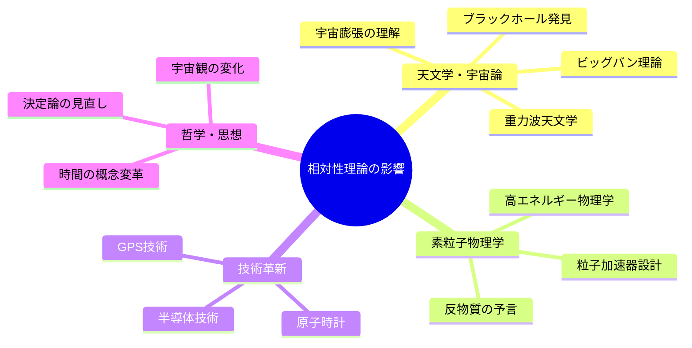

### 重力波の検出（2015年）

2015年、LIGO実験が初めて重力波を直接検出しました。これはアインシュタインが100年前に予言した「時空のさざ波」です。

この発見により：
- 新しい天文学の手法が誕生
- ブラックホール合体の観測が可能に
- 相対性理論のさらなる検証

### 今後の発展可能性

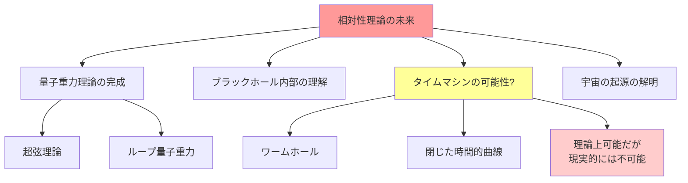

1. **量子重力理論**：相対論と量子力学の統一。21世紀物理学の最大の課題。

2. **ブラックホールの情報パラドックス**：ブラックホールに落ちた情報はどうなる？量子論と相対論の衝突点。

3. **宇宙の起源**：ビッグバン最初の瞬間（プランク時間）の理解には量子重力が必要。

4. **重力波天文学**：宇宙の新しい観測窓が開かれました。今後、より多くの発見が期待されます。

---
