# 人間のメンタルモデルと生成AI 完全理解ガイド

## 🌟 一言要約

**メンタルモデル**とは「頭の中の設計図」であり、生成AIとの関係性を理解することは、未来の人機協調社会を築く鍵となる認知科学の最重要テーマです。

## 📖 目次

```mermaid
graph TD
    A[🌟 一言要約] --> B[🧠 メンタルモデル基礎理解]
    A --> C[🤖 生成AIとの関係性]
    A --> D[⚡ 重要性の深層分析]
    A --> E[🚀 発展性と未来展望]
    A --> F[📚 学習ロードマップ]
    
    B --> B1[基本概念]
    B --> B2[認知メカニズム]
    B --> B3[形成プロセス]
    
    C --> C1[相互作用パターン]
    C --> C2[心理的影響]
    C --> C3[適応メカニズム]
    
    D --> D1[認知科学的意義]
    D --> D2[社会的インパクト]
    D --> D3[倫理的考察]
    
    E --> E1[技術発展動向]
    E --> E2[人機協調の未来]
    E --> E3[応用可能性]
    
    F --> F1[初学者向けパス]
    F --> F2[専門家向けパス]
    F --> F3[実践応用パス]
    
    click A "#一言要約"
    click B "#メンタルモデル基礎理解"
    click C "#生成aiとの関係性"
    click D "#重要性の深層分析"
    click E "#発展性と未来展望"
    click F "#学習ロードマップ"
```

## 🚀 はじめに

想像してみてください。あなたが初めて自転車に乗った時の記憶を。最初はバランスを取るのに必死でしたが、一度身につけると無意識に乗れるようになりました。これが「**メンタルモデル**」の力です。

現在、生成AIが私たちの生活に浸透する中で、人間の脳内にある「思考の設計図」であるメンタルモデルと、AIシステムがどのように相互作用するかが、人とAIの関係をどのように理解すべきかという注目される問題となっています。

この概要資料では、料理のレシピを覚えるように段階的に、この複雑で魅力的なテーマを解き明かしていきます。

## 🧠 メンタルモデル基礎理解

### 基本概念：心の中の「設計図」

メンタルモデルとは、頭の中にある「ああなったらこうなる」といった「行動のイメージ」を表現したものです。

想像してみてください：
- **カフェでの注文** = 「メニューを見る→注文する→お金を払う→商品を受け取る」
- **スマホの操作** = 「アプリアイコンをタップする→アプリが起動する」
- **信号機の理解** = 「赤＝止まれ、青＝進め」

```mermaid
graph LR
    A[外界の刺激] --> B[メンタルモデル<br/>頭の中の設計図]
    B --> C[行動予測]
    B --> D[意思決定]
    B --> E[適応行動]
    
    C --> F[実際の行動]
    D --> F
    E --> F
    
    F --> G[結果の観察]
    G --> H[メンタルモデルの更新]
    H --> B
    
    style B fill:#e1f5fe
    style H fill:#f3e5f5
    
    click B "#認知メカニズム"
    click H "#形成プロセス"
```

### 認知メカニズム：脳はどう「理解」するか

メンタルモデルは、プロダクト、場所、人々など、相互作用するすべてのものに形成される認知の基盤です。

**メンタルモデルの3つの特徴：**

1. **効率性** - 時間とエネルギーを節約する手段として慎重に考慮された分析を置換
2. **適応性** - 新しい状況に既存の知識を応用
3. **予測性** - 未来の状況を推定する基盤

### 形成プロセス：経験が作る「思考の地図」

メンタルモデルは、人がこれまで生きてきた中で積み重ねてきた経験やできごと、育った環境や文化などによって形成されます。

**形成の4段階：**
1. **体験** - 新しい状況に遭遇
2. **観察** - 結果を記憶に保存
3. **パターン化** - 共通点を発見
4. **モデル化** - 予測可能な「設計図」として定着

## 🤖 生成AIとの関係性

### 相互作用パターン：人とAIの「対話の舞台」

生成AIと人間の関係は、まるでダンスパートナーのようなものです。お互いのステップを理解し合うことで、美しいハーモニーが生まれます。

```mermaid
graph TD
    subgraph "人間側"
        A[既存のメンタルモデル]
        B[AI使用体験]
        C[期待の調整]
    end
    
    subgraph "AI側"
        D[応答パターン]
        E[学習データ]
        F[出力生成]
    end
    
    subgraph "相互作用空間"
        G[共創プロセス]
        H[価値生成]
        I[関係性進化]
    end
    
    A --> G
    B --> G
    C --> G
    D --> G
    E --> G
    F --> G
    
    G --> H
    H --> I
    I --> A
    I --> D
    
    style G fill:#e8f5e8
    style H fill:#fff3e0
    style I fill:#f3e5f5
    
    click G "#心理的影響"
    click H "#適応メカニズム"
    click I "#重要性の深層分析"
```

### 心理的影響：AIが変える「心の風景」

最新の研究では、AIとの関わりにおいても、人間関係と同様に「自分の気持ちを話したくない傾向」（親密性回避）と「AIに感情的な反応を求める傾向」（見捨てられ不安）という2つの傾向が見られることが判明しています。

**3つの主要な心理的変化：**

1. **依存性の形成**
   - AIへの過度な信頼
   - 自己判断力の低下リスク

2. **創造性への影響**
   - 生成AIの能力を活かしながらも、人間の創造性や自律性、心理的満足感を維持していくことが重要

3. **認知負荷の軽減**
   - あるタスクにかかる時間が37％減少し、成果物の質も高まる効果

### 適応メカニズム：共に成長する関係性

人間のメンタルモデルは、生成AIとの接触を通じて継続的に更新されます。これは新しい楽器を学ぶプロセスに似ています。

**適応の3段階：**
1. **探索期** - AIの能力と限界を理解
2. **調整期** - 効果的な使用方法を習得
3. **統合期** - AIを自然な思考パートナーとして活用

## ⚡ 重要性の深層分析

### 認知科学的意義：思考の革命

メンタルモデルとAIの関係性の研究は、心理学と機械工学の両面から取り組む必要がある学際的分野です。

**3つの研究領域：**

1. **認知拡張** - AIによる人間の思考能力の増強
2. **意思決定支援** - より良い判断を支援するシステム
3. **学習効率化** - 知識習得プロセスの最適化

```mermaid
flowchart TD
    subgraph "認知科学的意義"
        A[人間の思考メカニズム解明]
        B[AIとの協調モデル構築]
        C[新しい学習理論の発展]
    end
    
    subgraph "社会的インパクト"
        D[教育革新]
        E[労働環境変化]
        F[コミュニケーション進化]
    end
    
    subgraph "倫理的考察"
        G[プライバシー保護]
        H[自律性の維持]
        I[公平性の確保]
    end
    
    A --> D
    B --> E
    C --> F
    
    D --> G
    E --> H
    F --> I
    
    style A fill:#e3f2fd
    style E fill:#f1f8e9
    style H fill:#fce4ec
    
    click A "#社会的インパクト"
    click E "#倫理的考察"
    click H "#発展性と未来展望"
```

### 社会的インパクト：社会を変える力

AIと人間のインタラクションによる価値創造とエンパワーメントに焦点を当て、人間中心のアプローチに基づいた研究や実践が求められています。

**5つの変革領域：**

1. **教育分野** - 個人最適化された学習支援
2. **医療分野** - 生成AI chatbotsによる心理的サポート効果
3. **ビジネス分野** - 意思決定プロセスの高度化
4. **創作分野** - 人間とAIの共創による新表現
5. **福祉分野** - 高齢者・障害者支援の進化

### 倫理的考察：責任ある発展のために

孤立感や不安を抱える人がAIに過剰に頼らないよう、感情を操作しすぎない倫理的な設計と透明な説明が社会的に求められる状況です。

**倫理的課題のトライアングル：**
- **透明性** - AIの判断プロセスの可視化
- **公平性** - すべての人への平等なアクセス
- **自律性** - 人間の主体性の尊重

## 🚀 発展性と未来展望

### 技術発展動向：次世代への架け橋

時代は生成AIからAIエージェントへと変化しており、個性（Profile）、記憶（Memory）、計画（Planning）、行動（Action）の4つの要素が相互作用する高度なシステムが登場しています。

**発展の3つの方向性：**

```mermaid
timeline
    title AI発展のロードマップ
    
    2025 : 生成AI時代
         : 基本的な対話・創作支援
         : メンタルモデルの初期研究
    
    2027 : AIエージェント時代
         : 個性を持つAIパートナー
         : 深層的な人機協調
    
    2030 : 統合知能時代
         : 人間とAIの認知統合
         : 新しい思考パラダイム
    
    2035 : 共進化時代
         : 人機一体の新社会
         : 認知的共生の実現
```

### 人機協調の未来：共に創る明日

人間のようなロボット」の基盤となる「人間と同じようなコミュニケーション機能を機械で実現する」研究が進展しています。

**未来の協調モデル：**

1. **認知的パートナーシップ**
   - AIが人間の思考を補完
   - 相互の強みを活かす協働

2. **感情的共鳴システム**
   - 感情を理解し応答するAI
   - より自然な相互作用

3. **創造的共進化**
   - 人間とAIが共に成長
   - 新しい価値の創造

### 応用可能性：無限の可能性

**5つの革新的応用領域：**

1. **パーソナライズド教育** - 一人ひとりの学習スタイルに適応
2. **創造的支援ツール** - アーティストや作家のパートナー
3. **意思決定支援システム** - 複雑な判断をサポート
4. **感情ケアAI** - メンタルヘルスの維持・向上
5. **文化的橋渡し** - 異なる文化間の理解促進

## 📚 学習ロードマップ

### 初学者向けパス：基礎から応用へ

**ステップ1：基礎理解（1-2週間）**
- メンタルモデルの概念を身近な例で理解
- 認知科学の基本原理を学習
- 簡単なAI体験（ChatGPTとの対話など）

**ステップ2：関係性の探索（2-3週間）**
- AIとの相互作用パターンの観察
- 自身のメンタルモデルの変化を記録
- 心理的影響の自己分析

**ステップ3：実践応用（1ヶ月）**
- 日常生活でのAI活用実験
- 効果的な使用方法の発見
- 他者との経験共有

### 専門家向けパス：研究と実践の統合

**フェーズ1：理論的基盤（1ヶ月）**
- 認知科学の最新研究レビュー
- AI技術の深層理解
- 学際的アプローチの習得

**フェーズ2：実証研究（2-3ヶ月）**
- 実験デザインの設計
- データ収集と分析
- 仮説検証プロセス

**フェーズ3：応用開発（継続的）**
- 実用的システムの構築
- 社会実装の検討
- 倫理的ガイドライン策定

### 実践応用パス：社会変革への貢献

**段階1：問題発見**
- 現実社会の課題特定
- AIによる解決可能性の評価
- ステークホルダーの分析

**段階2：解決策設計**
- 人間中心設計の実践
- AIシステムの要件定義
- プロトタイプ開発

**段階3：社会実装**
- パイロット実験の実施
- フィードバック収集と改善
- スケールアップ戦略

## 🔗 関連リソース

### 📖 必読文献

### 🌐 オンラインリソース

### 🎯 実践コミュニティ
- AI倫理研究グループ
- 人機協調デザインワークショップ
- メンタルモデル研究会

---

## ✨ まとめ：共に歩む未来への第一歩

人間のメンタルモデルと生成AIの関係性は、まさに「認知の新しい地平線」を切り開く冒険です。生成AIと人間の関係性は進化し続け、テクノロジーとの新たな共存の形を模索し続ける必要があります。

この概要資料を読み終えた今、あなたは以下のことができるようになりました：

🎯 **メンタルモデルの本質を理解** - 思考の設計図としての役割
🤖 **AIとの健全な関係性を築く方法** - 相互補完的なパートナーシップ  
⚡ **未来社会への影響を予測** - 技術と人間性の調和
🚀 **実践的な学習パスの選択** - 個人の目標に応じた成長戦略

**次のステップ：**
1. 自分自身のメンタルモデルを観察してみましょう
2. AI（ChatGPTなど）との対話で変化を記録してみましょう
3. 周囲の人とこのテーマについて議論してみましょう
4. 関連する研究論文を1つ読んでみましょう

未来は、人間とAIが共に創造する美しい協奏曲のようなものになるでしょう。その最初の音符を、今日から奏で始めませんか？

---

Warning: Don’t paste code into the DevTools Console that you don’t understand or haven’t reviewed yourself. This could allow attackers to steal your identity or take control of your computer. Please type ‘allow pasting’ below and hit Enter to allow pasting.
allow pasting
// GitHubの新しい目次パネルからリンクを取得
console.log('=== GitHub Markdown 目次リンク取得 ===');

// 新しいGitHubのUI構造に基づくセレクタ
const outlineLinks = Array.from(document.querySelectorAll('nav.TableOfContentsPanel-module__NavList--LnyCZ a'))
  .filter(link => link.getAttribute('href') && link.getAttribute('href').startsWith('#'))
  .map(link => {
    const href = link.getAttribute('href');
    const text = link.querySelector('.prc-ActionList-ItemLabel-TmBhn')?.textContent.trim() || 
                 link.textContent.trim();
    
    return {
      text: text,
      hash: href,
      fullUrl: window.location.origin + window.location.pathname + href
    };
  });

console.log(`✅ ${outlineLinks.length}個の目次リンクを取得しました`);

if (outlineLinks.length > 0) {
  // テーブル形式で表示
  console.table(outlineLinks);
  
  // URL一覧を表示
  const urls = outlineLinks.map(item => item.fullUrl);
  console.log('\n=== URL一覧 ===');
  urls.forEach((url, index) => {
    console.log(`${index + 1}. ${url}`);
  });
  
  // クリップボードにコピー
  if (navigator.clipboard) {
    navigator.clipboard.writeText(urls.join('\n'))
      .then(() => console.log('\n✅ URLがクリップボードにコピーされました'))
      .catch(err => console.log('❌ クリップボードへのコピーに失敗:', err));
  }
  
  // 配列として出力（コピペしやすい形式）
  console.log('\n=== JavaScript配列形式 ===');
  console.log(JSON.stringify(urls, null, 2));
  
} else {
  console.log('❌ 目次リンクが見つかりませんでした');
  
  // デバッグ用：利用可能な要素を確認
  console.log('\n=== デバッグ情報 ===');
  const navElement = document.querySelector('nav.TableOfContentsPanel-module__NavList--LnyCZ');
  if (navElement) {
    console.log('✅ nav要素は見つかりました');
    const allLinks = navElement.querySelectorAll('a');
    console.log(`nav内のaタグ数: ${allLinks.length}`);
  } else {
    console.log('❌ nav要素が見つかりません');
  }
}

VM401:2 === GitHub Markdown 目次リンク取得 ===
VM401:19 ✅ 0個の目次リンクを取得しました
VM401:44 ❌ 目次リンクが見つかりませんでした
VM401:47 
=== デバッグ情報 ===
VM401:54 ❌ nav要素が見つかりません
undefined
// GitHubの新しい目次パネルからリンクを取得
console.log('=== GitHub Markdown 目次リンク取得 ===');

// 新しいGitHubのUI構造に基づくセレクタ
const outlineLinks = Array.from(document.querySelectorAll('nav.TableOfContentsPanel-module__NavList--LnyCZ a'))
  .filter(link => link.getAttribute('href') && link.getAttribute('href').startsWith('#'))
  .map(link => {
    const href = link.getAttribute('href');
    const text = link.querySelector('.prc-ActionList-ItemLabel-TmBhn')?.textContent.trim() || 
                 link.textContent.trim();
    
    return {
      text: text,
      hash: href,
      fullUrl: window.location.origin + window.location.pathname + href
    };
  });

console.log(`✅ ${outlineLinks.length}個の目次リンクを取得しました`);

if (outlineLinks.length > 0) {
  // テーブル形式で表示
  console.table(outlineLinks);
  
  // URL一覧を表示
  const urls = outlineLinks.map(item => item.fullUrl);
  console.log('\n=== URL一覧 ===');
  urls.forEach((url, index) => {
    console.log(`${index + 1}. ${url}`);
  });
  
  // クリップボードにコピー
  if (navigator.clipboard) {
    navigator.clipboard.writeText(urls.join('\n'))
      .then(() => console.log('\n✅ URLがクリップボードにコピーされました'))
      .catch(err => console.log('❌ クリップボードへのコピーに失敗:', err));
  }
  
  // 配列として出力（コピペしやすい形式）
  console.log('\n=== JavaScript配列形式 ===');
  console.log(JSON.stringify(urls, null, 2));
  
} else {
  console.log('❌ 目次リンクが見つかりませんでした');
  
  // デバッグ用：利用可能な要素を確認
  console.log('\n=== デバッグ情報 ===');
  const navElement = document.querySelector('nav.TableOfContentsPanel-module__NavList--LnyCZ');
  if (navElement) {
    console.log('✅ nav要素は見つかりました');
    const allLinks = navElement.querySelectorAll('a');
    console.log(`nav内のaタグ数: ${allLinks.length}`);
  } else {
    console.log('❌ nav要素が見つかりません');
  }
}

  "https://github.com/SparklingDetergent/doc_genai_mental_model/blob/main/mental_model/genai.md#人間のメンタルモデルと生成ai-完全理解ガイド",
  "https://github.com/SparklingDetergent/doc_genai_mental_model/blob/main/mental_model/genai.md#-一言要約",
  "https://github.com/SparklingDetergent/doc_genai_mental_model/blob/main/mental_model/genai.md#-目次",
  "https://github.com/SparklingDetergent/doc_genai_mental_model/blob/main/mental_model/genai.md#-はじめに",
  "https://github.com/SparklingDetergent/doc_genai_mental_model/blob/main/mental_model/genai.md#-メンタルモデル基礎理解",
  "https://github.com/SparklingDetergent/doc_genai_mental_model/blob/main/mental_model/genai.md#基本概念心の中の設計図",
  "https://github.com/SparklingDetergent/doc_genai_mental_model/blob/main/mental_model/genai.md#認知メカニズム脳はどう理解するか",
  "https://github.com/SparklingDetergent/doc_genai_mental_model/blob/main/mental_model/genai.md#形成プロセス経験が作る思考の地図",
  "https://github.com/SparklingDetergent/doc_genai_mental_model/blob/main/mental_model/genai.md#-生成aiとの関係性",
  "https://github.com/SparklingDetergent/doc_genai_mental_model/blob/main/mental_model/genai.md#相互作用パターン人とaiの対話の舞台",
  "https://github.com/SparklingDetergent/doc_genai_mental_model/blob/main/mental_model/genai.md#心理的影響aiが変える心の風景",
  "https://github.com/SparklingDetergent/doc_genai_mental_model/blob/main/mental_model/genai.md#適応メカニズム共に成長する関係性",
  "https://github.com/SparklingDetergent/doc_genai_mental_model/blob/main/mental_model/genai.md#-重要性の深層分析",
  "https://github.com/SparklingDetergent/doc_genai_mental_model/blob/main/mental_model/genai.md#認知科学的意義思考の革命",
  "https://github.com/SparklingDetergent/doc_genai_mental_model/blob/main/mental_model/genai.md#社会的インパクト社会を変える力",
  "https://github.com/SparklingDetergent/doc_genai_mental_model/blob/main/mental_model/genai.md#倫理的考察責任ある発展のために",
  "https://github.com/SparklingDetergent/doc_genai_mental_model/blob/main/mental_model/genai.md#-発展性と未来展望",
  "https://github.com/SparklingDetergent/doc_genai_mental_model/blob/main/mental_model/genai.md#技術発展動向次世代への架け橋",
  "https://github.com/SparklingDetergent/doc_genai_mental_model/blob/main/mental_model/genai.md#人機協調の未来共に創る明日",
  "https://github.com/SparklingDetergent/doc_genai_mental_model/blob/main/mental_model/genai.md#応用可能性無限の可能性",
  "https://github.com/SparklingDetergent/doc_genai_mental_model/blob/main/mental_model/genai.md#-学習ロードマップ",
  "https://github.com/SparklingDetergent/doc_genai_mental_model/blob/main/mental_model/genai.md#初学者向けパス基礎から応用へ",
  "https://github.com/SparklingDetergent/doc_genai_mental_model/blob/main/mental_model/genai.md#専門家向けパス研究と実践の統合",
  "https://github.com/SparklingDetergent/doc_genai_mental_model/blob/main/mental_model/genai.md#実践応用パス社会変革への貢献",
  "https://github.com/SparklingDetergent/doc_genai_mental_model/blob/main/mental_model/genai.md#-関連リソース",
  "https://github.com/SparklingDetergent/doc_genai_mental_model/blob/main/mental_model/genai.md#-必読文献",
  "https://github.com/SparklingDetergent/doc_genai_mental_model/blob/main/mental_model/genai.md#-オンラインリソース",
  "https://github.com/SparklingDetergent/doc_genai_mental_model/blob/main/mental_model/genai.md#-実践コミュニティ",
  "https://github.com/SparklingDetergent/doc_genai_mental_model/blob/main/mental_model/genai.md#-まとめ共に歩む未来への第一歩"
